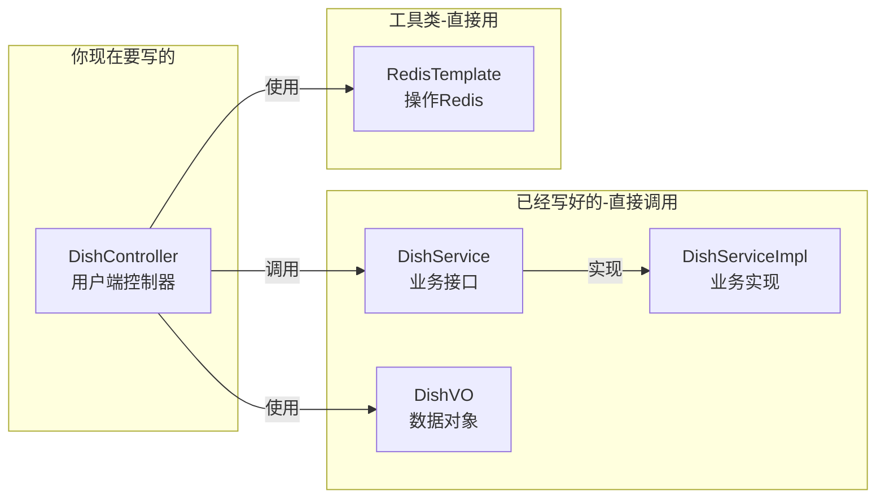
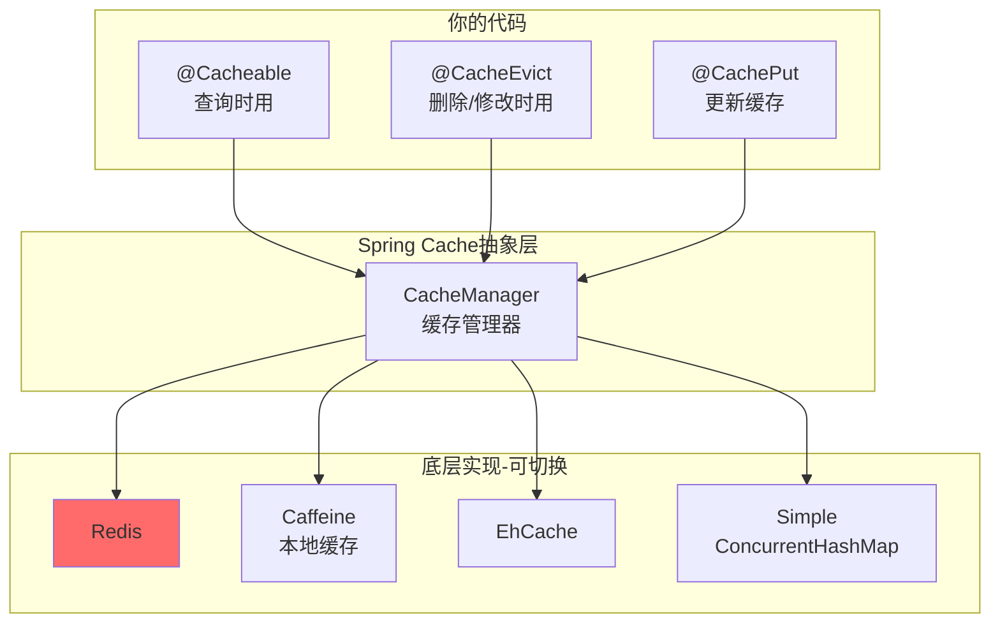
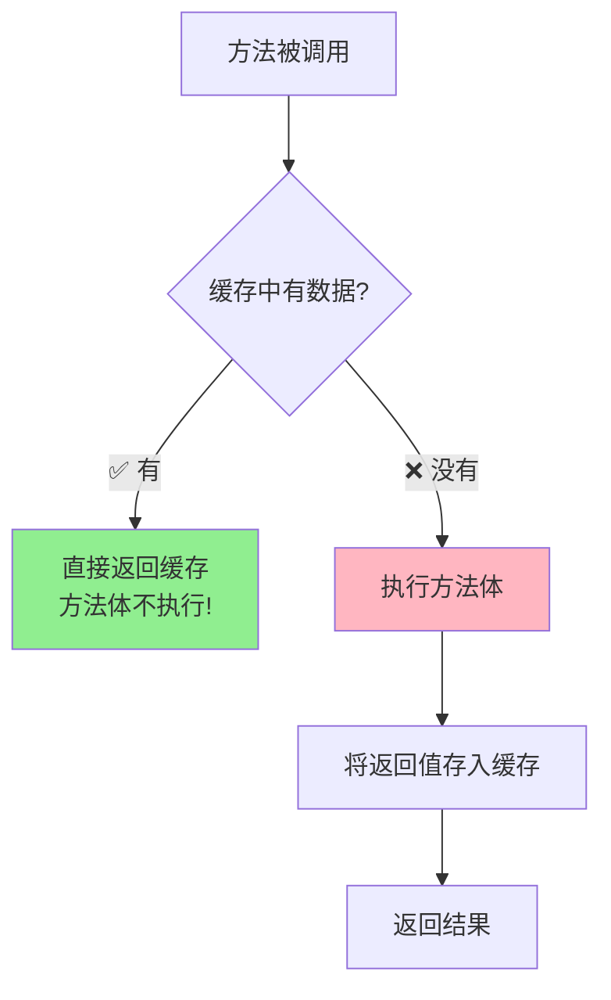
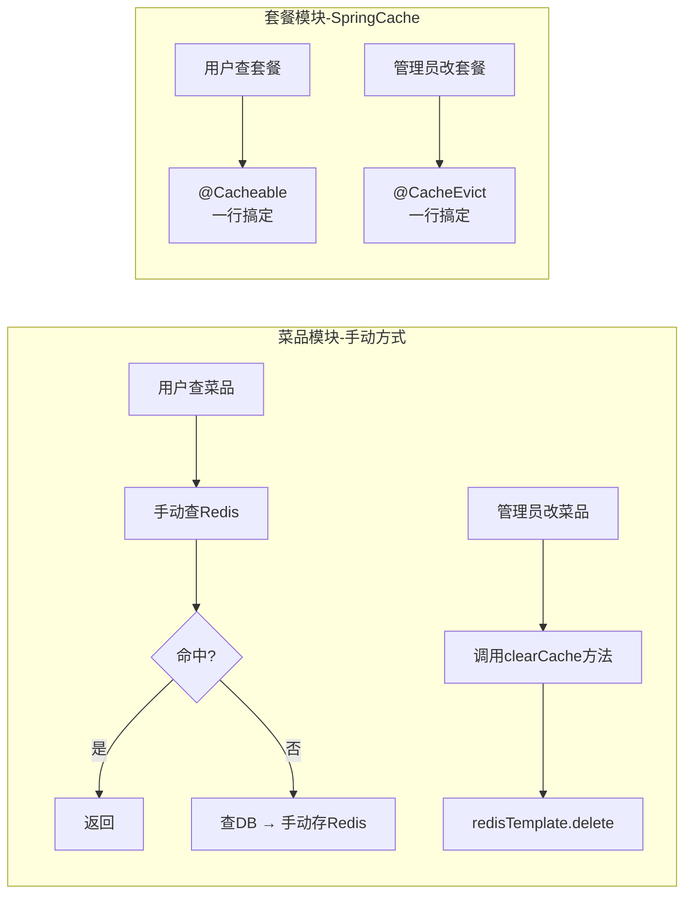

# 🎥 Day07-01到05 缓存菜品

## 🧩 本节概述

> **一句话总结**：通过 Redis 缓存菜品数据，减少数据库查询操作，提升系统性能

**主要内容关键词**：`Redis缓存`、`SpringCache`

---

## 🧠 模块目标

- 小程序展示菜品数据是通过数据库获得，若用户端访问量大，数据库访问压力随之增大
- 通过 Redis 缓存菜品数据，减少数据库查询操作

---

## 🔄 实现流程

1. 用户小程序查询菜品数据
2. 到达后端服务，先判断缓存是否有菜品数据
3. 有缓存数据 → 读取缓存数据
4. 没有缓存数据 → 查询数据库并响应 → 将数据载入缓存

---

## 🔄 缓存逻辑

1. 每个分类下的菜品保存一份缓存数据，将分类作为 key，菜品转为 String 作为 value
2. 数据库中菜品有变更时要清理缓存数据

---

## 📘 学到的知识

### 📚 Part 1: 注解基础恶补

代码里的注解分成三类：

#### 🟢 Spring 框架注解（必须掌握）

| 注解 | 来源 | 作用 | 通俗理解 |
|------|------|------|----------|
| `@RestController` | Spring MVC | 标记这是一个控制器，且返回值自动转JSON | 告诉Spring："我是个接待员，客人(请求)来了我处理，结果用JSON格式回复" |
| `@RequestMapping` | Spring MVC | 定义URL路径前缀 | 相当于"部门门牌号"，所有本类的接口都以这个路径开头 |
| `@GetMapping` | Spring MVC | 处理GET请求，定义具体路径 | 相当于"工位号"，`@RequestMapping("/user/dish")` + `@GetMapping("/list")` = 完整路径 `/user/dish/list` |
| `@Autowired` | Spring Core | 自动注入依赖对象 | 告诉Spring："这个工具(对象)我要用，你帮我准备好" |

> **💡 关于 @RestController("userDishController") 的参数：**
> - 参数是给这个 Bean 起个名字，用于区分同名类
> - 为什么要起名？因为 admin 端也有一个 DishController！
> - 不写参数也行，Spring 会自动用类名（首字母小写）作为名字

#### 🟡 Lombok 注解（简化代码）

| 注解 | 作用 | 通俗理解 |
|------|------|----------|
| `@Slf4j` | 自动生成一个 `log` 对象 | 省得你写 `Logger log = LoggerFactory.getLogger(...)` |

#### 🔵 Swagger 注解（生成 API 文档）

| 注解 | 作用 | 通俗理解 |
|------|------|----------|
| `@Api(tags = "...")` | 给Controller分组起名 | 在Swagger页面上显示的"大标题" |
| `@ApiOperation("...")` | 描述单个接口的功能 | 在Swagger页面上显示的"小标题" |

---

### 🧠 Part 2: 代码编写的思考过程

你问得好：**是不是要在 DishVO, DishService, DishServiceImpl, DishController 中来回辗转？**

答案是：**在这个简单场景下，你只需要关注 Controller 层**！

让我画个图帮你理解分工：



**关键认知**：

- `DishVO` 是个**数据容器**，已经定义好了，你直接用
- `DishService.listWithFlavor()` 方法**已经写好了**，你直接调用
- 你只需要在 Controller 里**组装逻辑**

---

### ✍️ Part 3: 手把手带你写代码

我把代码拆成**6个小步骤**，每步我先问你问题，你思考后我再给答案：

#### Step 1: 构造 Redis 的 Key

```java
String key = "dish_" + categoryId;
```

✅ 你这步已经写对了！就是字符串拼接。

---

#### Step 2: 从 Redis 查询数据

**问你**：`redisTemplate` 有个方法可以根据 key 获取 value，你猜是什么？

<details>
<summary>👉 点击看答案</summary>

```java
List<DishVO> list = (List<DishVO>) redisTemplate.opsForValue().get(key);
```

**解释**：

- `opsForValue()` → 操作 String 类型的数据
- `.get(key)` → 根据 key 获取 value
- `(List<DishVO>)` → 强制类型转换（因为 Redis 取出来是 Object）

</details>

---

#### Step 3: 判断缓存是否命中

**问你**：怎么判断 `list` 里有数据？（提示：两个条件）

<details>
<summary>👉 点击看答案</summary>

```java
if (list != null && list.size() > 0) {
    // 命中缓存
}
```

**为什么要两个条件？**

- `list != null` → Redis 里有这个 key
- `list.size() > 0` → 这个 key 对应的列表不是空的

</details>

---

#### Step 4: 命中缓存 → 直接返回

**问你**：怎么把数据包装成统一的返回格式？（提示：看方法返回值类型）

<details>
<summary>👉 点击看答案</summary>

```java
return Result.success(list);
```

**解释**：项目里有个统一返回类 `Result`，用 `Result.success()` 包装成功响应

</details>

---

#### Step 5: 未命中 → 查询数据库

**问你**：需要查询"某分类下、起售中"的菜品，怎么告诉 Service 这两个条件？

<details>
<summary>👉 点击看答案</summary>

```java
Dish dish = new Dish();
dish.setCategoryId(categoryId);        // 条件1：分类ID
dish.setStatus(StatusConstant.ENABLE); // 条件2：起售状态

list = dishService.listWithFlavor(dish);  // 调用已有的Service方法
```

**解释**：

- 创建一个 `Dish` 对象作为**查询条件载体**
- 设置好条件后，调用 Service 层的方法
- `StatusConstant.ENABLE` 是个常量，值为 1，表示"起售中"

</details>

---

#### Step 6: 存入Redis + 返回

**问你**：怎么把数据存进Redis？（提示：和get相反的方法）

<details>
<summary>👉 点击看答案</summary>

```java
redisTemplate.opsForValue().set(key, list);  // 存入Redis
return Result.success(list);                  // 返回数据
```

</details>

---

## 🎯 完整代码（你对照检查）

```java
@GetMapping("/list")
@ApiOperation("根据分类id查询菜品")
public Result<List<DishVO>> list(Long categoryId) {
    // 1. 构造Redis的Key
    String key = "dish_" + categoryId;

    // 2. 查询Redis
    List<DishVO> list = (List<DishVO>) redisTemplate.opsForValue().get(key);
    
    // 3-4. 命中缓存，直接返回
    if (list != null && list.size() > 0) {
        return Result.success(list);
    }

    // 5. 未命中，查询数据库
    Dish dish = new Dish();
    dish.setCategoryId(categoryId);
    dish.setStatus(StatusConstant.ENABLE);
    list = dishService.listWithFlavor(dish);

    // 6. 存入Redis并返回
    redisTemplate.opsForValue().set(key, list);
    return Result.success(list);
}
```

---

## 🎤 面试会怎么问这些基础？

**Q1: `@RestController` 和 `@Controller` 有什么区别？**

👉 `@RestController` = `@Controller` + `@ResponseBody`，返回值自动转 JSON

**Q2: `@Autowired` 的原理是什么？**

👉 依赖注入(DI)，Spring 容器启动时自动把对象注入进来（面试深问会涉及**反射**）

---

## 🗂️ 关联文件

```text
com/sky/controller/admin/DishController.java
com/sky/controller/user/DishController.java
```

---

# 🎥 Day07-06到12 缓存套餐

## 🧩 本节概述

> **一句话总结**：通过 Spring Cache 注解实现套餐缓存，简化缓存代码编写

**主要内容关键词**：`Redis缓存`、`Spring Cache`

---

## 📘 学到的知识

### 🤔 为什么需要 Spring Cache？

对比一下你刚学的**菜品缓存**（手动方式）：

```java
// 手动操作Redis - 菜品模块的做法
String key = "dish_" + categoryId;
List<DishVO> list = (List<DishVO>) redisTemplate.opsForValue().get(key);
if (list != null && list.size() > 0) {
    return Result.success(list);
}
list = dishService.listWithFlavor(dish);
redisTemplate.opsForValue().set(key, list);  // 还要手动存
return Result.success(list);
```

**问题**：每个需要缓存的方法都要写一堆重复代码！

**Spring Cache 的解决方案**：用注解，一行搞定！

---

### 🏗️ Spring Cache 架构图



**核心思想**：Spring Cache 是一个**抽象层**，底层可以接 Redis、本地缓存等多种实现，你的代码**不用改**！

---

### 🔑 三大核心注解

#### 1️⃣ `@EnableCaching` - 开启缓存功能

```java
// 在启动类上添加，项目中已有 ✅
@SpringBootApplication
@EnableCaching  // 👈 没有这个，其他注解都不生效！
public class SkyApplication { ... }
```

---

#### 2️⃣ `@Cacheable` - 查询缓存（最常用）

```java
@GetMapping("/list")
@Cacheable(cacheNames = "setmealCache", key = "#categoryId")
public Result<List<Setmeal>> list(Long categoryId) {
    // 业务代码...直接写，不用管缓存！
    List<Setmeal> list = setmealService.list(setmeal);
    return Result.success(list);
}
```

**执行流程**：



**参数详解**：

| 参数 | 作用 | 示例 |
|------|------|------|
| `cacheNames` | 缓存名称（相当于分组） | `"setmealCache"` |
| `key` | 缓存的键，用SpEL表达式 | `"#categoryId"` → 取方法参数的值 |

**最终Redis中的Key**：`setmealCache::12`（cacheNames + "::" + key的值）

---

#### 3️⃣ `@CacheEvict` - 清除缓存

```java
// 新增套餐时，清除该分类的缓存
@PostMapping
@CacheEvict(cacheNames = "setmealCache", key = "#setmealDTO.categoryId")
public Result save(@RequestBody SetmealDTO setmealDTO) { ... }

// 删除套餐时，清除所有缓存
@DeleteMapping
@CacheEvict(cacheNames = "setmealCache", allEntries = true)
public Result delete(@RequestParam List<Long> ids) { ... }
```

**参数详解**：

| 参数 | 作用 | 示例 |
|------|------|------|
| `key` | 清除指定key的缓存 | `"#setmealDTO.categoryId"` |
| `allEntries = true` | 清除该缓存名下的**所有**缓存 | 删除/修改时常用 |

---

### 🆚 对比：手动操作 vs Spring Cache

| 对比项 | 手动操作 RedisTemplate | Spring Cache |
|-------|----------------------|--------------|
| **代码量** | 多（每次7-10行） | 少（1行注解） |
| **侵入性** | 高（业务代码和缓存代码混在一起） | 低（注解声明式） |
| **灵活性** | 高（可精细控制） | 中（标准场景够用） |
| **学习成本** | 高 | 低 |
| **项目中应用** | 菜品模块 (Dish) | 套餐模块 (Setmeal) |

---

### 📊 项目中的应用对比图



---

## 🎯 面试必问点

### Q1: Spring Cache 的原理是什么？

> **答**：基于 **AOP（面向切面编程）** 实现。Spring 在运行时为带有缓存注解的方法创建代理对象，在方法执行前后织入缓存逻辑。

### Q2（追问）: 那 Spring Cache 有什么坑吗？

> **答**：有！**同一个类中方法互相调用，缓存注解会失效**！因为内部调用不走代理对象。
> 
> ```java
> public class SetmealController {
>     public void methodA() {
>         this.methodB();  // ❌ 缓存注解失效！
>     }
>     
>     @Cacheable(...)
>     public void methodB() { ... }
> }
> ```

### Q3: @Cacheable 的 key 怎么写？

> **答**：使用 **SpEL（Spring Expression Language）** 表达式：
> - `#参数名` → 取方法参数
> - `#对象.属性` → 取对象的属性
> - `#result` → 取返回值（仅@CachePut可用）
> - `#root.methodName` → 取方法名

### Q4: 如果缓存和数据库数据不一致怎么办？

> **答**：这就是**缓存一致性问题**！常见策略：
> 1. **Cache Aside Pattern**（旁路缓存）- 本项目用的就是这个
>    - 读：先读缓存，没有再读DB并回写
>    - 写：先更新DB，再删除缓存
> 2. 设置**过期时间**作为兜底
> 3. 更大并发场景：用消息队列异步更新缓存

---

## 🗂️ 关联文件

```text
com/sky/controller/user/SetmealController.java
com/sky/controller/admin/SetmealController.java
```
