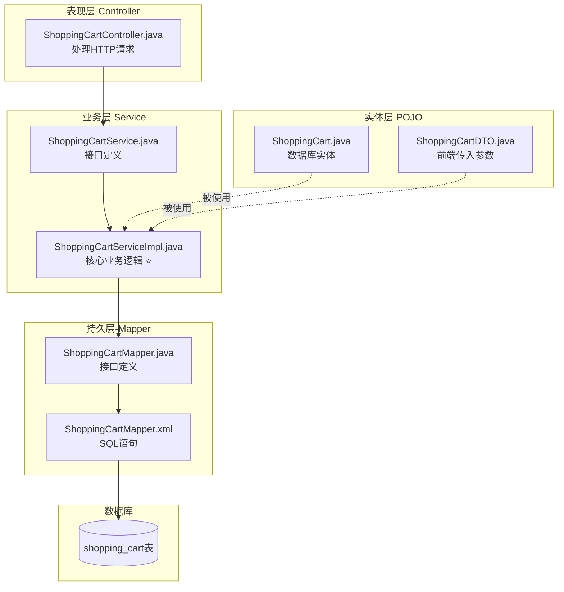
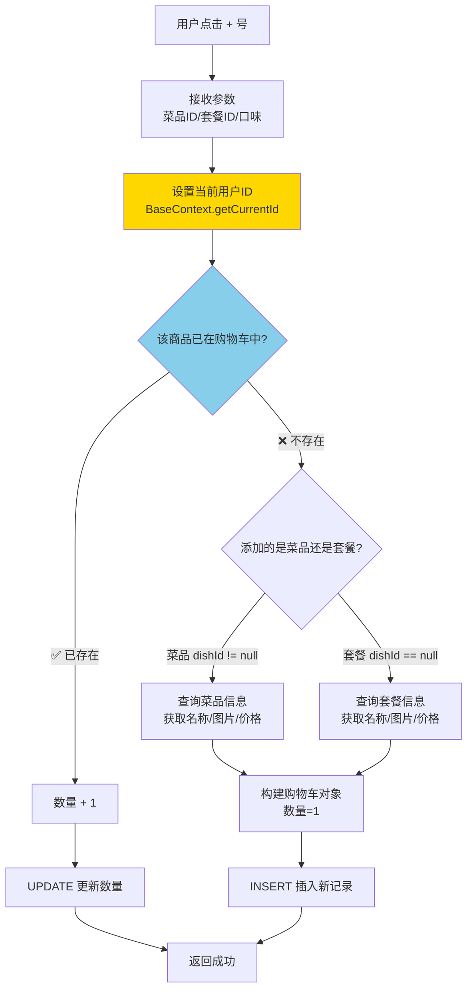
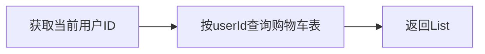
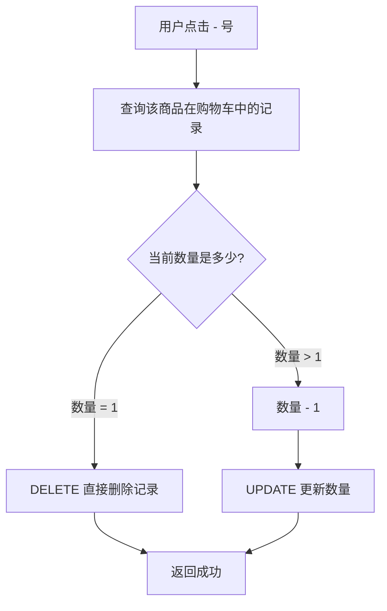
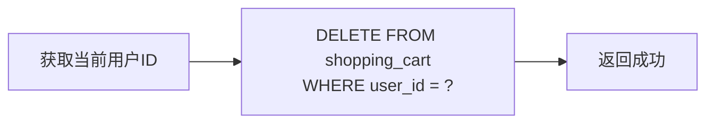

# 🎥 Day07-06到12 购物车模块

### 🧩 本节概述
> **一句话总结**：  

**主要内容关键词**：`类名1`、`类名2`、`技术点1`

---

## 🛒 购物车模块 - 全景图

### 📁 代码板块分布



---

## 🎯 四大核心功能

| 功能 | 接口路径 | HTTP方法 | 业务描述 |
|-----|---------|---------|---------|
| **添加购物车** | `/user/shoppingCart/add` | POST | 加菜品或套餐到购物车 |
| **查看购物车** | `/user/shoppingCart/list` | GET | 查看当前用户的购物车 |
| **减少商品** | `/user/shoppingCart/sub` | POST | 商品数量-1或删除 |
| **清空购物车** | `/user/shoppingCart/clean` | DELETE | 一键清空 |

---

## 🔥 核心业务逻辑（最重要）

### 功能1：添加购物车 `addShoppingCart()`

这是**最复杂的功能**，流程图如下：



**关键设计思考**：

| 设计点 | 说明 |
|-------|------|
| **用户隔离** | 通过 `BaseContext.getCurrentId()` 获取当前用户ID，保证每个用户只能操作自己的购物车 |
| **菜品 vs 套餐** | 通过判断 `dishId` 是否为空来区分 |
| **口味区分** | 同一菜品不同口味是**不同的购物车记录**！ |

---

### 功能2：查看购物车 `showShoppingCart()`



**就一行代码**：查询当前用户的所有购物车记录。

---

### 功能3：减少商品 `subShoppingCart()`



---

### 功能4：清空购物车 `cleanShoppingCart()`



---

## 📊 数据库表结构

```sql
shopping_cart 购物车表
├── id              -- 主键
├── name            -- 商品名称（冗余存储，避免查询）
├── user_id         -- 用户ID ⭐ 关键字段
├── dish_id         -- 菜品ID（二选一）
├── setmeal_id      -- 套餐ID（二选一）
├── dish_flavor     -- 口味（如：不辣,少糖）
├── number          -- 数量
├── amount          -- 单价
├── image           -- 图片
└── create_time     -- 创建时间
```

**设计亮点**：`name`、`image`、`amount` 是**冗余字段**，这样查看购物车时不需要再去查菜品表/套餐表！

---

## 🎤 面试高频考点

### Q1: 为什么购物车数据存在数据库而不是 Redis？

> **答**：本项目用数据库存储，优点是**数据持久化**，用户关闭小程序后购物车数据仍在。
> 
> **追问**：*"如果用 Redis 存购物车会怎么设计？"*
> 
> 👉 使用 `Hash` 结构：
> - Key: `cart:用户ID`
> - Field: `菜品ID:口味` 或 `套餐ID`
> - Value: 商品数量/商品JSON

### Q2: `BaseContext.getCurrentId()` 是怎么实现的？

> **答**：使用 **ThreadLocal** 存储当前登录用户的ID。在拦截器中解析JWT后，将用户ID存入ThreadLocal，后续业务代码直接取用。
> 
> 👉 **这是面试必问点！** 你之前学过的 JWT + ThreadLocal 知识就用在这里！

### Q3: 同一菜品不同口味怎么处理？

> **答**：看 Mapper 的 `list` 查询条件：
> ```xml
> <if test="dishFlavor!=null">and dish_flavor=#{dishFlavor}</if>
> ```
> 口味是查询条件之一，所以"宫保鸡丁-不辣"和"宫保鸡丁-微辣"是**两条不同的记录**。

### Q4: 购物车表为什么要冗余存储 name、image、amount？

> **答**：**以空间换时间**！
> - 如果不冗余：查看购物车时需要 JOIN 菜品表/套餐表，查询慢
> - 冗余后：一条 SQL 就能查出所有展示信息
> 
> **追问**：*"如果菜品改名了怎么办？"*
> 
> 👉 购物车里的还是旧名字，但这符合业务逻辑（用户加入购物车时是那个名字）。如果需要同步，可以在菜品修改时清空相关购物车。

---

## ✍️ 练习任务

1. **画图练习**：自己手画一遍"添加购物车"的流程图（不看我的）
2. **代码阅读**：找到 `BaseContext` 类，理解 ThreadLocal 如何存取用户ID
3. **思考题**：如果同时有100个用户在加购物车，会有并发问题吗？

想继续深入哪个部分？比如：
- ThreadLocal + BaseContext 实现原理
- 下单流程（购物车 → 订单）
- 动态SQL的写法> 

