# 📚 苍穹外卖 - Day07学习笔记总结

---

# 第一部分：缓存模块

## 1.1 为什么需要缓存？

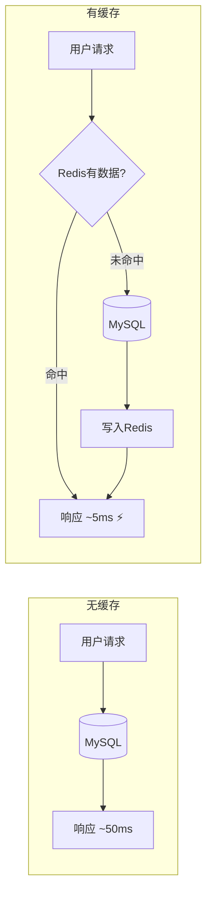

| 对比项 | 无缓存 | 有缓存 |
|-------|-------|-------|
| 响应速度 | 慢（50-100ms） | 快（1-10ms） |
| 数据库压力 | 高 | 低 |
| 适用场景 | 低并发 | 高并发读多写少 |

---

## 1.2 方式一：手动操作 RedisTemplate（菜品模块）

### 📍 代码位置
- user/DishController.java - 用户端查询
- admin/DishController.java - 管理端清除缓存

### 📋 核心逻辑

**查询流程（用户端）**：
```
Step 1: 构造Key → "dish_" + categoryId
Step 2: 查询Redis → redisTemplate.opsForValue().get(key)
Step 3: 判断是否命中 → list != null && list.size() > 0
Step 4a: 命中 → 直接返回
Step 4b: 未命中 → 查数据库 → 存入Redis → 返回
```

**清除缓存（管理端）**：
```
新增菜品 → 清除该分类缓存 → clearCache("dish_" + categoryId)
修改/删除/起停售 → 清除所有菜品缓存 → clearCache("dish_*")
```

### 💻 关键代码片段

```java
// 查询缓存
List<DishVO> list = (List<DishVO>) redisTemplate.opsForValue().get(key);

// 存入缓存
redisTemplate.opsForValue().set(key, list);

// 清除缓存（支持通配符）
Set keys = redisTemplate.keys(pattern);
redisTemplate.delete(keys);
```

---

## 1.3 方式二：Spring Cache 注解（套餐模块）

### 📍 代码位置
- SkyApplication.java - `@EnableCaching` 开启缓存
- user/SetmealController.java - `@Cacheable`
- admin/SetmealController.java - `@CacheEvict`

### 📋 三大核心注解

| 注解 | 作用 | 使用场景 | 示例 |
|-----|------|---------|------|
| `@EnableCaching` | 开启缓存功能 | 启动类 | 只加一次 |
| `@Cacheable` | 查询时缓存 | 读操作 | `@Cacheable(cacheNames="setmealCache", key="#categoryId")` |
| `@CacheEvict` | 清除缓存 | 写操作 | `@CacheEvict(cacheNames="setmealCache", allEntries=true)` |

### 📋 参数详解

```java
@Cacheable(
    cacheNames = "setmealCache",  // 缓存分组名
    key = "#categoryId"           // SpEL表达式，取方法参数值
)
// 最终Redis Key: setmealCache::12

@CacheEvict(
    cacheNames = "setmealCache",
    key = "#setmealDTO.categoryId"  // 取对象属性
)

@CacheEvict(
    cacheNames = "setmealCache",
    allEntries = true  // 清除该分组下所有缓存
)
```

---

## 1.4 两种方式对比

| 对比项 | 手动 RedisTemplate | Spring Cache |
|-------|-------------------|--------------|
| **代码量** | 多（7-10行） | 少（1行注解） |
| **侵入性** | 高（混在业务代码中） | 低（声明式） |
| **灵活性** | 高（可精细控制过期时间等） | 中 |
| **学习成本** | 高 | 低 |
| **项目应用** | 菜品模块 Dish | 套餐模块 Setmeal |
| **适用场景** | 复杂缓存逻辑 | 标准CRUD |

---

## 1.5 缓存模块 - 面试题库

### 基础题

| 问题 | 答案要点 |
|-----|---------|
| Redis在项目中怎么用的？ | 菜品/套餐缓存，减轻DB压力，提升响应速度 |
| Spring Cache原理？ | 基于AOP，代理对象在方法前后织入缓存逻辑 |
| @Cacheable的key怎么写？ | SpEL表达式：`#参数名`、`#对象.属性`、`#root.methodName` |

### 进阶追问

| 问题 | 答案要点 |
|-----|---------|
| 缓存和数据库数据不一致怎么办？ | Cache Aside Pattern：先更新DB，再删除缓存 |
| Spring Cache有什么坑？ | 同类方法内部调用，注解失效（不走代理） |
| 更大并发场景如何优化？ | 1) 设置过期时间 2) 布隆过滤器防穿透 3) 分布式锁防击穿 |

---

# 第二部分：购物车模块

## 2.1 模块结构

```
购物车模块
├── Controller层
│   └── ShoppingCartController.java     # 接收请求
├── Service层
│   ├── ShoppingCartService.java        # 接口
│   └── ShoppingCartServiceImpl.java    # 核心业务逻辑 ⭐
├── Mapper层
│   ├── ShoppingCartMapper.java         # 接口
│   └── ShoppingCartMapper.xml          # SQL语句
└── POJO层
    ├── ShoppingCart.java               # 实体类
    └── ShoppingCartDTO.java            # 传输对象
```

---

## 2.2 四大核心功能

| 功能 | 路径 | 方法 | 核心逻辑 |
|-----|------|------|---------|
| 添加购物车 | POST `/add` | `addShoppingCart()` | 已存在→数量+1，不存在→新增记录 |
| 查看购物车 | GET `/list` | `showShoppingCart()` | 按userId查询所有记录 |
| 减少商品 | POST `/sub` | `subShoppingCart()` | 数量>1→-1，数量=1→删除 |
| 清空购物车 | DELETE `/clean` | `cleanShoppingCart()` | 按userId删除所有记录 |

---

## 2.3 添加购物车 - 详细流程

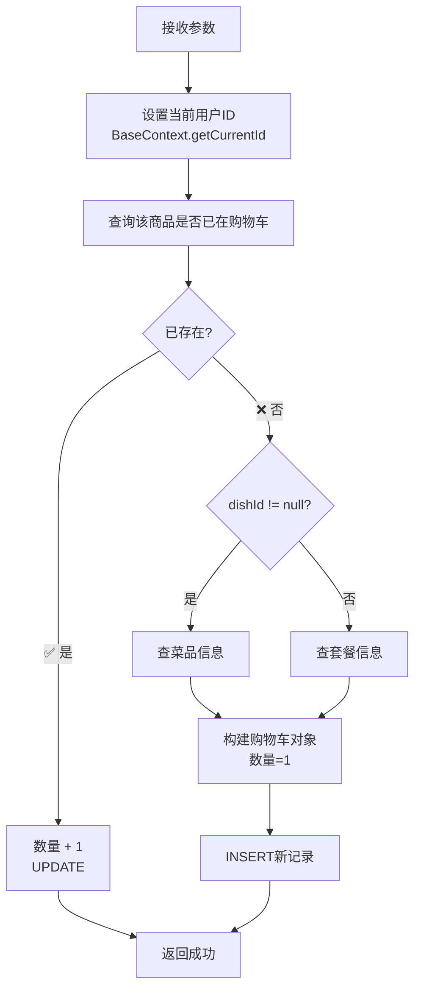

---

## 2.4 数据库设计

```sql
shopping_cart 购物车表
├── id              -- 主键
├── name            -- 商品名称 ⭐冗余字段
├── user_id         -- 用户ID（关键！隔离不同用户）
├── dish_id         -- 菜品ID（与setmeal_id二选一）
├── setmeal_id      -- 套餐ID
├── dish_flavor     -- 口味（区分同菜品不同口味）
├── number          -- 数量
├── amount          -- 单价 ⭐冗余字段
├── image           -- 图片 ⭐冗余字段
└── create_time     -- 创建时间
```

**设计亮点**：冗余存储 `name`、`image`、`amount`，查询时无需JOIN，空间换时间！

---

## 2.5 关键技术点

### 🔐 用户隔离 - ThreadLocal

```java
// 拦截器中存入用户ID
BaseContext.setCurrentId(userId);

// 业务代码中获取
Long userId = BaseContext.getCurrentId();

// 查询时自动带上userId条件
shoppingCart.setUserId(BaseContext.getCurrentId());
```

### 🍽️ 口味区分

同一菜品不同口味 = 不同的购物车记录：
```xml
<if test="dishFlavor!=null">and dish_flavor=#{dishFlavor}</if>
```

---

## 2.6 购物车模块 - 面试题库

| 问题 | 答案要点 |
|-----|---------|
| 购物车数据存哪里？ | 数据库（本项目），也可用Redis Hash |
| 如何保证用户只能看自己的购物车？ | ThreadLocal存储当前用户ID，查询时带userId条件 |
| 同菜品不同口味怎么处理？ | dish_flavor作为查询条件，不同口味是不同记录 |
| 为什么冗余存储name/image/amount？ | 避免查询时JOIN，提升性能 |
| 如果用Redis存购物车怎么设计？ | Hash结构，Key=`cart:userId`，Field=`dishId:flavor`，Value=数量 |

---

# 第三部分：注解速查表

## Spring 核心注解

| 注解 | 来源 | 作用 |
|-----|------|------|
| `@RestController` | Spring MVC | 控制器 + 返回值转JSON |
| `@RequestMapping` | Spring MVC | URL路径前缀 |
| `@GetMapping` / `@PostMapping` | Spring MVC | 处理GET/POST请求 |
| `@Autowired` | Spring Core | 自动注入依赖 |
| `@Service` | Spring Core | 标记Service层组件 |
| `@Mapper` | MyBatis | 标记Mapper接口 |

## Lombok 注解

| 注解 | 作用 |
|-----|------|
| `@Data` | 生成getter/setter/toString等 |
| `@Slf4j` | 生成log对象 |
| `@Builder` | 生成建造者模式代码 |
| `@NoArgsConstructor` | 无参构造 |
| `@AllArgsConstructor` | 全参构造 |

## Swagger 注解

| 注解 | 作用 |
|-----|------|
| `@Api(tags="...")` | Controller分组描述 |
| `@ApiOperation("...")` | 单个接口描述 |

---

# 第四部分：待学习清单

根据今天的学习，建议你后续继续深入：

| 优先级 | 模块 | 面试热度 |
|-------|------|---------|
| ⭐⭐⭐⭐⭐ | ThreadLocal + JWT 登录认证 | 必问 |
| ⭐⭐⭐⭐⭐ | AOP 公共字段填充 | 高频 |
| ⭐⭐⭐⭐ | 下单流程（购物车→订单） | 高频 |
| ⭐⭐⭐⭐ | 事务管理 @Transactional | 高频 |
| ⭐⭐⭐ | WebSocket 来单提醒 | 中频 |
| ⭐⭐⭐ | 定时任务（订单超时处理） | 中频 |

---

## 📝 复习建议

1. **今天**：把流程图自己手画一遍（不看笔记）
2. **明天**：尝试不看源码，自己写一遍添加购物车的逻辑
3. **后续**：带着面试题去读源码，每学一个模块就整理面试题

---

根据你之前的提问风格和基础水平，我预测你可能对以下知识点**似懂非懂**，让我逐个击破：

---

## 🤔 预测一：RedisTemplate 的类型转换看不懂

### 你可能的困惑

```java
List<DishVO> list = (List<DishVO>) redisTemplate.opsForValue().get(key);
//                  ↑↑↑↑↑↑↑↑↑↑↑↑↑
//                  这个强制转换是什么意思？为什么要转？
```

### 详细解答

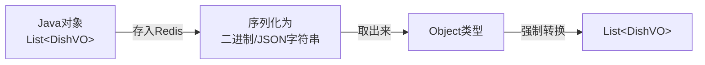

**原因**：
1. Redis 存储的是字符串/二进制，不是 Java 对象
2. `get(key)` 返回的是 `Object` 类型（因为Redis不知道你存的是什么类型）
3. 你需要**强制转换**告诉Java："我知道这是个 `List<DishVO>`"

**类比理解**：
> 就像快递柜取件，快递柜只知道里面有个"包裹"（Object），但你知道你买的是"书"（List<DishVO>），所以你取出来后要当作"书"来用。

---

## 🤔 预测二：BaseContext.getCurrentId() 到底怎么来的？

### 你可能的困惑

```java
shoppingCart.setUserId(BaseContext.getCurrentId());
//                     ↑↑↑↑↑↑↑↑↑↑↑↑↑↑↑↑↑↑↑↑↑↑↑↑↑
//                     这个ID从哪来的？谁存进去的？
```

### 详细解答
完整流程图：

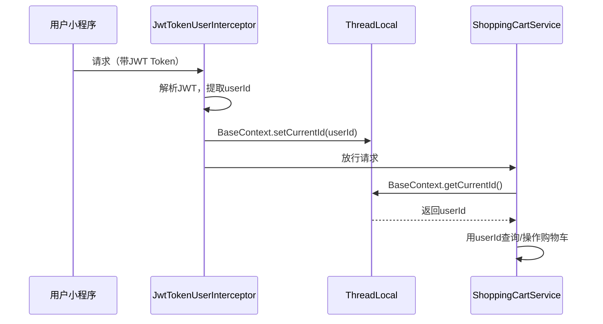

### 核心代码解读

```java
// 拦截器中（请求进来时）
Claims claims = JwtUtil.parseJWT(secretKey, token);  // 解析JWT
Long userId = Long.valueOf(claims.get("userId"));     // 提取用户ID
BaseContext.setCurrentId(userId);                     // 存入ThreadLocal ⭐

// 业务代码中（后续使用）
Long userId = BaseContext.getCurrentId();            // 从ThreadLocal取出 ⭐
```

### ThreadLocal 通俗理解

> **类比**：ThreadLocal 就像每个员工（线程）自己的抽屉。
> - 拦截器把"工牌"（userId）放进你的抽屉
> - 后面干活时，你从自己的抽屉取工牌
> - 每个员工的抽屉互不干扰（线程隔离）

---

## 🤔 预测三：BeanUtils.copyProperties 是什么？

### 你可能的困惑

```java
ShoppingCart shoppingCart = new ShoppingCart();
BeanUtils.copyProperties(shoppingCartDTO, shoppingCart);
//        ↑↑↑↑↑↑↑↑↑↑↑↑↑↑↑
//        这是在干什么？
```

### 详细解答

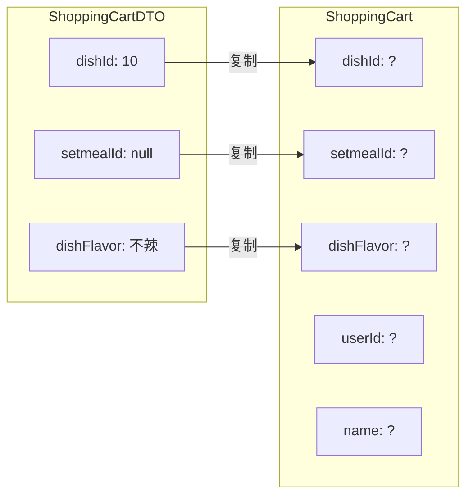

**作用**：把一个对象的属性值**批量复制**到另一个对象（属性名相同的才会复制）

**等价于手写**：
```java
// 不用BeanUtils，你要写一堆：
shoppingCart.setDishId(shoppingCartDTO.getDishId());
shoppingCart.setSetmealId(shoppingCartDTO.getSetmealId());
shoppingCart.setDishFlavor(shoppingCartDTO.getDishFlavor());
// ...还有很多

// 用BeanUtils一行搞定：
BeanUtils.copyProperties(shoppingCartDTO, shoppingCart);
```

---

## 🤔 预测四：动态SQL的 `<where>` 标签

### 你可能的困惑

```xml
<select id="list" resultType="com.sky.entity.ShoppingCart">
    select * from shopping_cart
    <where>
        <if test="userId!=null">and user_id=#{userId}</if>
        <if test="dishId!=null">and dish_id=#{dishId}</if>
    </where>
</select>
```

**问题**：为什么不直接写 `WHERE and user_id=...`？

### 详细解答

**`<where>` 标签的魔法**：
1. 自动添加 `WHERE` 关键字
2. 自动去掉开头多余的 `AND` 或 `OR`

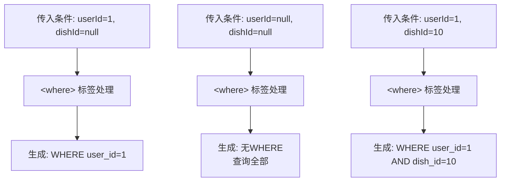

**如果不用 `<where>` 会出问题**：
```sql
-- 如果userId为空，dishId不为空，会生成：
SELECT * FROM shopping_cart WHERE AND dish_id=10
--                            ↑↑↑↑↑↑↑↑↑
--                            语法错误！WHERE后面直接跟AND
```

---

## 🤔 预测五：Spring Cache 的缓存到底存在哪里？

### 你可能的困惑

```java
@Cacheable(cacheNames = "setmealCache", key = "#categoryId")
// 这个缓存存在哪里？内存？Redis？文件？
```

### 详细解答 

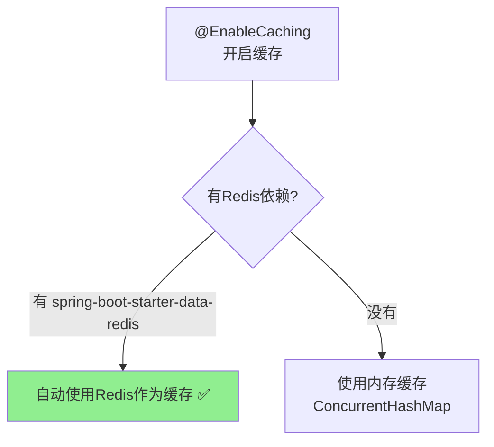

**本项目的情况**：
- 引入了 `spring-boot-starter-data-redis` 依赖
- 配置了 Redis 连接信息
- Spring Boot **自动配置**，使用 Redis 作为 Spring Cache 的存储

**缓存Key格式**：
```
setmealCache::12
     ↑         ↑
 cacheNames   key值
```

你可以用 Redis 客户端工具（如 Redis Desktop Manager）查看，会看到这些Key！

---

## 🤔 预测六：为什么查询用对象而不是直接传参数？

### 你可能的困惑

```java
// 为什么要这样？
Dish dish = new Dish();
dish.setCategoryId(categoryId);
dish.setStatus(StatusConstant.ENABLE);
list = dishService.listWithFlavor(dish);

// 而不是直接这样？
list = dishService.listWithFlavor(categoryId, status);
```

### 详细解答

**原因：扩展性和灵活性**

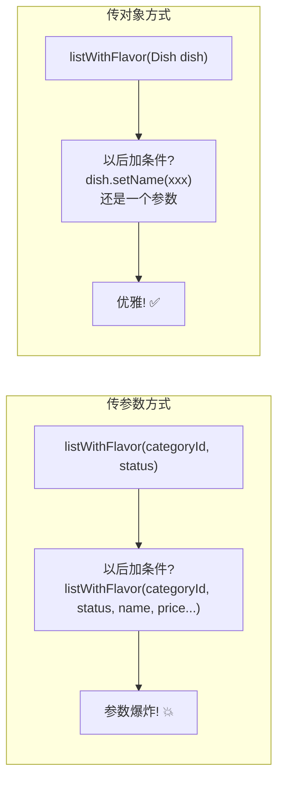

**配合动态SQL**：
```xml
<select id="list">
    select * from dish
    <where>
        <if test="categoryId != null">and category_id = #{categoryId}</if>
        <if test="status != null">and status = #{status}</if>
        <if test="name != null">and name like concat('%',#{name},'%')</if>
        <!-- 以后加条件，SQL改一行就行，方法签名不用改 -->
    </where>
</select>
```

---

## 🤔 预测七：缓存穿透、击穿、雪崩（面试必问但你可能没概念）

虽然今天代码里没直接涉及，但**面试100%会问**，提前给你铺垫：

### 📊 三大缓存问题对比

| 问题 | 场景 | 后果 | 解决方案 |
|-----|------|------|---------|
| **缓存穿透** | 查询**不存在**的数据 | 每次都打到DB | 1) 缓存空值 2) 布隆过滤器 |
| **缓存击穿** | **热点**数据过期瞬间 | 大量请求打到DB | 1) 热点数据不过期 2) 分布式锁 |
| **缓存雪崩** | 大量数据**同时**过期 | DB瞬间压力暴增 | 过期时间加随机值 |

### 图解

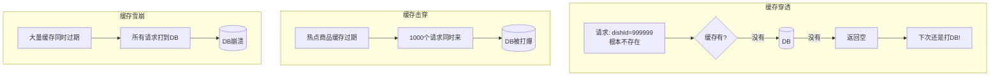

**本项目的潜在问题**：
```java
// 当前代码没有设置过期时间！
redisTemplate.opsForValue().set(key, list);  // 永不过期

// 更好的做法：
redisTemplate.opsForValue().set(key, list, 30, TimeUnit.MINUTES);  // 30分钟过期
```

---

## 📝 知识点自检清单

学完今天的内容，你应该能回答这些问题：

| 序号 | 问题 | 能答上来吗？ |
|-----|------|------------|
| 1 | `(List<DishVO>)` 强制转换为什么需要？ | ☐ |
| 2 | `BaseContext.getCurrentId()` 的值是谁存进去的？ | ☐ |
| 3 | ThreadLocal 的作用是什么？ | ☐ |
| 4 | `BeanUtils.copyProperties` 干什么的？ | ☐ |
| 5 | MyBatis `<where>` 标签的作用？ | ☐ |
| 6 | Spring Cache 用 `@Cacheable` 存的数据在哪里？ | ☐ |
| 7 | 为什么查询条件用对象封装而不是多参数？ | ☐ |
| 8 | 缓存穿透、击穿、雪崩分别是什么？ | ☐ |

---

好的！我来给你整理一份**面试导向**的题库，分为「基于项目的问题」和「延伸扩展问题」两类：

---

# 🎯 苍穹外卖 - 缓存&购物车模块面试题库

---

## 第一部分：缓存模块

### 📋 Level 1：基础问题（必须答上来）

---

#### Q1: 你项目中 Redis 是怎么用的？

✅ **标准答案**：

> 项目中 Redis 主要用于**菜品和套餐数据的缓存**，采用 **Cache Aside Pattern（旁路缓存模式）**：
> 
> - **读操作**：先查Redis，命中直接返回；未命中查MySQL，再写入Redis
> - **写操作**：先更新MySQL，再删除Redis缓存
> 
> 这样做的目的是**减轻数据库压力**，提升接口响应速度。高峰期大量用户浏览菜品，如果每次都查库，数据库扛不住。

**📍 对应代码位置**：
- user/DishController.java - 读缓存
- admin/DishController.java - 清缓存

---

#### Q2: 你用的什么数据结构存储缓存？Key 怎么设计的？

✅ **标准答案**：

> 使用 Redis 的 **String 类型**，存储序列化后的 `List<DishVO>`。
> 
> Key 设计规则：`dish_分类ID`，例如 `dish_12`
> 
> 这样设计的好处：
> 1. **按分类隔离**：不同分类的菜品缓存互不影响
> 2. **精准清理**：新增菜品时只清除该分类的缓存，不影响其他分类

---

#### Q3: 项目中用了两种缓存方式，有什么区别？

✅ **标准答案**：

| 对比项 | 手动 RedisTemplate | Spring Cache |
|-------|-------------------|--------------|
| **项目应用** | 菜品模块 | 套餐模块 |
| **代码侵入性** | 高（混在业务代码中） | 低（注解声明式） |
| **灵活性** | 高（可精细控制） | 中 |
| **适用场景** | 复杂缓存逻辑 | 标准CRUD |

> 选择手动方式是因为菜品查询需要更灵活的控制，比如需要处理口味数据的嵌套查询。

---

### 📋 Level 2：进阶追问（区分度问题）

---

#### Q4: 如果管理员修改了菜品，缓存里的数据不就是旧的吗？怎么处理的？

✅ **标准答案**：

> 采用**删除缓存**策略，而不是更新缓存。
> 
> 具体做法：
> - **新增菜品**：删除该分类的缓存 `clearCache("dish_" + categoryId)`
> - **修改/删除/起停售**：删除所有菜品缓存 `clearCache("dish_*")`

**🔥 追问**：为什么是删除缓存而不是更新缓存？

> 因为**更新缓存有并发问题**：
> ```
> 线程A更新DB → 线程B更新DB → 线程B更新缓存 → 线程A更新缓存
> 结果：缓存是A的旧数据，DB是B的新数据，数据不一致！
> ```
> 删除缓存更安全，下次读取时自然会从DB加载最新数据。

---

#### Q5: 你了解缓存穿透、击穿、雪崩吗？你项目里有处理吗？

✅ **标准答案**：

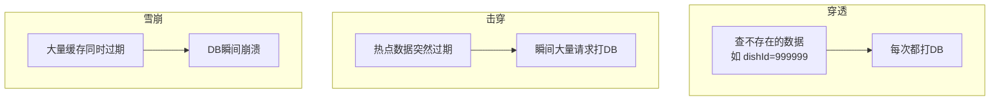

| 问题 | 本项目情况 | 生产环境解决方案 |
|-----|-----------|----------------|
| **穿透** | 未处理（菜品ID来自系统，可控） | 缓存空值 / 布隆过滤器 |
| **击穿** | 未设过期时间，不存在此问题 | 热点数据永不过期 / 分布式锁 |
| **雪崩** | 未设过期时间 | 过期时间加随机值 |

> 本项目是教学项目，未做完整处理。生产环境我会这样优化：
> ```java
> // 设置过期时间 + 随机值，防止雪崩
> int timeout = 30 + new Random().nextInt(10); // 30-40分钟
> redisTemplate.opsForValue().set(key, list, timeout, TimeUnit.MINUTES);
> ```

---

#### Q6: Spring Cache 的原理是什么？有什么坑？

✅ **标准答案**：

> **原理**：基于 **AOP 动态代理**。Spring 在运行时为带有缓存注解的 Bean 创建代理对象，在方法执行前后织入缓存逻辑。

> **坑1：同类方法内部调用，缓存失效！**
> ```java
> public class SetmealController {
>     public void methodA() {
>         this.methodB();  // ❌ 不走代理，缓存注解失效！
>     }
>     
>     @Cacheable(...)
>     public void methodB() { }
> }
> ```

> **坑2：private 方法加缓存注解无效**（代理无法拦截私有方法）

---

#### Q7: 如果让你优化这个缓存方案，你会怎么做？

✅ **标准答案**（展示你的技术深度）：

| 优化点 | 当前问题 | 改进方案 |
|-------|---------|---------|
| **过期时间** | 永不过期 | 设置30分钟+随机值 |
| **缓存预热** | 无 | 启动时加载热门分类到缓存 |
| **缓存穿透** | 无 | 缓存空值或布隆过滤器 |
| **监控** | 无 | 接入缓存命中率监控 |
| **序列化** | JDK序列化 | 改用JSON，可读性更好 |

---

## 第二部分：购物车模块

### 📋 Level 1：基础问题

---

#### Q8: 购物车的核心功能有哪些？数据存在哪里？

✅ **标准答案**：

> **四大功能**：添加购物车、查看购物车、减少商品、清空购物车
> 
> **存储位置**：MySQL 数据库的 `shopping_cart` 表
> 
> **为什么用数据库而不是 Redis？**
> - 数据需要**持久化**，用户关闭小程序后购物车数据仍在
> - 购物车数据量不大，数据库完全能支撑

---

#### Q9: 添加购物车的核心逻辑是什么？

✅ **标准答案**：

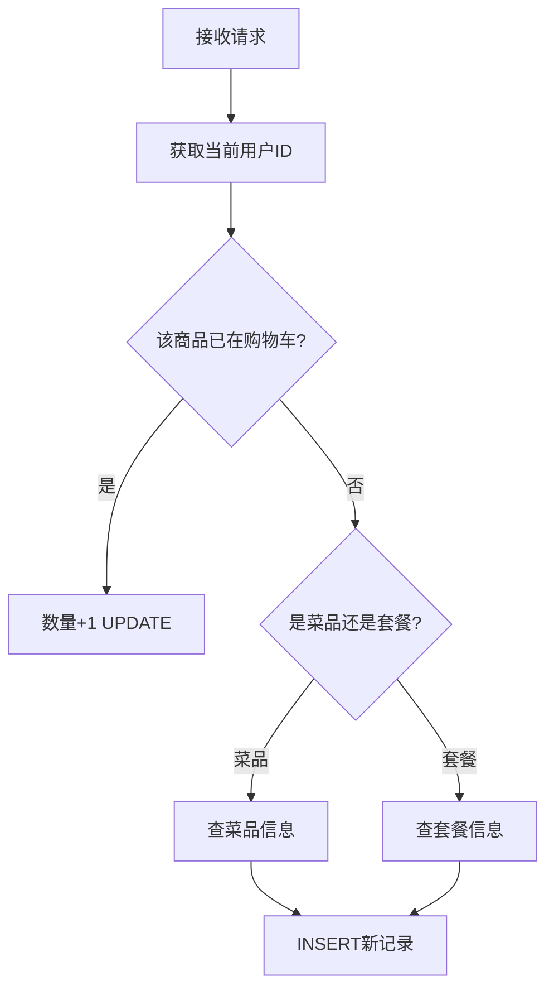

> 关键点：
> 1. 通过 `BaseContext.getCurrentId()` 获取用户ID，保证用户隔离
> 2. 同一菜品不同口味是**不同的记录**
> 3. 冗余存储 name/image/amount，避免查询时 JOIN

---

#### Q10: BaseContext.getCurrentId() 是怎么实现的？

✅ **标准答案**（这题必问！）：

> 使用 **ThreadLocal** 实现线程隔离的用户ID存储。
> 
> **流程**：
> 1. 用户请求到达 → JWT拦截器解析Token → 提取userId
> 2. 调用 `BaseContext.setCurrentId(userId)` 存入ThreadLocal
> 3. 业务代码调用 `BaseContext.getCurrentId()` 获取
> 
> **为什么用ThreadLocal？**
> - 每个请求是一个独立线程
> - ThreadLocal 保证线程之间数据隔离
> - 避免在方法间层层传递userId参数

---

### 📋 Level 2：进阶追问

---

#### Q11: ThreadLocal 会有内存泄漏问题吗？怎么解决？

✅ **标准答案**：

> **会！** 如果线程是线程池复用的，ThreadLocal 不手动清理会导致：
> 1. 内存泄漏（Entry的Value无法回收）
> 2. 数据错乱（下一个请求拿到上一个用户的ID）

> **解决方案**：请求结束后调用 `ThreadLocal.remove()`

```java
// 在拦截器的 afterCompletion 中清理
@Override
public void afterCompletion(...) {
    BaseContext.removeCurrentId();  // 清理ThreadLocal
}
```

**📍 检查项目代码**： **📍 检查项目代码**： 

搜索文本 `afterCompletion`，无结果

> ⚠️ **本项目存在隐患**：没有在拦截器中清理ThreadLocal！
> 
> 面试时可以主动指出："我注意到项目中没有清理ThreadLocal，在使用线程池的生产环境可能会有问题，我会在 `afterCompletion` 中添加清理逻辑。"

---

#### Q12: 同一菜品不同口味怎么区分的？

✅ **标准答案**：

> 口味 `dish_flavor` 是查询条件之一，所以"宫保鸡丁-不辣"和"宫保鸡丁-微辣"是**两条不同的购物车记录**。

```xml
<select id="list">
    select * from shopping_cart
    <where>
        <if test="userId!=null">and user_id=#{userId}</if>
        <if test="dishId!=null">and dish_id=#{dishId}</if>
        <if test="dishFlavor!=null">and dish_flavor=#{dishFlavor}</if>
    </where>
</select>
```

---

#### Q13: 购物车表为什么要冗余存储 name、image、amount？

✅ **标准答案**：

> **空间换时间**！
> 
> - **不冗余**：查看购物车需要 JOIN 菜品表/套餐表，查询慢
> - **冗余后**：一条SQL就能查出所有展示信息

> **追问**：如果菜品改名了怎么办？
> 
> 购物车里还是旧名字，但这**符合业务逻辑**——用户加入时是那个名字。如果需要同步，可以在菜品修改时清空相关购物车（本项目没做）。

---

#### Q14: 如果用 Redis 存购物车，你会怎么设计？

✅ **标准答案**（展示设计能力）：

> 使用 **Hash** 数据结构：

```
Key:    cart:用户ID           (如 cart:1001)
Field:  菜品ID:口味           (如 dish_10:不辣)
Value:  JSON{name,image,amount,number}
```

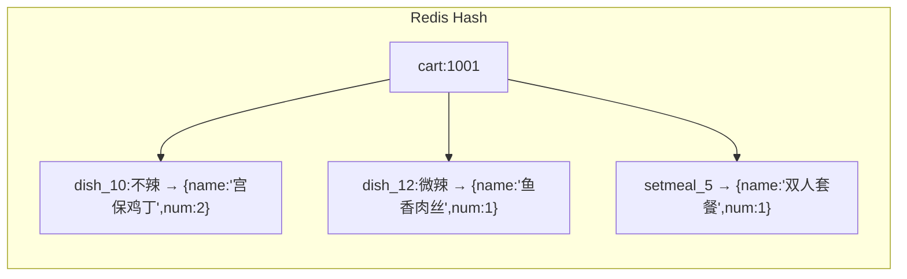

> **优势**：
> - 单个用户的购物车是一个Key，方便整体操作
> - Hash的HGET/HSET是O(1)复杂度
> - 可设置过期时间（如7天未操作自动清空）

---

#### Q15: 添加购物车有并发问题吗？比如用户快速点击两次？

✅ **标准答案**：

> **有！** 如果用户快速点击两次"加入购物车"：
> ```
> 线程1: 查询购物车 → 不存在 → 准备INSERT
> 线程2: 查询购物车 → 不存在 → 准备INSERT
> 线程1: INSERT成功
> 线程2: INSERT成功（重复数据！）
> ```

> **解决方案**：
> 1. **数据库唯一索引**：`UNIQUE(user_id, dish_id, dish_flavor)`
> 2. **分布式锁**：Redisson
> 3. **乐观锁**：version字段

> 本项目没处理，因为是教学项目。生产环境建议加唯一索引。

---

## 第三部分：综合扩展问题

---

#### Q16: 项目中用了哪些设计模式？

✅ **标准答案**：

| 设计模式 | 应用位置 | 说明 |
|---------|---------|------|
| **代理模式** | Spring Cache、AOP | 动态代理实现缓存织入 |
| **工厂模式** | Spring Bean创建 | BeanFactory |
| **单例模式** | Spring Bean默认作用域 | Controller/Service都是单例 |
| **建造者模式** | `ShoppingCart.builder()` | Lombok的@Builder |
| **模板方法** | JdbcTemplate、RedisTemplate | 定义操作骨架 |

---

#### Q17: 项目中的 DTO、VO、Entity 有什么区别？

✅ **标准答案**：

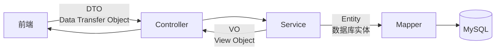

| 类型 | 用途 | 示例 |
|-----|------|------|
| **DTO** | 接收前端参数 | ShoppingCartDTO（只有dishId、setmealId、flavor） |
| **Entity** | 对应数据库表 | ShoppingCart（全部字段） |
| **VO** | 返回给前端 | DishVO（可能包含嵌套的flavor列表） |

---

#### Q18: 如果让你做这个项目的性能优化，你会怎么做？

✅ **标准答案**（综合能力展示）：

| 层级 | 优化点 | 具体措施 |
|-----|-------|---------|
| **缓存层** | 缓存预热 | 启动时加载热门数据 |
| **缓存层** | 多级缓存 | 本地缓存(Caffeine) + Redis |
| **数据库层** | 索引优化 | 给高频查询字段加索引 |
| **数据库层** | 读写分离 | 主库写、从库读 |
| **接口层** | 接口合并 | 减少HTTP请求次数 |
| **代码层** | 异步处理 | 日志、通知等非核心逻辑异步化 |

---

## 📝 面试模拟 - 连环追问

面试官可能这样问你：

```
面试官：你项目中用了Redis，说说怎么用的？
你：用于菜品缓存...（Q1答案）

面试官：那缓存和数据库数据不一致怎么办？
你：采用删除缓存策略...（Q4答案）

面试官：为什么是删除而不是更新？
你：因为更新有并发问题...（Q4追问答案）

面试官：你了解缓存穿透吗？你项目里有处理吗？
你：了解，但本项目没处理...生产环境会用布隆过滤器...（Q5答案）

面试官：嗯，那说说购物车怎么实现的？
你：...（Q9答案）

面试官：用户ID是怎么获取的？
你：ThreadLocal...（Q10答案）

面试官：ThreadLocal有什么问题吗？
你：有内存泄漏风险...（Q11答案）

面试官：不错，那如果让你优化这个项目，你会怎么做？
你：...（Q18答案）
```

---

## ✅ 自检清单

| 序号 | 问题 | 能流畅回答？ |
|-----|------|------------|
| 1 | Redis在项目中的应用 | ☐ |
| 2 | Cache Aside Pattern | ☐ |
| 3 | 为什么删除缓存而不是更新 | ☐ |
| 4 | 缓存穿透/击穿/雪崩 | ☐ |
| 5 | Spring Cache原理和坑 | ☐ |
| 6 | ThreadLocal原理和内存泄漏 | ☐ |
| 7 | 购物车添加逻辑 | ☐ |
| 8 | 口味区分实现 | ☐ |
| 9 | 冗余字段设计原因 | ☐ |
| 10 | DTO/VO/Entity区别 | ☐ |

---
