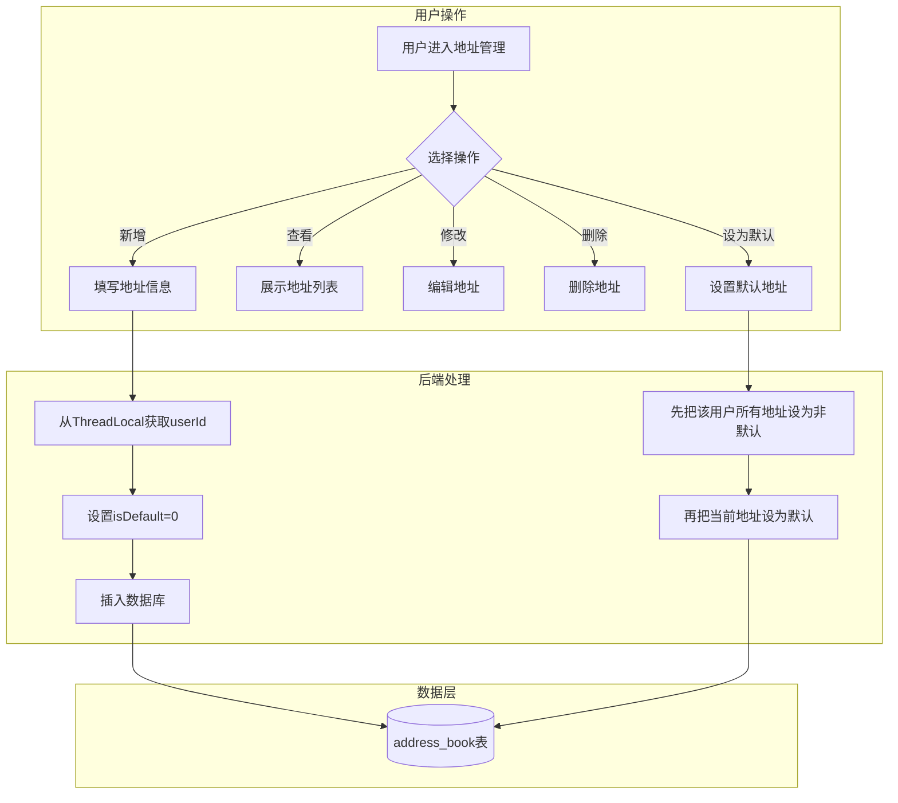
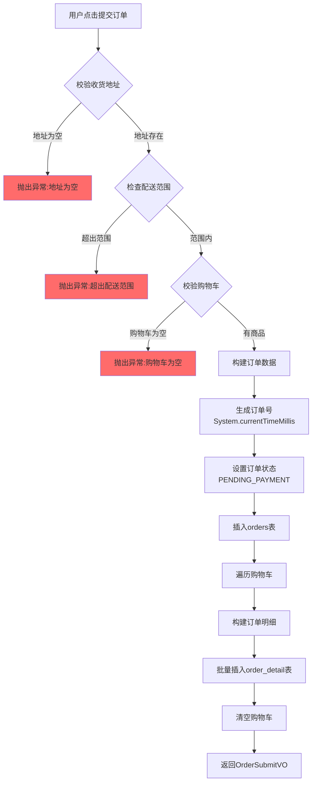
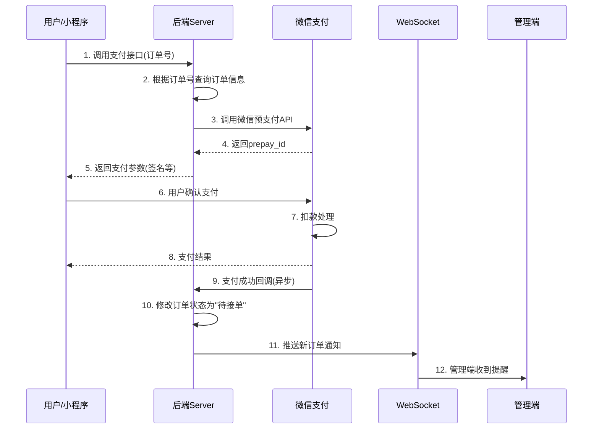
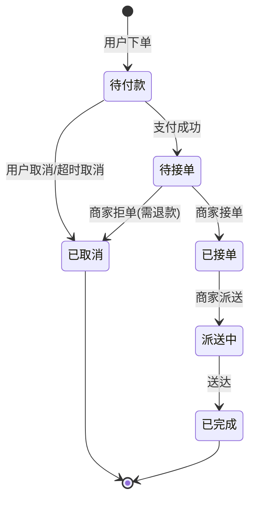

# 📚 核心业务模块详解

- [[Day08-12到18《订单支付》]]

## 一、地址簿模块

### 1.1 业务流程图



### 1.2 核心代码解析

**设置默认地址的实现**（这是一个经典的面试考点）：

```java
// AddressBookServiceImpl.java 第59-68行
public void setDefault(AddressBook addressBook) {
    // 第一步：把该用户的所有地址都设为非默认
    addressBook.setIsDefault(0);
    addressBook.setUserId(BaseContext.getCurrentId());  // 从ThreadLocal获取用户ID
    addressBookMapper.updateIsDefaultByUserId(addressBook);

    // 第二步：把当前地址设为默认
    addressBook.setIsDefault(1);
    addressBookMapper.update(addressBook);
}
```

### 1.3 🎯 面试考点

> **面试官常问：「设置默认地址这个功能，你是怎么实现的？为什么要分两步？」**

**标准回答：**
1. 因为数据库中只能有一个默认地址，所以需要先"取消旧的"，再"设置新的"
2. 先执行 `UPDATE address_book SET is_default = 0 WHERE user_id = ?`
3. 再执行 `UPDATE address_book SET is_default = 1 WHERE id = ?`

**追问1：「这两步操作需要加事务吗？」**
> ⚠️ **你的代码有问题！** 当前 `setDefault` 方法 **没有加 `@Transactional` 注解**！如果第一步成功、第二步失败，会导致用户没有默认地址！

**追问2：「能不能用一条SQL解决？」**
> 可以，但会更复杂。MySQL支持 `CASE WHEN`：
> ```sql
> UPDATE address_book 
> SET is_default = CASE WHEN id = #{id} THEN 1 ELSE 0 END 
> WHERE user_id = #{userId}
> ```

---

## 二、用户下单模块

### 2.1 业务流程图



### 2.2 核心代码解析

```java
// OrderServiceImpl.java 第69-117行
public OrderSubmitVO submitOrder(OrdersSubmitDTO ordersSubmitDTO) {
    // ========== 1. 参数校验阶段 ==========
    // 校验地址是否存在
    AddressBook addressBook = addressBookMapper.getById(ordersSubmitDTO.getAddressBookId());
    if (addressBook == null) {
        throw new AddressBookBusinessException(MessageConstant.ADDRESS_BOOK_IS_NULL);
    }

    // 调用百度地图API检查配送范围（5公里内）
    checkOutOfRange(addressBook.getCityName() + addressBook.getDistrictName() + addressBook.getDetail());

    // 校验购物车是否为空
    Long currentId = BaseContext.getCurrentId();  // ThreadLocal获取用户ID
    ShoppingCart shoppingCart = new ShoppingCart();
    shoppingCart.setUserId(currentId);
    List<ShoppingCart> shoppingCartList = shoppingCartMapper.list(shoppingCart);
    if (shoppingCartList == null || shoppingCartList.size() == 0) {
        throw new ShoppingCartBusinessException(MessageConstant.SHOPPING_CART_IS_NULL);
    }

    // ========== 2. 构建订单数据 ==========
    Orders order = new Orders();
    BeanUtils.copyProperties(ordersSubmitDTO, order);  // DTO -> Entity
    order.setPhone(addressBook.getPhone());
    order.setAddress(addressBook.getDetail());
    order.setConsignee(addressBook.getConsignee());
    order.setNumber(String.valueOf(System.currentTimeMillis()));  // ⚠️ 订单号生成
    order.setUserId(currentId);
    order.setStatus(Orders.PENDING_PAYMENT);  // 待付款状态
    order.setPayStatus(Orders.UN_PAID);       // 未支付
    order.setOrderTime(LocalDateTime.now());
    
    // ========== 3. 数据持久化 ==========
    orderMapper.insert(order);  // 插入订单主表

    // 构建订单明细
    ArrayList<OrderDetail> orderDetailList = new ArrayList<>();
    shoppingCartList.forEach(cart -> {
        OrderDetail orderDetail = new OrderDetail();
        BeanUtils.copyProperties(cart, orderDetail);
        orderDetail.setOrderId(order.getId());  // 关联订单ID
        orderDetailList.add(orderDetail);
    });
    orderDetailMapper.insertBatch(orderDetailList);  // 批量插入明细表

    // ========== 4. 清理购物车 ==========
    shoppingCartMapper.deleteByUserId(currentId);

    // ========== 5. 封装返回结果 ==========
    return OrderSubmitVO.builder()
            .id(order.getId())
            .orderNumber(order.getNumber())
            .orderAmount(order.getAmount())
            .orderTime(order.getOrderTime())
            .build();
}
```

### 2.3 🎯 面试考点

> **面试官常问：「用户下单这个接口，你考虑过哪些异常情况？」**

**标准回答：**
1. 地址为空 → 抛出 `AddressBookBusinessException`
2. 超出配送范围 → 调用百度地图API计算距离
3. 购物车为空 → 抛出 `ShoppingCartBusinessException`
4. 库存不足 → **这个项目没实现！面试时要主动说出来**

---

### ⚠️ 严重问题！我必须指出：

**问题1：订单号用时间戳生成有严重缺陷！**
```java
order.setNumber(String.valueOf(System.currentTimeMillis()));
```
- **并发场景下会重复！** 两个用户同一毫秒下单，订单号就重复了
- **面试必问优化方案：**
  - 雪花算法（Snowflake）
  - UUID
  - Redis自增ID + 日期前缀
  - 数据库自增ID + 业务前缀

**问题2：下单方法没有加 `@Transactional` 注解！**
```java
// 当前代码
public OrderSubmitVO submitOrder(OrdersSubmitDTO ordersSubmitDTO) {
    // ...
    orderMapper.insert(order);           // 步骤1：插入订单
    orderDetailMapper.insertBatch(...);  // 步骤2：插入明细
    shoppingCartMapper.deleteByUserId(...); // 步骤3：清空购物车
}
```
> 如果步骤2或步骤3失败，订单已经插入但数据不完整！**必须加事务！**

---

## 三、订单支付模块

### 3.1 业务流程图



### 3.2 核心代码解析

**支付接口：**
```java
// OrderServiceImpl.java 第126-150行
public OrderPaymentVO payment(OrdersPaymentDTO ordersPaymentDTO) throws Exception {
    Long userId = BaseContext.getCurrentId();
    User user = userMapper.getById(String.valueOf(userId));

    String orderNumber = ordersPaymentDTO.getOrderNumber();
    Orders orders = orderMapper.getByNumberAndUserId(orderNumber, userId);

    // 调用微信支付接口，生成预支付交易单
    JSONObject jsonObject = weChatPayUtil.pay(
            ordersPaymentDTO.getOrderNumber(),  // 商户订单号
            orders.getAmount(),                  // 金额
            "苍穹外卖订单" + orders.getId(),      // 商品描述
            user.getOpenid()                     // 用户openid
    );

    // 判断是否已支付
    if (jsonObject.getString("code") != null && 
        jsonObject.getString("code").equals("ORDERPAID")) {
        throw new OrderBusinessException("该订单已支付");
    }

    OrderPaymentVO vo = jsonObject.toJavaObject(OrderPaymentVO.class);
    vo.setPackageStr(jsonObject.getString("package"));
    return vo;
}
```

**支付成功回调：**
```java
// OrderServiceImpl.java 第158-180行
public void paySuccess(String outTradeNo) {
    Long userId = BaseContext.getCurrentId();
    Orders orderDB = orderMapper.getByNumberAndUserId(outTradeNo, userId);

    // 更新订单状态
    Orders orders = Orders.builder()
            .id(orderDB.getId())
            .status(Orders.TO_BE_CONFIRMED)  // 待接单
            .payStatus(Orders.PAID)          // 已支付
            .checkoutTime(LocalDateTime.now())
            .build();
    orderMapper.update(orders);

    // ========== WebSocket推送新订单提醒 ==========
    HashMap map = new HashMap();
    map.put("type", 1);  // 1=新订单 2=催单
    map.put("orderId", orders.getId());
    map.put("content", "订单号：" + outTradeNo);
    webSocketServer.sendToAllClient(JSON.toJSONString(map));
}
```

### 3.3 🎯 面试考点

> **面试官常问：「微信支付的流程是怎样的？为什么要用回调？」**

**标准回答：**

| 步骤 | 说明 |
|------|------|
| 1. 预支付 | 后端调用微信API，获取 `prepay_id` |
| 2. 签名 | 后端用私钥对参数签名，返回给前端 |
| 3. 唤起支付 | 前端用签名唤起微信支付 |
| 4. 回调通知 | 微信异步通知后端支付结果 |

**为什么用回调而不是轮询？**
- 用户可能关掉页面，但支付可能成功
- 网络原因导致前端没收到结果
- 回调是微信官方推荐的可靠方式

**追问1：「回调接口怎么保证安全性？」**
- 验证签名（微信用私钥签名，我们用公钥验证）
- 验证订单金额是否匹配
- 幂等处理（同一订单多次回调只处理一次）

**追问2：「如果回调失败了怎么办？」**
- 微信会重试（最多15次，间隔递增）
- 后端需要做幂等处理
- 可以做定时任务主动查询未支付订单

---

## 四、订单状态机



---

## 五、ThreadLocal 核心考点

```java
// BaseContext.java
public class BaseContext {
    public static ThreadLocal<Long> threadLocal = new ThreadLocal<>();

    public static void setCurrentId(Long id) {
        threadLocal.set(id);
    }

    public static Long getCurrentId() {
        return threadLocal.get();
    }

    public static void removeCurrentId() {
        threadLocal.remove();
    }
}
```

### 🎯 面试高频题

> **「ThreadLocal是什么？为什么用它存用户ID？」**

**回答要点：**
1. ThreadLocal 是线程本地变量，每个线程有独立副本
2. HTTP请求 = 一个线程，整个请求链路可以共享用户ID
3. 避免在方法参数中层层传递 userId

> **追问：「ThreadLocal会内存泄漏吗？怎么解决？」**

**关键点：**
- ThreadLocalMap 的 key 是弱引用，但 value 是强引用
- 线程池场景下线程复用，value 不会被回收
- **解决方案：用完必须调用 `remove()`**

> ⚠️ **你的代码潜在问题：** 需要在拦截器的 `afterCompletion` 中调用 `BaseContext.removeCurrentId()` 避免内存泄漏！

---

## 六、高并发优化建议

| 当前实现 | 生产环境优化 |
|---------|-------------|
| 订单号用时间戳 | **雪花算法** 或 **Redis自增+日期前缀** |
| 没有库存校验 | **Redis预减库存 + 数据库最终扣减** |
| 没有分布式锁 | **Redisson分布式锁** 防止超卖 |
| 同步下单 | **消息队列异步下单** 削峰填谷 |
| 直接查询数据库 | **Redis缓存热点数据** |

---

**你想深入了解哪个部分？** 比如：
1. 「详细讲解一下WebSocket是怎么实现订单提醒的」
2. 「给我讲讲事务失效的几种场景」
3. 「帮我看看购物车模块的Redis实现」