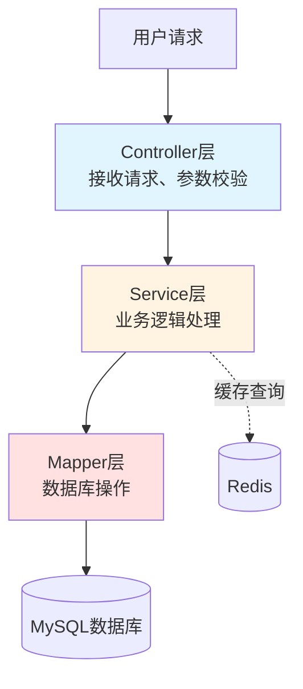
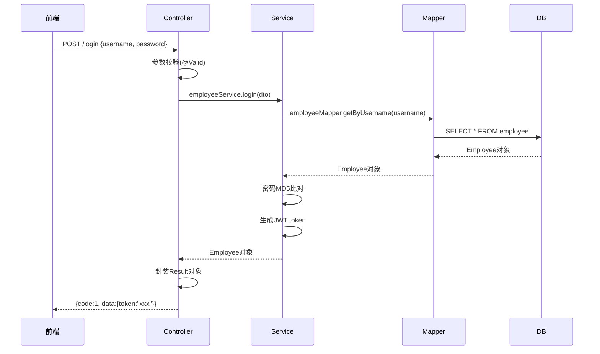

## 一、SpringBoot项目的典型结构

- [《苍穹外卖》概述](《苍穹外卖》概述)

### 1. **Maven多模块划分**（当前项目结构）

```
sky-take-out (父工程)
├── sky-common   (公共模块：工具类、常量、异常等)
├── sky-pojo     (实体类模块：Entity、DTO、VO)
└── sky-server   (核心业务模块：Controller、Service、Mapper)
```

**为什么这样划分？**
- **解耦**：各模块职责单一，common和pojo可以被多个服务复用
- **协作**：多人开发时可以各自负责不同模块，减少代码冲突
- **演进**：未来如果要拆分成微服务，改造成本低

---

### 2. **核心业务模块（sky-server）的分层结构**

让我画个图说明：



---

## 二、为什么要分三层架构？

### **核心原因：职责分离（Single Responsibility）**

| 层级 | 职责 | 举例（员工登录） |
|------|------|------------------|
| **Controller** | 接收HTTP请求、返回HTTP响应 | 接收POST `/admin/employee/login`，返回JWT token |
| **Service** | 业务逻辑处理、事务管理 | 校验密码、生成token、记录登录日志 |
| **Mapper** | 数据访问、SQL执行 | `SELECT * FROM employee WHERE username = ?` |

### **实际业务流程示例**（员工登录）



---

## 三、三层架构的深层优势

### 1. **可维护性**
> 「修改某个功能时，知道改哪一层」

- 需求变更：修改业务规则 → 只改Service
- 性能优化：加缓存 → 在Service层加Redis逻辑
- 数据库迁移：MySQL改PostgreSQL → 只改Mapper的SQL

### 2. **可测试性**
> 「每一层都可以单独测试」

```java
// Controller单元测试：Mock Service
@Test
void testLogin() {
    when(employeeService.login(any())).thenReturn(employee);
    // 测试参数校验、返回格式
}

// Service单元测试：Mock Mapper
@Test
void testLoginBusinessLogic() {
    when(employeeMapper.getByUsername("admin")).thenReturn(employee);
    // 测试密码校验、异常处理
}
```

### 3. **可扩展性**
> 「在高并发场景下怎么优化？」

- **Controller层**：加限流注解（Sentinel）
- **Service层**：加分布式锁（Redisson）、异步处理（@Async）
- **Mapper层**：读写分离、分库分表（ShardingSphere）

---

## 四、⚠️ 面试中通常这样问

### **问题1：三层架构中事务应该加在哪一层？**
**答案**：Service层  
**原因**：  
- 一个业务操作可能涉及多个Mapper调用，需要保证原子性
- Controller处理HTTP请求，不应该管理事务
- 示例：下单操作需要同时操作订单表、订单明细表、扣减库存

```java
@Service
public class OrderServiceImpl {
    @Transactional // 事务控制在Service层
    public void submitOrder(OrderDTO orderDTO) {
        orderMapper.insert(order);        // 插入订单
        orderDetailMapper.insert(details); // 插入订单明细
        dishMapper.updateStock(dishId);    // 扣减库存
    }
}
```

### **问题2：为什么不直接在Controller里写SQL？**
**答案**：  
1. **违反单一职责**：Controller负责HTTP交互，不应该关心SQL细节
2. **代码复用困难**：同样的查询逻辑在多个Controller里重复
3. **事务管理困难**：无法保证多个SQL操作的原子性
4. **测试困难**：需要启动整个Web容器才能测试

### **追问：Service层应该依赖Controller吗？**
**答案**：绝对不能！  
- 依赖方向：Controller → Service → Mapper（单向依赖）
- 如果反向依赖，会造成**循环依赖**，破坏分层架构

---

## 五、你的项目里的具体体现

在"苍穹外卖"中：
- **Controller**：sky-server/src/main/java/com/sky/controller（分admin和user两个包）
- **Service**：service（接口定义）+ impl包（实现类）
- **Mapper**：mapper（接口）+ resources/mapper（XML）

---

## 💡 总结口诀

> **Controller收参数，Service写逻辑，Mapper操数据**  
> **事务加Service，缓存看需求，依赖向下走**

准备面试时，你可以用"员工登录"或"下单流程"作为例子，展示你对三层架构的理解。记住一定要强调**职责分离**和**单向依赖**这两个核心原则！