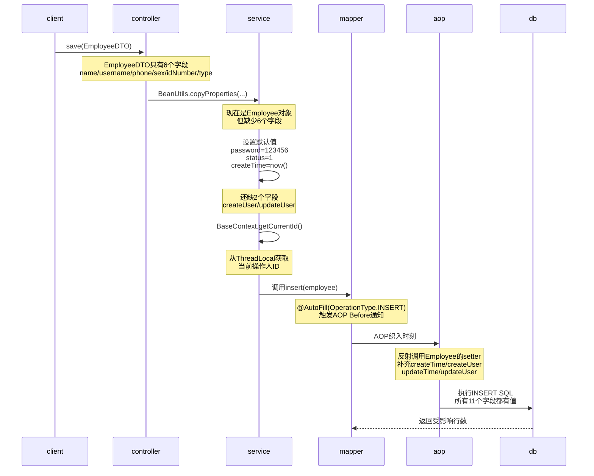
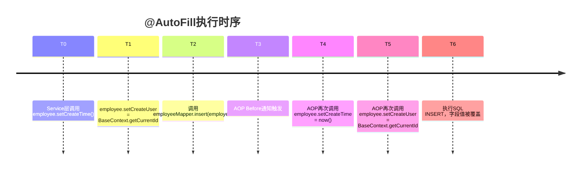

完美！现在我为你设计一份**架构师级的学习计划**。这个计划将通过"删除→理解→复现"的方式，让你深刻理解整个员工管理体系。

## Plan: 员工管理模块深度学习与代码复现

**TL;DR** — 通过删除EmployeeServiceImpl.save()方法，逐步理解数据流转、自动填充机制、异常处理等5个核心环节。分为4个学习阶段：（1）业务流梳理，（2）关键代码分析，（3）对照还原实现，（4）延伸技术深化。最终目标是掌握Sky Takeout的CRUD通用模式，为面试准备架构级答案。

---

### **阶段1：业务流梳理（理论基础）**

首先，我为你绘制3张图，理解员工新增的完整业务流：

#### **图1：HTTP请求到数据库全链路**

```mermaid
graph LR
    A["POST /admin/employee<br/>EmployeeDTO<br/>name=张三<br/>username=zhangsan"] -->|Controller层| B["EmployeeController<br/>.save流程"]
    B -->|1. BeanUtils拷贝| C["生成Employee对象<br/>id=null(自增)<br/>name=张三"]
    C -->|2. 设置默认值| D["password=MD5<br/>status=1<br/>createTime=now"]
    D -->|3. 从ThreadLocal获取| E["createUser=BaseContext<br/>.getCurrentId"]
    E -->|@AutoFill AOP切面| F["Before通知<br/>反射调用setter<br/>填充4个字段"]
    F -->|4. 调用Mapper| G["EmployeeMapper<br/>.insert"]
    G -->|5. MyBatis代理| H["SQL执行<br/>INSERT INTO employee"]
    H -->|6. DB返回自增ID| I["Employee表<br/>新记录"]
    I -->|7. 返回结果| J["Result{code=1<br/>msg=新建成功}"]
```

这个流程的关键：每一步都有明确的职责分工。

#### **图2：几个关键对象的变化**



**关键认知**：
- ✅ DTO来自客户端，字段最少（只有业务必需）
- ✅ Service层负责补充业务逻辑字段（密码、状态）
- ✅ AOP负责补充审计字段（操作人、操作时间）
- ✅ Mapper执行数据库操作

#### **图3：EmployeeServiceImpl.save的决策树**

```mermaid
flowchart TD
    A["save<br/>EmployeeDTO"] -->|Step1| B["验证username<br/>非空?"]
    B -->|否| C["抛出异常<br/>username不能为空"]
    B -->|是| D["调用<br/>BeanUtils<br/>.copyProperties"]
    D -->|Step2| E["设置4个默认值"]
    E -->|password| E1["MD5<br/>123456"]
    E -->|status| E2["1启用"]
    E -->|createTime<br/>updateTime| E3["LocalDateTime.now"]
    E -->|createUser<br/>updateUser| E4["BaseContext<br/>.getCurrentId"]
    E1 --> F["Step3: 调用<br/>EmployeeMapper<br/>.insert"]
    E2 --> F
    E3 --> F
    E4 --> F
    F --> G["AOP切面<br/>Before通知"]
    G -->|@AutoFill<br/>INSERT| H["再次设置4个字段<br/>覆盖了createTime等"]
    H --> I["执行SQL<br/>INSERT"]
    I -->|成功| J["返回<br/>Result.success"]
    I -->|SQL异常<br/>如username重复| K["SQLIntegrity<br/>ConstraintViolation<br/>异常"]
    K --> L["GlobalException<br/>Handler捕获"]
    L --> M["解析异常信息<br/>提取冲突值"]
    M --> N["返回<br/>Result.error<br/>提示友好"]
```

---

### **阶段2：关键代码深度分析**

#### **2.1 - save方法的完整实现应包含的要素**

EmployeeServiceImpl.java中，save方法需要：

| 要素 | 代码行为 | 技术细节 |
|------|--------|---------|
| **1. 参数验收** | `public void save(EmployeeDTO employeeDTO)` | DTO作为参数，避免直接传入Entity |
| **2. DTO→Entity转换** | `BeanUtils.copyProperties(employeeDTO, employee)` | 自动映射同名字段 |
| **3. 业务默认值** | `employee.setPassword(DigestUtils.md5DigestAsHex(...))` | 密码加密（需字符集UTF-8） |
| **4. 业务状态初始化** | `employee.setStatus(StatusConstant.ENABLE)` | 新员工默认启用 |
| **5. 时间戳设置** | `LocalDateTime.now()` | 创建和修改时间初始化 |
| **6. 审计字段获取** | `BaseContext.getCurrentId()` | ThreadLocal获取当前操作人 |
| **7. Mapper调用** | `employeeMapper.insert(employee)` | MyBatis代理执行SQL |
| **8. 异常处理** | 由`@GlobalExceptionHandler`统一处理 | SQLIntegrityConstraintViolationException捕获重复用户名 |

#### **2.2 - 关键技术细节解析**

**① MD5密码加密（为什么这样写？）**

原代码：
```java
employee.setPassword(DigestUtils.md5DigestAsHex(
    password.getBytes(StandardCharsets.UTF_8)));
```

**在面试中怎么说？**
> "我们使用Spring的DigestUtils工具类对密码进行MD5加密，指定UTF-8字符集确保字符编码一致。但这个做法在生产环境有安全隐患，建议改用bcrypt或argon2加盐加密。"

**② ThreadLocal获取操作人（为什么不直接参数传递？）**

使用ThreadLocal的好处：
- 避免每个service方法都多一个userId参数
- 请求链路中任意位置可获取用户身份
- 配合拦截器，自动隔离不同请求的上下文

**关键风险**：
> ⚠️ 如果ThreadLocal在拦截器afterCompletion()中没有调用`removeCurrentId()`，会导致**内存泄漏**！用户信息残留在线程池的线程中。

**③ @AutoFill注解的AOP织入时机（为什么会重复填充？）**



**观察**：createTime/createUser被设置了**两次**！
- 第一次：Service层手工设置
- 第二次：AOP切面覆盖

这看起来冗余，但实际上是**安全保障**：确保审计字段绝对不会被遗漏或篡改。

---

### **阶段3：对照原代码逐步还原（实践部分）**

#### **第一步：理解现有实现**

打开EmployeeServiceImpl.java，找到save方法，逐行阅读并标注：

1. **行号标注**：标注关键行所在的行号
2. **参数追踪**：EmployeeDTO包含哪些字段，出自谁？
3. **字段补充**：哪些字段是Service补充的？哪些是AOP补充的？

#### **第二步：删除vs理解**

当你准备删除save方法时，**请不要直接删除**！而是这样做：

1. **备份**：在该方法上方写注释，把整个方法逻辑记录下来
2. **验证理解**：能否凭记忆写出关键步骤的伪代码？
3. **查看调用链**：使用IDE的"Find Usages"找出哪些地方调用了save
   - 预期：EmployeeController.save()、EmployeeService接口

#### **第三步：逐步复现**

使用EmployeeService.java接口作为参考：

```java
// 需要实现这个签名
void save(EmployeeDTO employeeDTO);
```

按以下顺序复现：

**Checkpoint 1 — 参数和对象创建**
```
1. 接收 EmployeeDTO employeeDTO
2. 创建 Employee employee = new Employee()
3. 调用 BeanUtils.copyProperties(employeeDTO, employee)
```

**Checkpoint 2 — 业务逻辑初始化**
```
4. 从 PasswordConstant 或 配置 中读取默认密码
5. 使用 DigestUtils.md5DigestAsHex() 加密，指定字符集：StandardCharsets.UTF_8
6. 调用 employee.setStatus(StatusConstant.ENABLE)
   // StatusConstant 在哪个包？
```

**Checkpoint 3 — 审计信息获取**
```
7. 调用 BaseContext.getCurrentId() 获取操作人ID
8. 分别赋值给 createUser 和 updateUser
   // 这里能否省掉？为什么 updateUser 也要设置？
```

**Checkpoint 4 — Mapper调用**
```
9. 调用 employeeMapper.insert(employee)
10. 如果抛异常，由全局异常处理器 GlobalExceptionHandler 捕获
    // 不需要在service层catch，因为已经切面织入了
```

---

### **阶段4：技术深化与面试准备**

#### **4.1 - 关键问题演练**

当你复现完save方法后，思考以下问题（这些是**高频面试题**）：

**Q1：为什么EmployeeDTO中没有password字段，而Entity中有？**

A：DTO代表来自客户端的数据，只包含客户端需要输入的字段。password不应该由客户端直接设置，而由服务器根据业务规则生成默认密码。这是**最小权限原则**的体现。

**Q2：为什么上面设置了createTime，AOP切面还要再设置一遍？**

A：这是冗余设计，但是**防御性编程**的最佳实践。AOP确保即使开发者忘记手工赋值，审计字段也不会缺失。在高并发下，这种重复赋值的开销极小。

**Q3：如果两个管理员同时新增员工，createUser会不会串联？**

A：不会。因为使用了ThreadLocal隔离，每个请求获得独立的user上下文。前提是拦截器正确（每个请求都setCurrentId()，请求结束都removeCurrentId()）。

**Q4：能否将save方法改成异步？会有什么风险？**

A：可以用@Async，但需要注意：
- ThreadLocal会失效（异步线程与请求线程不同）
- 需要在主线程中拷贝ThreadLocal值到子线程
- 数据库事务需要重新考虑

**Q5：高并发场景下，save方法的性能瓶颈在哪？**

A：
1. **数据库：** INSERT操作本身很快，但唯一索引冲突检查有开销
2. **AOP反射：** 反射获取字段、调用setter有开销，可用字节码生成缓存
3. **ThreadLocal获取：** HashTable查询，通常不是瓶颈

---

### **阶段5：验证检查**

完成复现后，进行这些验证：

**✅ 功能验证**
- [ ] 使用Postman调用POST /admin/employee，验证员工是否创建成功
- [ ] 检查数据库中password字段是否MD5加密
- [ ] 检查createTime/createUser是否自动填充

**✅ 代码检查**
- [ ] IDE中使用Ctrl+F查找save，确认EmployeeController能正确调用
- [ ] 查看EmployeeService接口，save方法签名是否一致
- [ ] 检查是否导入了所有必要的类（BaseContext、StatusConstant等）

**✅ 异常检查**
- [ ] 尝试创建username重复的员工，是否收到友好的错误提示
- [ ] 查看GlobalExceptionHandler是否捕获了SQLIntegrityConstraintViolationException

**✅ 对比检查**
- [ ] 将你复现的save与分类模块的CategoryServiceImpl.save对比，找出异同
- [ ] 两者都使用了@AutoFill吗？都有业务验证吗？

---

### **Decisions**

- **选择对照学习而非空白重写**：这个方式更高效，能够理解项目的原设计思想
- **仅聚焦EmployeeServiceImpl**：免得分散注意力，但在对比阶段可扩展
- **强调ThreadLocal风险和AOP冗余的必要性**：这些是架构级思考，面试的加分项

---

好了！这个计划涵盖了从业务流梳理→代码分析→实践复现→技术深化的完整路径。你现在可以开始：

**立即行动**：
1. 打开EmployeeServiceImpl.java，定位save方法
2. 阅读完整代码并做标注
3. 查看调用链：EmployeeController.java的save接口
4. 理解DTO和Entity的映射关系

之后，我会陪你逐步复现。有任何卡点，随时告诉我具体的代码行和疑惑点。加油！🚀