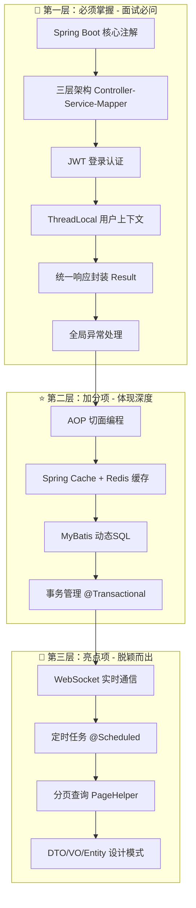
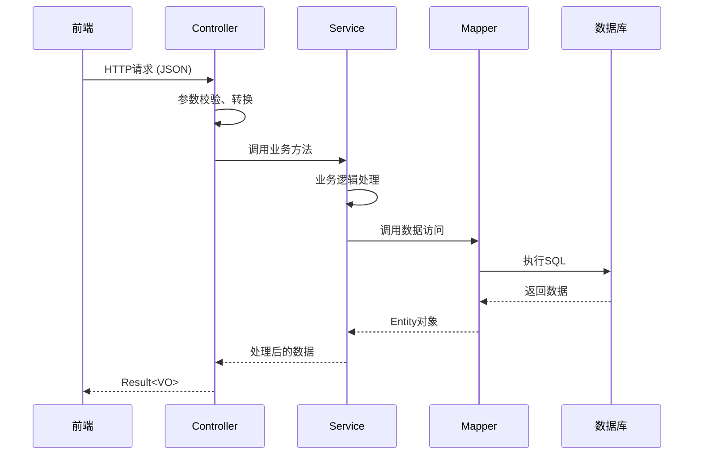
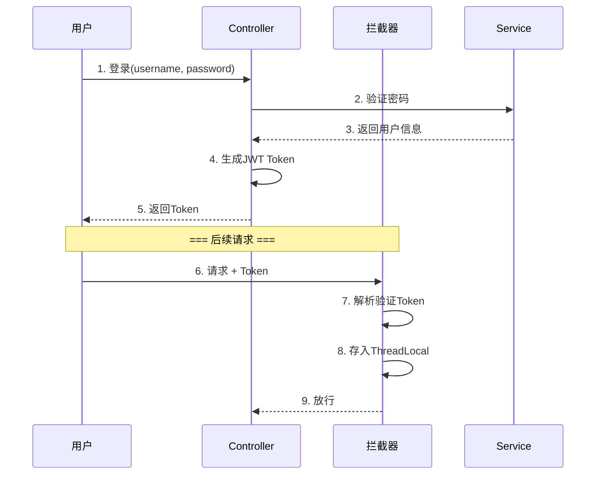
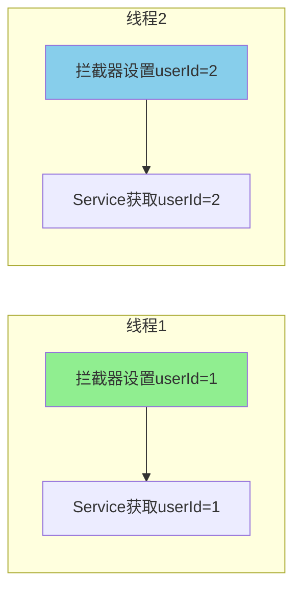
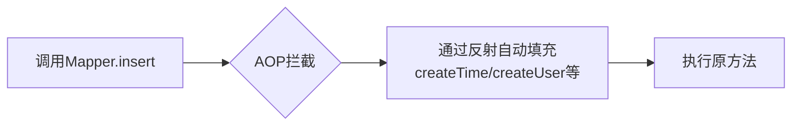

# 📚 苍穹外卖项目 - 面试必学知识点清单

作为面试官，我把这个项目的知识点分为**三个层次**，你按顺序学习：



---

## 🎯 第一层：必须掌握（面试必问）

### 1️⃣ Spring Boot 核心注解

从这个项目你必须学会的注解：

| 注解                         | 位置         | 作用                                | 面试怎么问              |
| -------------------------- | ---------- | --------------------------------- | ------------------ |
| `@SpringBootApplication`   | 启动类        | 组合注解，包含自动配置                       | "这个注解包含哪几个注解？"     |
| `@RestController`          | Controller | = `@Controller` + `@ResponseBody` | "和@Controller的区别？" |
| `@RequestMapping`          | Controller | 定义请求路径                            | "GET和POST怎么区分？"    |
| `@Autowired`               | 属性注入       | 依赖注入                              | "和@Resource的区别？"   |
| `@Service` / `@Component`  | 业务类        | 注册为Spring Bean                    | "这几个注解有什么区别？"      |
| `@Configuration` + `@Bean` | 配置类        | 声明配置和Bean                         | "什么时候用@Bean？"      |

---

### 2️⃣ 三层架构



> **📌 面试追问：** "为什么要分三层？直接在Controller里写SQL不行吗？"
> 
> **答：** 职责分离、便于测试、便于维护。比如换数据库只需要改Mapper层。

---

### 3️⃣ JWT 登录认证（重点！）

项目中的实现在 JwtTokenAdminInterceptor.java



> **📌 面试必问：**
> 1. "JWT由哪三部分组成？"（Header.Payload.Signature）
> 2. "Token过期了怎么办？"（刷新Token机制 / 双Token方案）
> 3. "JWT和Session的区别？"（无状态 vs 有状态）

---

### 4️⃣ ThreadLocal（超高频考点！）

项目中的实现在 BaseContext.java

```java
public class BaseContext {
    public static ThreadLocal<Long> threadLocal = new ThreadLocal<>();
    
    public static void setCurrentId(Long id) {
        threadLocal.set(id);  // 拦截器中设置
    }
    
    public static Long getCurrentId() {
        return threadLocal.get();  // Service中获取
    }
}
```



> **📌 面试必问：**
> 1. "ThreadLocal的原理？"（每个线程有自己的ThreadLocalMap）
> 2. **"ThreadLocal会内存泄漏吗？怎么解决？"**（key是弱引用，value是强引用，用完要remove）
> 3. "为什么不用Session存userId？"（分布式环境Session不共享）

> ⚠️ **我注意到这个项目有个问题：** `BaseContext` 没有在请求结束时调用 `removeCurrentId()`，这在高并发下可能导致内存泄漏！这是个面试可以提的优化点。

---

### 5️⃣ 统一响应封装

项目中的实现在 Result.java

```java
public class Result<T> {
    private Integer code;  // 1成功，0失败
    private String msg;    // 错误信息
    private T data;        // 数据（泛型）
}
```

> **📌 面试会问：** "为什么要统一封装响应？" → 前端好处理、便于全局异常处理

---

### 6️⃣ 全局异常处理

项目中的实现在 GlobalExceptionHandler.java

```java
@RestControllerAdvice  // 全局控制器增强
public class GlobalExceptionHandler {
    
    @ExceptionHandler  // 捕获指定异常
    public Result exceptionHandler(BaseException ex){
        return Result.error(ex.getMessage());
    }
}
```

> **📌 面试会问：** 
> 1. "`@RestControllerAdvice`和`@ControllerAdvice`的区别？"
> 2. "如果有多个ExceptionHandler，执行顺序是什么？"（精确匹配优先）

---

## ⭐ 第二层：加分项

### 7️⃣ AOP 切面编程（项目亮点！）

项目用AOP实现了**公共字段自动填充**（createTime, updateTime, createUser, updateUser）

文件在 AutoFillAspect.java



> **📌 面试必问：**
> 1. "AOP的几种通知类型？"（@Before, @After, @Around, @AfterReturning, @AfterThrowing）
> 2. "AOP的实现原理？"（JDK动态代理 vs CGLIB）
> 3. "什么情况下AOP会失效？"（自调用、private方法、final类）

---

### 8️⃣ Redis 缓存

项目使用了 `@EnableCaching` 和 Spring Cache

> **📌 面试必问：**
> 1. "缓存穿透、缓存击穿、缓存雪崩是什么？怎么解决？"
> 2. "Redis的数据结构有哪些？分别适合什么场景？"
> 3. "如何保证缓存和数据库的一致性？"

---

### 9️⃣ 事务管理

项目使用了 `@EnableTransactionManagement` 和 `@Transactional`

> **📌 面试必问：**
> 1. **"@Transactional什么情况下会失效？"**（自调用、非public、异常被catch、数据库不支持）
> 2. "事务的传播行为有哪些？REQUIRED和REQUIRES_NEW的区别？"
> 3. "事务的隔离级别？MySQL默认是什么？"

---

## 🚀 第三层：亮点项

### 🔟 定时任务

项目中的 OrderTask.java 用于处理超时订单：

```java
@Scheduled(cron = "0 * * * * ?")  // 每分钟执行
public void processTimeoutOrder() {
    // 取消15分钟未支付的订单
}
```

> **📌 面试会问：** "分布式环境下定时任务重复执行怎么办？"（分布式锁 / XXL-Job / Elastic-Job）

---

### 1️⃣1️⃣ WebSocket

项目用WebSocket实现来单提醒、催单提醒

> **📌 面试会问：** "WebSocket和HTTP的区别？" "什么时候用WebSocket？"

---

## 📋 总结：面试必背清单

| 优先级 | 知识点 | 对应项目文件 | 面试考频 |
|--------|--------|-------------|---------|
| ⭐⭐⭐ | ThreadLocal | BaseContext.java | 🔥🔥🔥 |
| ⭐⭐⭐ | JWT认证 | JwtTokenAdminInterceptor.java | 🔥🔥🔥 |
| ⭐⭐⭐ | AOP原理 | AutoFillAspect.java | 🔥🔥🔥 |
| ⭐⭐⭐ | 事务失效场景 | OrderServiceImpl.java | 🔥🔥🔥 |
| ⭐⭐⭐ | 全局异常处理 | GlobalExceptionHandler.java | 🔥🔥 |
| ⭐⭐ | Redis缓存 | `RedisConfiguration.java` | 🔥🔥🔥 |
| ⭐⭐ | MyBatis动态SQL | `mapper/*.xml` | 🔥🔥 |
| ⭐ | 定时任务 | OrderTask.java | 🔥 |
| ⭐ | WebSocket | `WebSocketServer.java` | 🔥 |

---

## 🎯 学习建议

1. **先把第一层6个知识点吃透**，这是面试的基本盘
2. 每个知识点都**手写一遍代码**，不要只看
3. 准备好**面试话术**：用"这个项目中我用到了xxx，具体是在xxx场景下..."这种句式

---

**你想从哪个知识点开始深入学习？我可以带你逐行读代码，并模拟面试追问！** 💪