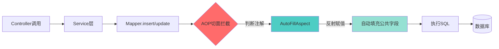
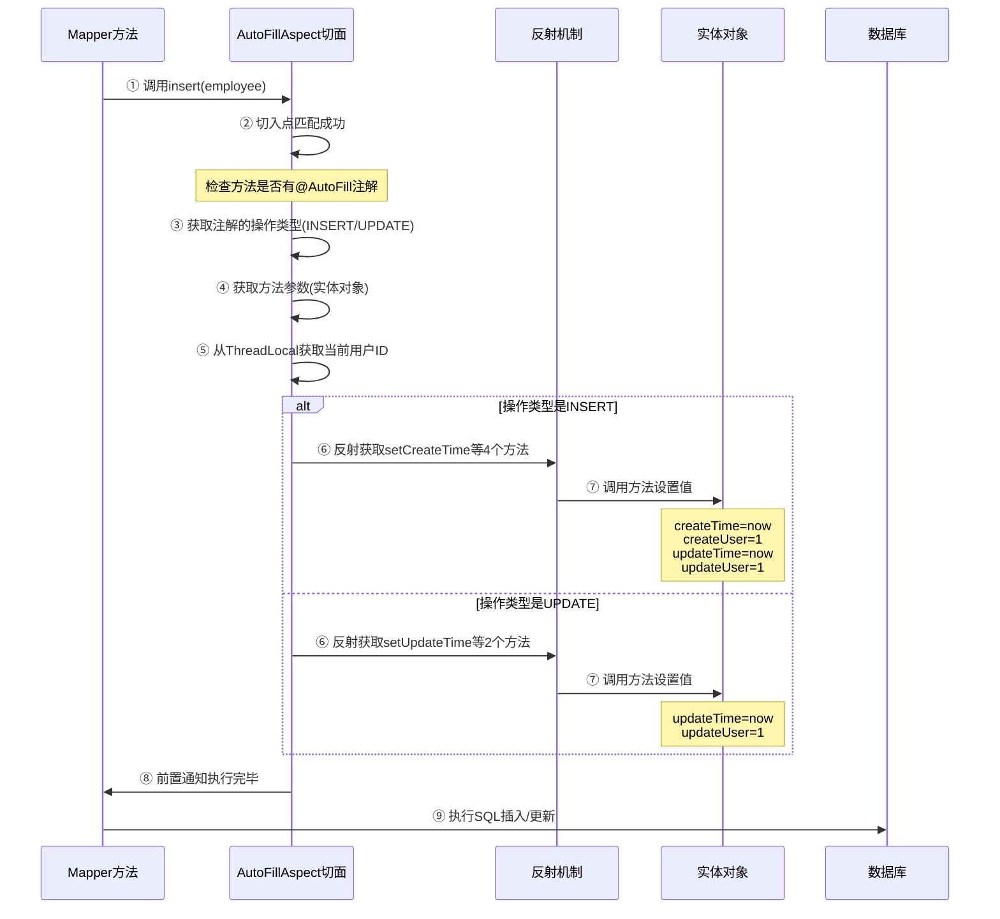

## 📌 一、AOP是什么？（先理解概念）

**通俗解释**：你想象一下你是一个快递员，每次送快递都要做这些事情：
1. 拍照取证（送之前）
2. 送快递（核心业务）
3. 记录送货时间（送之后）

如果每个地方送快递都要写这3步代码，太麻烦了。AOP就是说："凡是送快递的方法，我自动帮你拍照和记录，你只管专心送快递就行。"

**专业术语**：AOP（面向切面编程）是一种编程思想，可以在不修改源代码的情况下，给程序动态地添加额外功能。

---

## 🎯 二、项目中的业务需求（为什么要用AOP？）

### 业务场景
在外卖系统中，几乎所有数据表都有这4个公共字段：

```java
createTime    // 创建时间
createUser    // 创建人ID
updateTime    // 修改时间  
updateUser    // 修改人ID
```

**痛点**：
- 每次新增员工/菜品/套餐/分类时，都要手动设置这4个字段
- 每次修改数据时，都要手动更新 `updateTime` 和 `updateUser`
- 代码重复，容易遗漏，维护困难

### 传统写法（没有AOP）

```java
// Service层代码 - 太冗余了！
public void addEmployee(Employee emp) {
    emp.setCreateTime(LocalDateTime.now());    // 手动设置
    emp.setCreateUser(getCurrentUserId());      // 手动设置
    emp.setUpdateTime(LocalDateTime.now());     // 手动设置
    emp.setUpdateUser(getCurrentUserId());      // 手动设置
    employeeMapper.insert(emp);
}

public void updateEmployee(Employee emp) {
    emp.setUpdateTime(LocalDateTime.now());     // 又要手动设置
    emp.setUpdateUser(getCurrentUserId());      // 又要手动设置
    employeeMapper.update(emp);
}
```

**问题**：10个Service方法就要重复10次！

---

## 🏗️ 三、AOP设计方案（项目中的实现）

### 核心组件架构



### 1️⃣ **自定义注解** `@AutoFill`

AutoFill.java

```java
@Target(ElementType.METHOD)  // 只能标记在方法上
@Retention(RetentionPolicy.RUNTIME)  // 运行时生效
public @interface AutoFill {
    OperationType value();  // 标记是INSERT还是UPDATE
}
```

**作用**：给Mapper方法打标签，告诉AOP："这个方法需要自动填充！"

---

### 2️⃣ **操作类型枚举** `OperationType`

OperationType.java

```java
public enum OperationType {
    INSERT,  // 新增：填充4个字段
    UPDATE   // 修改：填充2个字段
}
```

---

### 3️⃣ **切面类** `AutoFillAspect`（核心！）

AutoFillAspect.java

#### **业务流程图**



#### **核心代码解析**

```java
@Aspect
@Component
@Slf4j
public class AutoFillAspect {

    // ===== 步骤1: 定义切入点 =====
    @Pointcut("execution(* com.sky.mapper.*.*(..)) && @annotation(com.sky.annotation.AutoFill)")
    public void autoFillPointCut() {}
    
    /* 解释切入点表达式：
       execution(* com.sky.mapper.*.*(..))  
       - 第一个*: 返回值任意类型
       - com.sky.mapper.*: mapper包下的任意类
       - .*(..)): 任意方法，任意参数
       
       && @annotation(com.sky.annotation.AutoFill)
       - 并且该方法必须有@AutoFill注解
    */

    // ===== 步骤2: 前置通知 =====
    @Before("autoFillPointCut()")
    public void autoFill(JoinPoint joinPoint) {
        
        // ① 获取方法上的注解，判断是INSERT还是UPDATE
        MethodSignature signature = (MethodSignature) joinPoint.getSignature();
        AutoFill autoFill = signature.getMethod().getAnnotation(AutoFill.class);
        OperationType operationType = autoFill.value();

        // ② 获取方法的第一个参数（实体对象）
        Object[] args = joinPoint.getArgs();
        if (args == null || args.length == 0) return;
        Object entity = args[0];  // Employee、Dish、Setmeal等

        // ③ 准备要填充的数据
        LocalDateTime now = LocalDateTime.now();
        Long currentId = BaseContext.getCurrentId();  // 从ThreadLocal获取

        // ④ 根据操作类型，使用反射调用setter方法
        if (operationType == OperationType.INSERT) {
            // 新增：填充4个字段
            Method setCreateTime = entity.getClass()
                .getDeclaredMethod("setCreateTime", LocalDateTime.class);
            Method setCreateUser = entity.getClass()
                .getDeclaredMethod("setCreateUser", Long.class);
            Method setUpdateTime = entity.getClass()
                .getDeclaredMethod("setUpdateTime", LocalDateTime.class);
            Method setUpdateUser = entity.getClass()
                .getDeclaredMethod("setUpdateUser", Long.class);

            setCreateTime.invoke(entity, now);
            setCreateUser.invoke(entity, currentId);
            setUpdateTime.invoke(entity, now);
            setUpdateUser.invoke(entity, currentId);
            
        } else if (operationType == OperationType.UPDATE) {
            // 修改：填充2个字段
            Method setUpdateTime = entity.getClass()
                .getDeclaredMethod("setUpdateTime", LocalDateTime.class);
            Method setUpdateUser = entity.getClass()
                .getDeclaredMethod("setUpdateUser", Long.class);

            setUpdateTime.invoke(entity, now);
            setUpdateUser.invoke(entity, currentId);
        }
    }
}
```

---

### 4️⃣ **实际使用场景**

#### Mapper层标注注解

EmployeeMapper.java

```java
@Mapper
public interface EmployeeMapper {

    @AutoFill(OperationType.INSERT)  // 🔥 标记：这个方法需要自动填充
    void insert(Employee employee);

    @AutoFill(OperationType.UPDATE)  // 🔥 更新操作也自动填充
    void update(Employee employee);
}
```

#### Service层无需关心公共字段

```java
@Service
public class EmployeeServiceImpl implements EmployeeService {

    public void save(Employee employee) {
        // 不需要手动设置createTime等字段，AOP会自动处理！
        employeeMapper.insert(employee);
    }

    public void update(Employee employee) {
        // 不需要手动设置updateTime，AOP会自动处理！
        employeeMapper.update(employee);
    }
}
```

---

## ⚠️ 代码漏洞分析（划重点！）

我在代码中发现了一个**严重的BUG**：

AutoFillAspect.java

```java
} else if (operationType == operationType.UPDATE) {  // ❌ BUG!
```

**问题**：这里应该是 `== OperationType.UPDATE`，但写成了 `== operationType.UPDATE`

**后果**：
- 小写的 `operationType` 是注解上获取的值（比如INSERT）
- `operationType.UPDATE` 相当于 `OperationType.INSERT.UPDATE`（实际上是UPDATE枚举）
- 当INSERT操作时，这个条件永远是false，不会执行UPDATE分支（虽然逻辑上没问题）
- 但如果operationType是null，会抛**空指针异常**！

**正确写法**：

```java
} else if (operationType == OperationType.UPDATE) {
```

**面试加分点**：如果面试官让你review这段代码，你能指出这个bug，会大大加分！

---

## 🚀 四、更优的设计方案（进阶）

### 方案1：使用MyBatis-Plus的自动填充（推荐）

在大厂中，更常用 **MyBatis-Plus** 的 `MetaObjectHandler`：

```java
@Component
public class MyMetaObjectHandler implements MetaObjectHandler {

    @Override
    public void insertFill(MetaObject metaObject) {
        this.strictInsertFill(metaObject, "createTime", LocalDateTime.class, LocalDateTime.now());
        this.strictInsertFill(metaObject, "createUser", Long.class, BaseContext.getCurrentId());
        this.strictUpdateFill(metaObject, "updateTime", LocalDateTime.class, LocalDateTime.now());
        this.strictUpdateFill(metaObject, "updateUser", Long.class, BaseContext.getCurrentId());
    }

    @Override
    public void updateFill(MetaObject metaObject) {
        this.strictUpdateFill(metaObject, "updateTime", LocalDateTime.class, LocalDateTime.now());
        this.strictUpdateFill(metaObject, "updateUser", Long.class, BaseContext.getCurrentId());
    }
}
```

**优点**：
- 无需自定义注解
- 无需反射（性能更好）
- 代码更简洁

---

### 方案2：数据库触发器（不推荐）

```sql
CREATE TRIGGER auto_fill_time 
BEFORE INSERT ON employee 
FOR EACH ROW 
SET NEW.create_time = NOW();
```

**缺点**：
- 数据库耦合太高
- 无法获取当前用户ID（数据库不知道是谁操作的）

---

### 方案3：审计框架 Spring Data JPA（适合JPA项目）

```java
@EntityListeners(AuditingEntityListener.class)
public class Employee {
    @CreatedDate
    private LocalDateTime createTime;
    
    @CreatedBy
    private Long createUser;
}
```

---

## 🎤 五、面试高频题（必背！）

### 🔥 基础题（必问）

#### 1. **什么是AOP？有哪些应用场景？**

**标准回答**：
> AOP是面向切面编程，可以在不修改源代码的情况下，给程序动态添加功能。核心概念包括切面、切点、通知、连接点。
> 
> **应用场景**：
> - 日志记录
> - 权限校验
> - 事务管理
> - 性能监控
> - 公共字段自动填充

#### 2. **AOP的核心概念有哪些？**

| 概念 | 说明 | 项目中的体现 |
|-----|------|------------|
| **切面 (Aspect)** | 封装横切关注点的类 | `@Aspect` 标注的 AutoFillAspect |
| **切点 (Pointcut)** | 定义在哪里切入 | `@Pointcut("execution(...)...")` |
| **通知 (Advice)** | 具体增强逻辑 | `@Before` 标注的 autoFill方法 |
| **连接点 (JoinPoint)** | 程序执行的某个点 | Mapper的insert/update方法 |
| **目标对象 (Target)** | 被代理的对象 | EmployeeMapper实现类 |

#### 3. **项目中AOP具体是怎么实现的？**

**回答框架**（展示你对整体的把握）：
> 我们项目中用AOP实现了公共字段自动填充。
> 
> **设计思路**：
> 1. 自定义 `@AutoFill` 注解，标记需要填充的Mapper方法
> 2. 创建切面类 `AutoFillAspect`，使用 `@Before` 前置通知
> 3. 切入点表达式匹配 mapper包下带有 `@AutoFill` 注解的方法
> 4. 通过反射获取实体类的setter方法，自动填充时间和用户ID
> 5. 时间用 `LocalDateTime.now()`，用户ID从 `ThreadLocal` 中获取

---

### 🔥 进阶题（看水平）

#### 4. **为什么用反射？有什么优缺点？**

**回答**：
> **为什么用**：因为切面不知道传入的是Employee还是Dish，只能用反射动态调用setter方法。
> 
> **优点**：灵活、通用，支持所有实体类
> **缺点**：性能略差（不过getDeclaredMethod有缓存，影响不大）
> 
> **优化方案**：可以把反射获取的Method对象缓存到Map中，避免重复获取。

#### 5. **如果实体类没有setter方法会怎样？**

**回答**：
> 会抛出 `NoSuchMethodException`，导致切面执行失败。
> 
> **改进建议**：
> - 捕获异常后记录日志，不要让整个事务回滚
> - 或者使用反射直接操作字段：`field.set(entity, value)`

#### 6. **ThreadLocal是什么？为什么要用它？**

**回答**：
> `ThreadLocal` 是线程本地变量，每个线程都有独立的副本，互不干扰。
> 
> **为什么用**：
> - 用户ID是在拦截器中从JWT解析出来的
> - 传递给Service、Mapper太麻烦（要改很多方法签名）
> - 用ThreadLocal存储，AOP切面可以直接取，优雅！
> 
> **注意**：用完必须调用 `remove()`，避免线程池场景下的内存泄漏。

**追问：项目中是在哪里remove的？**
> 应该在拦截器的 `afterCompletion` 方法中remove，但我需要检查代码确认（这里要诚实）。

#### 7. **AOP底层原理是什么？**

**回答**（这是送命题，要答好）：
> Spring AOP 基于**动态代理**实现：
> - 如果目标类实现了接口，用 **JDK动态代理**
> - 如果没有实现接口，用 **CGLIB代理**（生成子类）
> 
> **代理对象执行流程**：
> 1. 调用Mapper的insert方法
> 2. 实际调用的是代理对象的invoke方法
> 3. 代理对象先执行@Before通知（自动填充）
> 4. 再执行真正的insert方法

**追问：能讲讲JDK动态代理和CGLIB的区别吗？**

| 对比项 | JDK动态代理 | CGLIB |
|-------|------------|-------|
| 原理 | 基于接口，实现InvocationHandler | 基于继承，生成子类 |
| 限制 | 必须有接口 | 不能代理final类/方法 |
| 性能 | 调用稍慢（反射） | 创建慢，调用快 |
| 项目中 | Mapper接口用的就是JDK动态代理 | Service类可能用CGLIB |

---

### 🔥 深度题（区分度极高）

#### 8. **高并发场景下，这个方案有什么问题？怎么优化？**

**潜在问题**：
1. **反射性能**：每次都反射获取Method对象
2. **ThreadLocal泄漏**：线程池场景下不remove会内存泄漏
3. **时间精度**：`LocalDateTime.now()` 精度到纳秒，实际数据库只到秒

**优化方案**：
```java
// 1. 用ConcurrentHashMap缓存Method对象
private static final Map<String, Method> METHOD_CACHE = new ConcurrentHashMap<>();

private Method getSetterMethod(Class<?> clazz, String methodName, Class<?> paramType) {
    String key = clazz.getName() + "#" + methodName;
    return METHOD_CACHE.computeIfAbsent(key, k -> {
        try {
            return clazz.getDeclaredMethod(methodName, paramType);
        } catch (NoSuchMethodException e) {
            throw new RuntimeException(e);
        }
    });
}

// 2. 拦截器中确保remove
@Override
public void afterCompletion(HttpServletRequest request, HttpServletResponse response, 
                           Object handler, Exception ex) {
    BaseContext.removeCurrentId();  // 释放ThreadLocal
}

// 3. 时间统一处理（秒级精度）
LocalDateTime now = LocalDateTime.now().withNano(0);
```

#### 9. **能写个AOP记录操作日志吗？**（现场编码）

```java
@Aspect
@Component
public class OperationLogAspect {

    @Pointcut("@annotation(com.sky.annotation.OperationLog)")
    public void logPointCut() {}

    @Around("logPointCut()")
    public Object recordLog(ProceedingJoinPoint joinPoint) throws Throwable {
        // 记录开始时间
        long start = System.currentTimeMillis();
        
        // 获取操作人
        Long userId = BaseContext.getCurrentId();
        
        // 获取方法名
        String methodName = joinPoint.getSignature().getName();
        
        // 执行方法
        Object result = joinPoint.proceed();
        
        // 计算耗时
        long cost = System.currentTimeMillis() - start;
        
        // 记录日志
        log.info("用户[{}]执行了[{}]操作，耗时[{}]ms", userId, methodName, cost);
        
        return result;
    }
}
```

---

## 📝 总结：面试回答模板

当面试官问："你们项目中是怎么用AOP的？"

**完美回答（3分钟版本）**：

> **背景**：我们外卖系统中，所有表都有createTime、createUser、updateTime、updateUser这4个公共字段，如果每次新增/修改都手动设置，代码重复且容易遗漏。
> 
> **方案**：我们用AOP实现了自动填充：
> 1. 自定义 `@AutoFill` 注解，标记Mapper的insert/update方法
> 2. 切面类中用 `@Before` 前置通知，在SQL执行前拦截
> 3. 通过反射调用实体类的setter方法，填充时间和用户ID
> 4. 用户ID从ThreadLocal中获取（拦截器解析JWT后存入的）
> 
> **技术细节**：
> - 切入点表达式：`execution(* com.sky.mapper.*.*(..)) && @annotation(...)`
> - 根据操作类型（INSERT填充4个字段，UPDATE填充2个字段）
> - 用反射 `getDeclaredMethod` + `invoke` 动态调用
> 
> **优点**：代码解耦、维护方便、统一管理
> **缺点**：反射有性能损耗，可以用Method缓存优化
> 
> **改进思路**：大厂更常用MyBatis-Plus的MetaObjectHandler，性能更好。

---

## 🎯 你现在可以尝试回答

面试官："能讲讲你们项目的AOP公共字段自动填充是怎么实现的吗？"

**你来试着组织语言回答，我帮你纠正！** 💪

或者你还有哪个点不清楚，我继续深挖！
