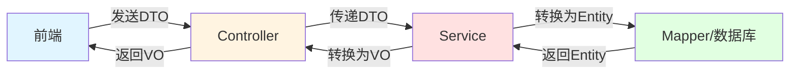
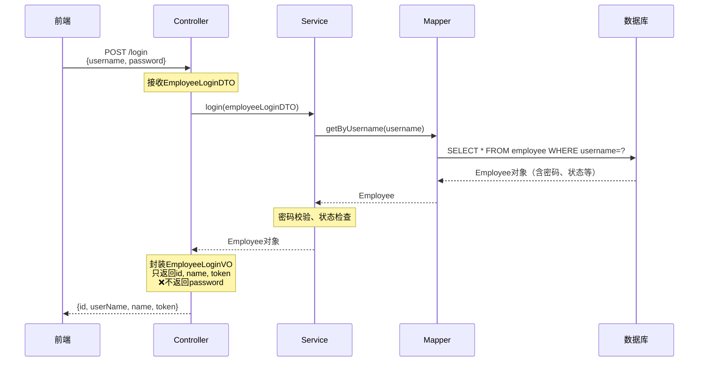
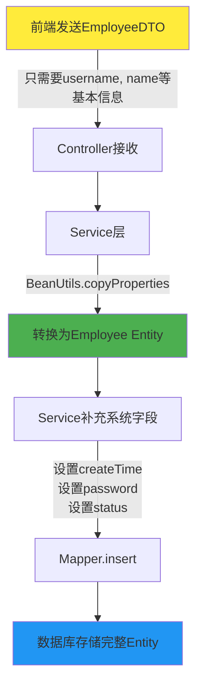
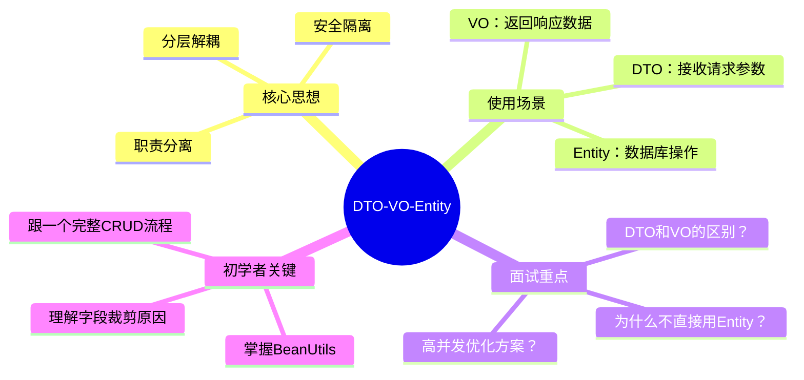

## 一、DTO-VO-Entity 是什么？

**用最简单的话说**：这是一种对象分层设计模式，将数据在不同的层级用不同的对象来承载。



### 三种对象的定义： 

| 对象类型 | 全称 | 作用层 | 核心作用 | 项目中的例子 |
|---------|------|--------|---------|------------|
| **DTO** | Data Transfer Object | Controller接收请求 | 前端→后端，传输数据 | EmployeeLoginDTO.java - 只有username和password |
| **Entity** | 实体类 | Service/Mapper操作数据库 | 数据库表的映射对象 | Employee.java - 完整的数据库字段（含createTime、updateTime等） |
| **VO** | View Object | Controller返回响应 | 后端→前端，展示数据 | EmployeeLoginVO.java - 只返回id、name、token（不返回密码！） |

---

## 二、业务场景：为什么要这样设计？

### 真实业务流程（以员工登录为例）



### 项目需求分析（为什么必须用三层对象？）

#### 需求1：**安全性** - 密码不能返回给前端
- 看Employee.java：Entity有`password`字段（数据库需要）
- 看EmployeeLoginVO.java：VO没有`password`字段（前端不应该知道）

#### 需求2：**字段裁剪** - 前端不需要的字段不传输
- 登录时，前端只需要`username`和`password`
- 但Entity有14个字段（createTime、updateTime、createUser等）
- 用DTO限制：**只接收需要的字段**

#### 需求3：**业务扩展** - 数据库字段≠业务字段
- 比如`createTime`、`updateTime`是系统自动设置，前端不应该传递
- DTO不包含这些字段，防止前端恶意篡改

#### 需求4：**接口文档清晰**
```java
// DTO：前端知道该传什么
@ApiModel(description = "员工登录时传递的数据模型")
public class EmployeeLoginDTO {
    @ApiModelProperty("用户名")
    private String username;
    @ApiModelProperty("密码")
    private String password;
}

// VO：前端知道会收到什么
@ApiModel(description = "员工登录返回的数据格式")
public class EmployeeLoginVO {
    @ApiModelProperty("主键值")
    private Long id;
    @ApiModelProperty("jwt令牌")
    private String token;
}
```

---

## 三、代码实战流程

以**新增员工**为例，看看三者如何配合：



**关键代码**（EmployeeServiceImpl.java第74-96行）：

```java
public void save(EmployeeDTO employeeDTO) {
    Employee employee = new Employee();
    
    // 第1步：DTO → Entity（拷贝相同字段）
    BeanUtils.copyProperties(employeeDTO, employee);
    
    // 第2步：Service补充业务字段（DTO不应该传递的）
    employee.setStatus(StatusConstant.ENABLE);
    employee.setPassword(DigestUtils.md5DigestAsHex(PasswordConstant.DEFAULT_PASSWORD.getBytes()));
    employee.setCreateTime(LocalDateTime.now());
    employee.setUpdateTime(LocalDateTime.now());
    employee.setCreateUser(BaseContext.getCurrentId());
    employee.setUpdateUser(BaseContext.getCurrentId());
    
    // 第3步：Mapper操作数据库
    employeeMapper.insert(employee);
}
```

---

## 四、面试怎么问？（重点！）

### 🔥 常见面试题1：为什么不直接用Entity？

**标准回答**：
1. **安全性**：Entity包含敏感字段（如password），直接返回给前端会泄露信息
2. **职责分离**：Entity是数据库模型，不应该暴露给前端，违反了单一职责原则
3. **字段冗余**：Entity包含createTime、updateUser等系统字段，前端用不到，浪费带宽
4. **灵活性**：前端需要的数据可能是多表关联（比如订单VO需要组合订单+订单明细），Entity无法满足

### 🔥 常见面试题2：DTO和VO的区别？

| 维度 | DTO | VO |
|------|-----|-----|
| **方向** | 前端→后端（请求） | 后端→前端（响应） |
| **用途** | 接收参数、数据校验 | 返回结果、数据展示 |
| **字段** | 只包含前端需要传递的 | 只包含前端需要展示的 |
| **典型场景** | 表单提交、查询条件 | 列表数据、详情数据 |

### 🔥 常见面试题3：如何在高并发下优化这种设计？

**进阶回答**：
1. **对象池技术**：频繁创建DTO/VO/Entity会产生大量GC，可以用对象池复用
2. **MapStruct替代BeanUtils**：BeanUtils底层用反射，性能较低，MapStruct在编译期生成代码，速度快10倍
3. **缓存VO对象**：如果某些VO数据不常变（如配置项），可以缓存起来，避免重复转换
4. **减少字段拷贝**：如果DTO和Entity字段很多，可以用Builder模式手动设置，避免全量拷贝

---

## 五、初学者学习路线

### 🎯 最小必学知识点

#### 1. **基础语法**（90%的人卡在这里！）
```java
// 必须掌握：对象拷贝
BeanUtils.copyProperties(source, target); // ⚠️注意：只拷贝同名同类型字段

// 建议学习：建造者模式
EmployeeLoginVO vo = EmployeeLoginVO.builder()
    .id(employee.getId())
    .name(employee.getName())
    .build();
```

#### 2. **包结构规范**
```
sky-pojo/
├── dto/      # 接收前端数据
├── entity/   # 数据库映射
└── vo/       # 返回前端数据
```

#### 3. **注解理解**
- `@Data`：自动生成getter/setter（Lombok）
- `@ApiModel`：Swagger接口文档注解
- `implements Serializable`：支持序列化（分布式必须）

### 📌 实战练习建议

1. **先找一个完整流程跟**：建议跟`Employee`的CRUD流程（登录、新增、修改、查询）
2. **画出数据流转图**：像我上面给你画的Mermaid图，自己画一遍
3. **对比三个文件**：Employee.java、EmployeeDTO.java、EmployeeLoginVO.java，标注字段差异
4. **调试断点**：在Service层的`BeanUtils.copyProperties`处打断点，看对象转换过程

### ⚠️ 常见初学者误区

| 误区 | 后果 | 正确做法 |
|------|------|---------|
| 直接把Entity返回给前端 | 密码泄露、数据冗余 | 必须转为VO |
| DTO包含所有字段 | 安全风险（如直接修改createTime） | 只包含业务需要的字段 |
| 不理解为什么要转换 | 代码写得很机械，面试答不上来 | 理解每层的职责边界 |

---

## 📚 总结



**最后强调**：这不是"过度设计"，而是**工程化思维**。在小项目里可能觉得麻烦，但在大型项目（多人协作、接口对接、安全审计）中，这种设计能避免90%的数据泄露和维护问题。

面试时，能说出"为了安全性、为了职责分离、为了接口清晰"这三点，基本就及格了。如果能提到"高并发下用MapStruct优化"，就是加分项了！
