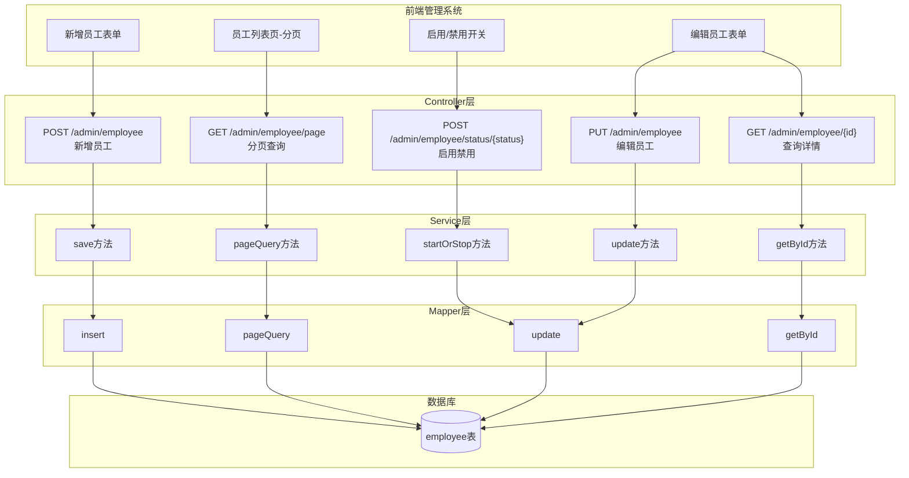
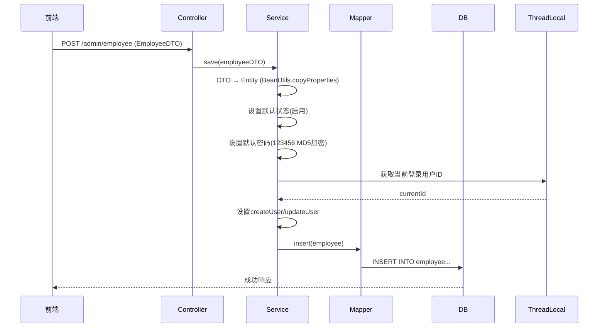
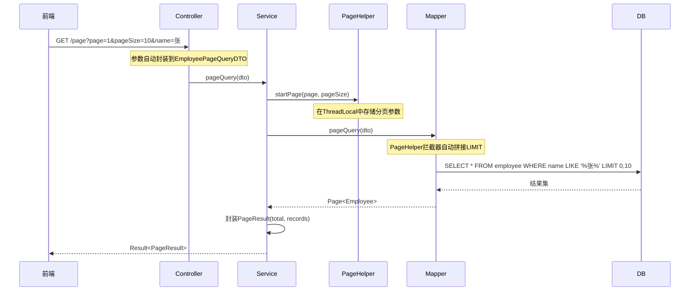
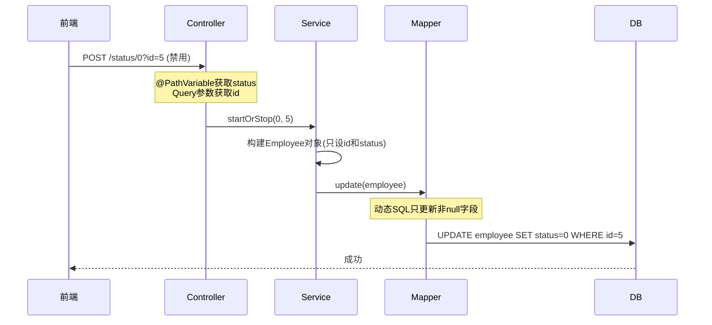
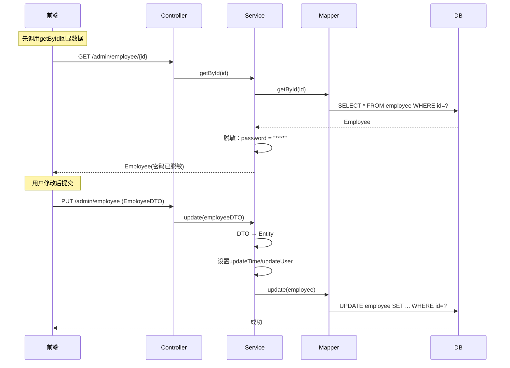
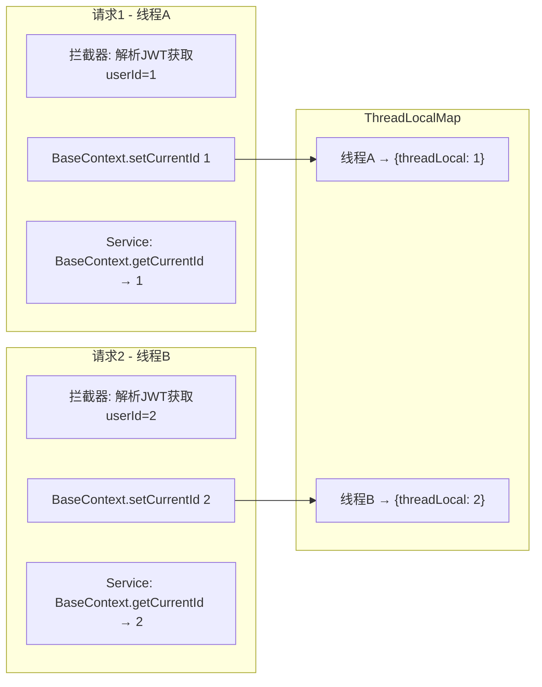
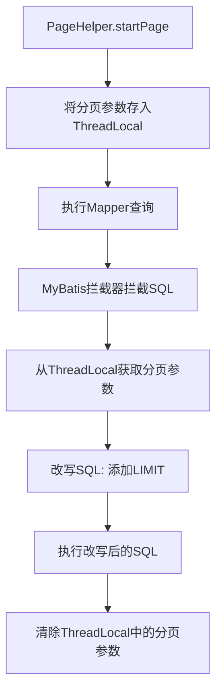

# 初期笔记

### 🔄 实现流程
1. 自定义注解AutoFill，用于标识需要公共字段自动填充的方法。
2. 自定义切面类AutoFillspect，统一拦截加入了AutoFill的方法，通过反射为公共字段赋值。
3. 在Mapper的方法上加入AutoFill注解.

---

### 📘 学到的知识
- 注解：Java里的特殊标记，比如 **@Override**和 **@Test** ,目标是 **让其他程序根据注解信息来决定怎么执行**；
- 自定义注解：注解本质是一个继承annotation的接口，属性本质是抽象方法；
```Java
  public @interface 注解名称 {
      String name();
      int age() default 18;
      String value(); //特殊属性value,如果注解只有一个value属性，那么value的名字可以省略不写
  }
```
- 元注解：**@Target**声明被修饰的注解只能在哪些位置使用；**@Retention**声明注解的保留周期；

- 反射：
- 枚举：
- mybaties：

---

# 📋 员工管理模块完整解析

## 一、整体业务流程图



---

## 二、逐个业务详解

### 🔹 1. 新增员工

#### 业务流程



#### 核心代码解析

```java
// EmployeeServiceImpl.java - save方法
public void save(EmployeeDTO employeeDTO) {
    Employee employee = new Employee();
    
    // ⭐ 考点1: BeanUtils属性拷贝
    BeanUtils.copyProperties(employeeDTO, employee);
    
    // 设置默认值
    employee.setStatus(StatusConstant.ENABLE);  // 默认启用
    employee.setPassword(DigestUtils.md5DigestAsHex(
        PasswordConstant.DEFAULT_PASSWORD.getBytes())); // ⭐ 考点2: MD5加密
    
    employee.setCreateTime(LocalDateTime.now());
    employee.setUpdateTime(LocalDateTime.now());
    
    // ⭐ 考点3: ThreadLocal获取当前用户
    Long currentId = BaseContext.getCurrentId();
    employee.setCreateUser(currentId);
    employee.setUpdateUser(currentId);
    
    employeeMapper.insert(employee);
}
```

#### 🎯 面试考点

| 技术点 | 面试常见问法 | 追问 |
|--------|--------------|------|
| **BeanUtils.copyProperties** | "这个方法的原理是什么？有什么局限性？" | "深拷贝还是浅拷贝？遇到类型不一致怎么办？" |
| **MD5加密** | "MD5安全吗？为什么现在不推荐单独用MD5？" | "如何增强？（加盐、BCrypt）" |
| **ThreadLocal** | "ThreadLocal的原理？为什么能获取当前用户？" | "会有内存泄漏吗？怎么避免？" |

---

### 🔹 2. 员工分页查询

#### 业务流程



#### 核心代码解析

```java
// Service层
public PageResult pageQuery(EmployeePageQueryDTO employeePageQueryDTO) {
    // ⭐ 关键：PageHelper的startPage必须紧跟查询语句
    PageHelper.startPage(
        employeePageQueryDTO.getPage(), 
        employeePageQueryDTO.getPageSize()
    );
    
    // 执行查询（PageHelper会自动拦截并添加LIMIT）
    Page<Employee> page = employeeMapper.pageQuery(employeePageQueryDTO);
    
    return new PageResult(page.getTotal(), page.getResult());
}
```

```xml
<!-- Mapper XML - 动态SQL -->
<select id="pageQuery" resultType="com.sky.entity.Employee">
    select * from employee
    <where>
        <if test="name != null and name != ''">
            and name like concat('%', #{name}, '%')
        </if>
    </where>
</select>
```

#### 🎯 面试考点

| 技术点 | 面试常见问法 | 追问 |
|--------|--------------|------|
| **PageHelper原理** | "PageHelper是怎么实现分页的？" | "它是怎么知道要拦截哪条SQL的？（ThreadLocal + 拦截器）" |
| **动态SQL** | "MyBatis动态SQL有哪些标签？" | "`<where>`和直接写`WHERE 1=1`有什么区别？" |
| **模糊查询** | "为什么用`concat`而不是`'%${name}%'`？" | "SQL注入是什么？怎么防止？" |

> ⚠️ **我要严厉指出一个问题**：这里的分页查询**没有加排序**！实际业务中，没有`ORDER BY`的分页是有问题的，因为数据库不保证每次返回顺序一致，可能导致翻页时数据重复或丢失。
>
> **应该改为**：
> ```xml
> select * from employee
> <where>...</where>
> ORDER BY create_time DESC
> ```

---

### 🔹 3. 启用/禁用员工账号

#### 业务流程



#### 核心代码解析

```java
// Service层 - 巧妙利用Builder模式
public void startOrStop(Integer status, Long id) {
    Employee employee = Employee.builder()
            .status(status)
            .id(id)
            .build();  // ⭐ 只设置需要更新的字段
    
    employeeMapper.update(employee);
}
```

```xml
<!-- 动态UPDATE - 只更新非null字段 -->
<update id="update" parameterType="Employee">
    update employee
    <set>
        <if test="name != null">name = #{name},</if>
        <if test="status != null">status = #{status},</if>
        <!-- 其他字段... -->
    </set>
    where id = #{id}
</update>
```

#### 🎯 面试考点

| 技术点 | 面试常见问法 | 追问 |
|--------|--------------|------|
| **RESTful设计** | "这个接口设计符合RESTful规范吗？" | "如果让你设计，你会怎么设计？（PATCH /employee/{id}）" |
| **动态UPDATE** | "为什么用`<set>`标签？" | "如果所有字段都是null会怎样？（SQL语法错误）" |
| **Builder模式** | "Builder模式有什么好处？" | "和直接new+setter有什么区别？" |

---

### 🔹 4. 编辑员工信息

#### 业务流程



#### 核心代码解析

```java
// 查询时脱敏处理
public Employee getById(Long id) {
    Employee employee = employeeMapper.getById(id);
    employee.setPassword("****");  // ⭐ 敏感信息脱敏
    return employee;
}

// 更新
public void update(EmployeeDTO employeeDTO) {
    Employee employee = new Employee();
    BeanUtils.copyProperties(employeeDTO, employee);
    
    employee.setUpdateTime(LocalDateTime.now());
    employee.setUpdateUser(BaseContext.getCurrentId());
    
    employeeMapper.update(employee);
}
```

#### 🎯 面试考点

| 技术点 | 面试常见问法 | 追问 |
|--------|--------------|------|
| **数据脱敏** | "敏感数据应该怎么处理？" | "除了手动脱敏，还有什么方式？（注解脱敏、Jackson序列化处理）" |
| **DTO vs Entity** | "为什么不直接用Entity接收参数？" | "DTO和VO的区别是什么？" |

---

## 三、核心技术点深度剖析

### ⭐ ThreadLocal（高频考点）

```java
public class BaseContext {
    public static ThreadLocal<Long> threadLocal = new ThreadLocal<>();
    
    public static void setCurrentId(Long id) {
        threadLocal.set(id);
    }
    
    public static Long getCurrentId() {
        return threadLocal.get();
    }
    
    public static void removeCurrentId() {
        threadLocal.remove();  // ⚠️ 必须调用，防止内存泄漏
    }
}
```

#### 工作原理图



#### 🎯 面试必问

> **Q: ThreadLocal的原理是什么？**
>
> A: 每个Thread内部有一个`ThreadLocalMap`，ThreadLocal作为key，存储的值作为value。所以不同线程访问同一个ThreadLocal变量时，实际上访问的是各自线程内部的副本。

> **Q: ThreadLocal会内存泄漏吗？**
>
> A: 会！ThreadLocalMap的key是弱引用，但value是强引用。如果ThreadLocal对象被GC了，key变成null，但value还在，就造成内存泄漏。**解决方案**：用完一定调用`remove()`。

> **Q: 在线程池环境下ThreadLocal有什么问题？**
>
> A: 线程池的线程是复用的，如果上一个请求设置的ThreadLocal没有清理，下一个请求可能读到脏数据！所以**必须在请求结束时调用remove()**。

---

### ⭐ PageHelper分页原理



#### 🎯 面试必问

> **Q: PageHelper.startPage为什么要紧跟查询语句？**
>
> A: 因为PageHelper使用ThreadLocal存储分页参数，只对**紧跟其后的第一条SQL**生效。如果中间插入其他SQL，分页参数会被消费掉。

> **Q: 在更大并发场景下，分页有什么优化方案？**
>
> A: 
> 1. **深分页问题**：当page很大时（如第10000页），`LIMIT 100000, 10`性能很差。优化方案：延迟关联（先查主键，再关联查询）或游标分页
> 2. **缓存**：对于不常变的数据，可以使用Redis缓存分页结果
> 3. **ES**：对于搜索场景，使用Elasticsearch的`search_after`

---

### ⭐ 动态SQL复用（update方法）

注意到`startOrStop`和`update`都复用了同一个Mapper方法：

```java
// 启用禁用 - 只传status和id
Employee employee = Employee.builder().status(status).id(id).build();
employeeMapper.update(employee);

// 编辑信息 - 传完整信息
Employee employee = new Employee();
BeanUtils.copyProperties(employeeDTO, employee);
employeeMapper.update(employee);
```

这是一个**很好的设计**，通过动态SQL的`<if>`标签，一个方法满足多种更新场景。

---

## 四、我发现的代码问题 ⚠️

作为你的面试模拟官，我要**严厉指出**几个问题：

### 1. 用户名唯一性校验缺失

```java
public void save(EmployeeDTO employeeDTO) {
    // ❌ 没有检查用户名是否已存在！
    // 如果插入重复用户名，会抛数据库异常，不够优雅
    employeeMapper.insert(employee);
}
```

**应该加上**：
```java
Employee existing = employeeMapper.getByUsername(employeeDTO.getUsername());
if (existing != null) {
    throw new BusinessException("用户名已存在");
}
```

### 2. 公共字段填充重复代码

Service中有重复代码：
```java
employee.setCreateTime(LocalDateTime.now());
employee.setUpdateTime(LocalDateTime.now());
employee.setCreateUser(currentId);
employee.setUpdateUser(currentId);
```

**实际上项目已经有AOP自动填充**（看到Mapper上的`@AutoFill`注解了），但Service里还手动设置了，这是**冗余代码**。这两块逻辑会冲突，应该只保留一种方式。

### 3. 分页查询缺少排序

前面已经提到，没有`ORDER BY`的分页在翻页时可能出现数据重复或丢失。

---

## 五、总结：面试怎么讲这个模块？

当面试官问："讲讲你项目中的员工管理模块"，你可以这样答：

> "员工管理是后台的基础模块，我来讲几个技术亮点：
> 
> 1. **统一的分页方案**：使用PageHelper插件，基于MyBatis拦截器+ThreadLocal实现，代码侵入性低
> 
> 2. **动态SQL复用**：update方法通过`<set>`+`<if>`实现动态更新，启用禁用和编辑信息复用同一个Mapper方法
> 
> 3. **ThreadLocal传递用户信息**：在拦截器中解析JWT获取用户ID，存入ThreadLocal，Service层可以随时获取当前登录用户
> 
> 4. **敏感信息脱敏**：查询返回时对密码进行脱敏处理
> 
> 当然也有可以优化的地方，比如新增时应该校验用户名唯一性，分页查询应该加排序..."

---

**你还想深入了解哪个点？** 比如：
- "我想看看JWT拦截器是怎么把用户ID存入ThreadLocal的"
- "我想看看`@AutoFill`自动填充的AOP是怎么实现的"
- "我想了解更多关于PageHelper的底层原理"

随时问我！💪
