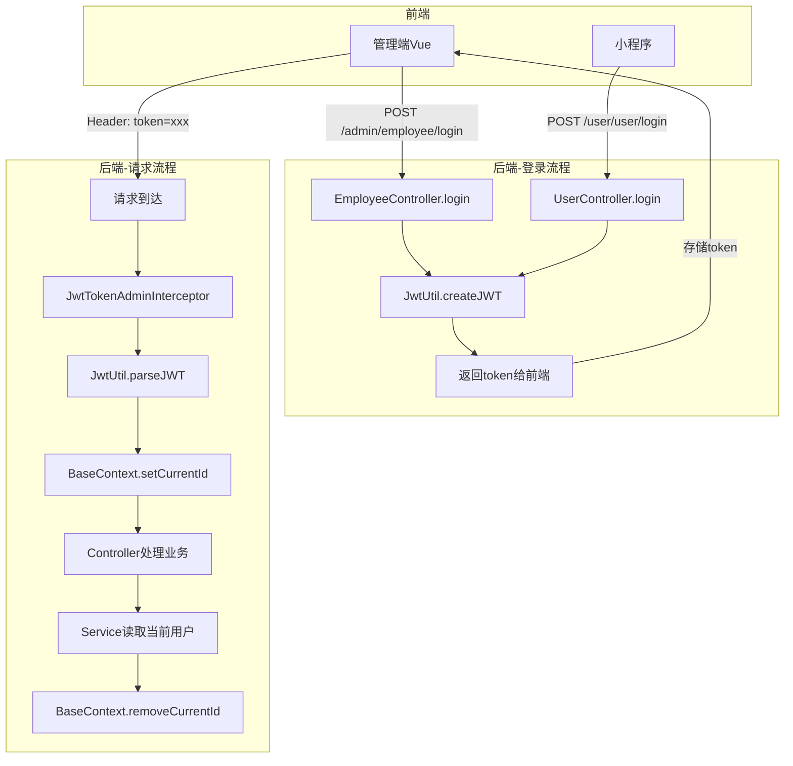
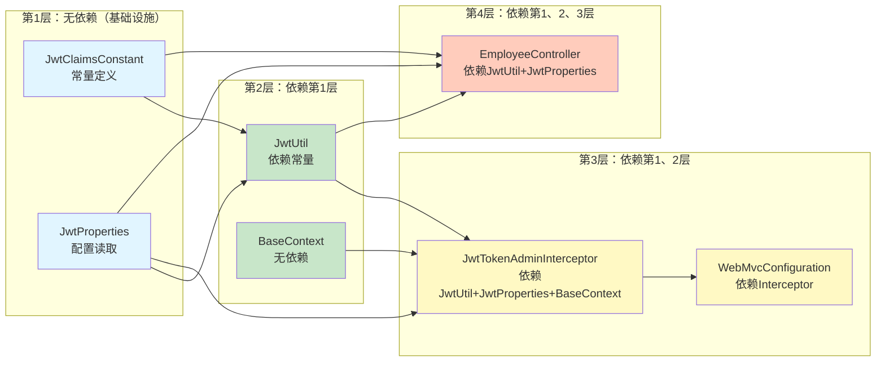
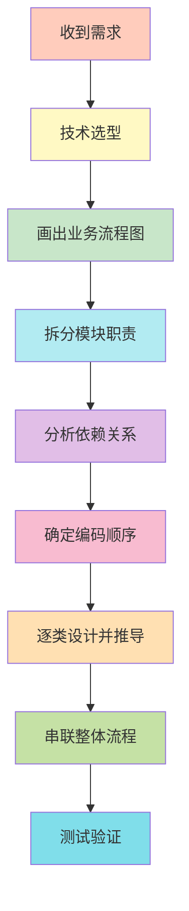

- [[JWT登录认证]]
- [[JWT登录认证code review]]

## **🎯 架构师的思考路径（从需求到代码的完整推演）**

### **阶段0：收到需求（产品经理的描述）**

**产品经理说：**
> "我们的外卖系统需要两个端：管理端（后台）和用户端（小程序）。管理员用账号密码登录，用户用微信登录。登录后要能记住身份，后续操作不用重复登录。"

**我（架构师）的第一反应：**
- 这是一个**身份认证（Authentication）**需求
- 涉及两个端，需要**权限隔离**
- 需要**会话保持**机制

---

## **阶段1：技术选型（5分钟思考）**

### **我的思考过程：**

**问题1：用什么方案做身份认证？**

我脑海中浮现3个选项：

| 方案 | 优点 | 缺点 | 适用场景 |
|------|------|------|---------|
| **Session** | 简单，Spring默认支持 | 服务端存储，难扩展，分布式需要Session共享 | 单体应用 |
| **JWT** | 无状态，天然支持分布式 | 无法主动撤销，payload不能太大 | 微服务、前后端分离 |
| **OAuth2** | 标准协议，支持第三方登录 | 复杂，需要授权服务器 | 开放平台 |

**我的选择：JWT**
- ✅ 项目是前后端分离架构（Vue后台 + 小程序）
- ✅ 未来可能做微服务拆分，JWT天然支持分布式
- ✅ 两个端权限隔离，JWT可以用不同密钥
- ❌ Session需要Redis共享，增加复杂度

**决策：使用JWT + 双密钥方案（管理端和用户端隔离）**

---

**问题2：JWT放在哪传输？**

| 方案 | 优缺点 | 决策 |
|------|--------|------|
| Cookie | 自动携带，但小程序不支持 | ❌ 排除 |
| URL参数 | 简单，但token会暴露在日志中 | ❌ 不安全 |
| **请求头Header** | 安全，RESTful标准做法 | ✅ 选择这个 |

**决策：前端在Header中携带token，后端从Header读取**

---

**问题3：如何拦截所有请求校验JWT？**

| 方案 | 执行时机 | 能否注入Spring Bean | 决策 |
|------|---------|-------------------|------|
| Filter | DispatcherServlet之前 | 不支持@Autowired | ❌ |
| **Interceptor** | DispatcherServlet之后 | 支持@Autowired | ✅ |
| AOP | Controller方法执行时 | 无法拦截所有请求 | ❌ |

**决策：用Spring MVC的Interceptor，可以注入配置类，可以判断Handler类型**

---

## **阶段2：模块设计（画出脑海中的蓝图）**

### **我拿出白板，画出这个图：**



**我对着图自问自答：**

❓ **问：登录流程需要哪些组件？**
- ✅ 答：Controller接收请求 → 工具类生成JWT → 返回token

❓ **问：校验流程需要哪些组件？**
- ✅ 答：拦截器拦截请求 → 工具类解析JWT → 存储用户ID到ThreadLocal

❓ **问：为什么要用ThreadLocal？**
- ✅ 答：Service层需要知道"当前用户是谁"，但拦截器和Service不在一个调用栈，无法通过参数传递

---

## **阶段3：职责拆分（定义每个类做什么）**

我在白板上列出职责清单：

### **我的思考：按照"谁负责什么"来划分**

| 职责 | 问题 | 我的设计 |
|------|------|---------|
| **存储JWT配置** | 密钥、过期时间放哪？ | `JwtProperties` 读取配置文件 |
| **生成JWT** | 谁来生成token？ | `JwtUtil.createJWT()` 静态工具方法 |
| **解析JWT** | 谁来验证token？ | `JwtUtil.parseJWT()` 静态工具方法 |
| **存储当前用户** | 用户ID放哪？ | `BaseContext` 封装ThreadLocal |
| **拦截请求** | 谁来校验token？ | `JwtTokenAdminInterceptor` 和 `JwtTokenUserInterceptor` |
| **注册拦截器** | 拦截哪些路径？ | `WebMvcConfiguration` 配置拦截规则 |
| **生成token** | 登录后谁生成token？ | `EmployeeController.login()` 和 `UserController.login()` |

---

## **阶段4：依赖关系分析（确定编码顺序）**

### **我画出依赖图：**



**我得出编码顺序：**
1. 第1层（无依赖） → `JwtClaimsConstant`、`JwtProperties`
2. 第2层（工具类） → `JwtUtil`、`BaseContext`
3. 第3层（拦截器） → `JwtTokenAdminInterceptor`、`WebMvcConfiguration`
4. 第4层（业务类） → `EmployeeController.login`

---

## **阶段5：逐类设计（从需求到代码的推导）**

现在我开始**逐个类设计**，每个类都从"为什么需要它"推导到"怎么实现它"。

---

### **类1：JwtClaimsConstant（为什么需要？）**

**我的思考：**
> 生成JWT时，我需要把用户ID放进claims，key叫什么名字？
> ```java
> claims.put("empId", employee.getId());  // 叫empId? emp_id? employeeId?
> ```
> 解析JWT时，也要用同样的key：
> ```java
> Long empId = claims.get("empId");  // 如果拼错成empID，运行时才发现
> ```

**问题：字符串硬编码容易拼写错误，且不统一**

**解决方案：定义常量类**
```java
public class JwtClaimsConstant {
    public static final String EMP_ID = "empId";
    public static final String USER_ID = "userId";
}
```

**我写代码时的思考：**
```java
// ✅ 为什么要写这行？
public static final String EMP_ID = "empId";
// 答：统一claims的key名称，避免硬编码

// ✅ 这行会在哪里用？
// 答：Controller生成JWT时：claims.put(JwtClaimsConstant.EMP_ID, id)
//     拦截器解析JWT时：claims.get(JwtClaimsConstant.EMP_ID)

// ✅ 为什么是"empId"而不是"emp_id"？
// 答：这是JWT的payload字段名，用驼峰；不是数据库字段名
```

---

### **类2：JwtProperties（为什么需要？）**

**我的思考：**
> JWT需要密钥、过期时间、Header名称，这些值写死在代码里吗？
> ```java
> String token = JwtUtil.createJWT("itcast", 7200000, claims);  // ❌ 写死了
> ```
> 如果要修改密钥，要改多处代码，而且密钥不应该写在代码里。

**问题：配置项散落在代码各处，难以维护**

**解决方案：配置文件 + 配置类**
```yaml
# application.yml
sky:
  jwt:
    admin-secret-key: itcast
    admin-ttl: 7200000
    admin-token-name: token
```

```java
@Component
@ConfigurationProperties(prefix = "sky.jwt")
@Data
public class JwtProperties {
    private String adminSecretKey;
    private long adminTtl;
    private String adminTokenName;
    
    private String userSecretKey;
    private long userTtl;
    private String userTokenName;
}
```

**我写代码时的思考：**
```java
// ✅ 为什么要写这行？
@ConfigurationProperties(prefix = "sky.jwt")
// 答：自动绑定配置文件的sky.jwt.*字段到类属性

// ✅ 为什么要@Component？
// 答：让Spring管理这个Bean，才能被@Autowired注入

// ✅ 为什么要两套配置（admin和user）？
// 答：管理端和用户端权限隔离，密钥不同，token不能混用

// ✅ 这个类会在哪里用？
// 答：Controller生成JWT时读取secretKey和ttl
//     拦截器校验JWT时读取secretKey和tokenName
```

---

### **类3：JwtUtil（为什么需要？）**

**我的思考：**
> 生成JWT的代码比较复杂，涉及签名算法、过期时间、Base64编码等，如果每个Controller都写一遍：
> ```java
> // ❌ Controller中写JWT生成逻辑，代码重复
> JwtBuilder builder = Jwts.builder()
>     .setClaims(claims)
>     .signWith(SignatureAlgorithm.HS256, secretKey)
>     .setExpiration(new Date(...));
> ```

**问题：JWT生成和解析逻辑重复，且容易出错**

**解决方案：封装成静态工具类**

**我的设计思路：**
1. **我需要什么功能？** → 生成JWT、解析JWT
2. **生成JWT需要什么参数？** → 密钥、过期时间、用户数据（claims）
3. **解析JWT需要什么参数？** → 密钥、token字符串
4. **返回什么？** → 生成返回String，解析返回Claims

**代码推导过程：**

```java
// 第1步：定义方法签名
public static String createJWT(String secretKey, long ttlMillis, Map<String, Object> claims)

// 第2步：我要做什么？生成JWT，JWT的结构是 header.payload.signature
// 第3步：怎么做？用jjwt库的Jwts.builder()

// 第4步：逐行推导
public static String createJWT(String secretKey, long ttlMillis, Map<String, Object> claims) {
    // ✅ 为什么要写这行？
    SignatureAlgorithm signatureAlgorithm = SignatureAlgorithm.HS256;
    // 答：指定签名算法，HS256是对称加密，性能高
    
    // ✅ 为什么要写这行？
    long expMillis = System.currentTimeMillis() + ttlMillis;
    Date exp = new Date(expMillis);
    // 答：计算过期时间 = 当前时间 + 有效期
    //     为什么要过期？防止token被盗用后长期有效
    
    // ✅ 为什么要写这行？
    JwtBuilder builder = Jwts.builder()
        .setClaims(claims)           // 设置payload（用户数据）
        .signWith(signatureAlgorithm, secretKey.getBytes(StandardCharsets.UTF_8))  // 签名
        .setExpiration(exp);         // 设置过期时间
    // 答：按照JWT标准，设置claims、签名、过期时间
    
    // ✅ 为什么要写这行？
    return builder.compact();
    // 答：生成最终的token字符串（header.payload.signature）
}
```

**解析JWT的推导：**
```java
public static Claims parseJWT(String secretKey, String token) {
    // ✅ 为什么要写这行？
    Claims claims = Jwts.parser()
        .setSigningKey(secretKey.getBytes(StandardCharsets.UTF_8))  // 设置密钥
        .parseClaimsJws(token)  // 解析token
        .getBody();             // 获取payload
    // 答：用相同的密钥验证签名，如果签名不匹配或过期，会抛异常
    
    // ✅ 为什么会抛异常？
    // 答：签名验证失败 → SignatureException
    //     token过期 → ExpiredJwtException
    //     格式错误 → MalformedJwtException
    
    return claims;
}
```

---

### **类4：BaseContext（为什么需要？）**

**我的思考：**
> 拦截器解析出empId后，Service层怎么知道"当前用户是谁"？
> 
> **方案1：传参数**
> ```java
> // ❌ 每个方法都要加empId参数，太麻烦
> public void save(EmployeeDTO dto, Long empId) { ... }
> ```
> 
> **方案2：请求作用域**
> ```java
> request.setAttribute("empId", empId);  // ❌ Service层拿不到request
> ```
> 
> **方案3：ThreadLocal**
> ```java
> ThreadLocal<Long> threadLocal = new ThreadLocal<>();
> threadLocal.set(empId);  // 拦截器设置
> Long empId = threadLocal.get();  // Service读取
> ```

**问题：如何在拦截器和Service之间传递用户ID？**

**解决方案：ThreadLocal（线程隔离的全局变量）**

**我的设计思路：**
```java
public class BaseContext {
    // ✅ 为什么要写这行？
    public static ThreadLocal<Long> threadLocal = new ThreadLocal<>();
    // 答：每个线程有独立的存储空间，线程A设置的值，线程B读不到
    
    // ✅ 为什么要static？
    // 答：工具类，全局共享一个ThreadLocal实例
    
    public static void setCurrentId(Long id) {
        threadLocal.set(id);  // 存储到当前线程
    }
    
    public static Long getCurrentId() {
        return threadLocal.get();  // 从当前线程读取
    }
    
    // ✅ 为什么要写这行？
    public static void removeCurrentId() {
        threadLocal.remove();  // 清理当前线程的数据
    }
    // 答：Tomcat用线程池，线程会复用，不清理会导致下次请求读到旧数据
}
```

**使用场景推导：**
```
请求A（线程1）：
拦截器：BaseContext.setCurrentId(1L)
Service：BaseContext.getCurrentId() → 返回1L
请求结束：BaseContext.removeCurrentId()

请求B（线程2）：
拦截器：BaseContext.setCurrentId(2L)
Service：BaseContext.getCurrentId() → 返回2L  // 不会读到1L
```

---

### **类5：JwtTokenAdminInterceptor（为什么需要？）**

**我的思考：**
> 前端每次请求都要校验JWT，难道每个Controller方法都写一遍校验代码吗？
> ```java
> // ❌ 每个方法都写，代码重复
> public void save(...) {
>     String token = request.getHeader("token");
>     Claims claims = JwtUtil.parseJWT(secretKey, token);
>     // ...业务逻辑
> }
> ```

**问题：JWT校验逻辑重复，且容易遗漏**

**解决方案：统一拦截器，在Controller执行前校验**

**我的设计思路（逐行推导）：**

```java
@Override
public boolean preHandle(HttpServletRequest request, HttpServletResponse response, Object handler) throws Exception {
    
    // ============ 第1步：判断是否需要拦截 ============
    // ✅ 为什么要写这行？
    if (!(handler instanceof HandlerMethod)) {
        return true;  // 直接放行
    }
    // 答：静态资源（图片、CSS）不需要JWT校验，只拦截Controller方法
    //     HandlerMethod代表Controller的方法
    
    // ============ 第2步：获取token ============
    // ✅ 为什么要写这行？
    String token = request.getHeader(jwtProperties.getAdminTokenName());
    // 答：前端约定把token放在Header中，key名称来自配置文件（默认"token"）
    //     为什么不从Cookie读？因为小程序不支持Cookie
    
    // ============ 第3步：校验JWT ============
    try {
        // ✅ 为什么要写这行？
        log.info("jwt校验:{}", token);
        // 答：记录日志，方便调试（但生产环境不要打印完整token，安全风险）
        
        // ✅ 为什么要写这行？
        Claims claims = JwtUtil.parseJWT(jwtProperties.getAdminSecretKey(), token);
        // 答：验证签名和过期时间，如果失败会抛异常
        //     为什么用adminSecretKey？因为这是管理端拦截器
        
        // ✅ 为什么要写这行？
        Long empId = Long.valueOf(claims.get(JwtClaimsConstant.EMP_ID).toString());
        // 答：从claims中取出empId，key名称来自常量类
        //     为什么要toString()再valueOf()？因为get()返回Object
        
        log.info("当前员工id：{}", empId);
        
        // ✅ 为什么要写这行？
        BaseContext.setCurrentId(empId);
        // 答：存储到ThreadLocal，后续Service层可以读取
        
        // ✅ 为什么要写这行？
        return true;  // 放行
        // 答：校验成功，允许请求继续执行到Controller
        
    } catch (Exception ex) {
        // ============ 第4步：校验失败处理 ============
        // ✅ 为什么要写这行？
        response.setStatus(401);
        return false;  // 拦截
        // 答：401表示未认证，前端收到后跳转登录页
        //     return false会阻止请求到达Controller
    }
}

// ============ 第5步：清理ThreadLocal ============
@Override
public void afterCompletion(HttpServletRequest request, HttpServletResponse response, Object handler, Exception ex) throws Exception {
    // ✅ 为什么要写这行？
    BaseContext.removeCurrentId();
    // 答：请求结束，清理ThreadLocal，防止内存泄漏
    //     什么时候执行？Controller处理完成、响应返回前
}
```

---

### **类6：WebMvcConfiguration（为什么需要？）**

**我的思考：**
> 拦截器写好了，但Spring怎么知道要用它？要拦截哪些路径？

**问题：需要注册拦截器并配置拦截规则**

**解决方案：继承WebMvcConfigurationSupport并重写addInterceptors**

**我的设计思路：**
```java
@Override
protected void addInterceptors(InterceptorRegistry registry) {
    log.info("开始注册自定义拦截器...");
    
    // ============ 注册管理端拦截器 ============
    // ✅ 为什么要写这行？
    registry.addInterceptor(jwtTokenAdminInterceptor)
        .addPathPatterns("/admin/**")
        .excludePathPatterns("/admin/employee/login");
    // 答：拦截所有/admin/**路径，但放行登录接口
    //     为什么要放行？因为登录时前端还没有token
    
    // ============ 注册用户端拦截器 ============
    // ✅ 为什么要写这行？
    registry.addInterceptor(jwtTokenUserInterceptor)
        .addPathPatterns("/user/**")
        .excludePathPatterns("/user/user/login")
        .excludePathPatterns("/user/shop/status");
    // 答：拦截所有/user/**路径，放行登录和查询店铺状态
    //     为什么要放行shop/status？因为未登录用户也要看店铺是否营业
}
```

---

### **类7：EmployeeController.login（为什么需要？）**

**我的思考：**
> 前端发起登录请求，后端需要：
> 1. 验证账号密码
> 2. 生成JWT
> 3. 返回给前端

**我的设计思路（逐步推导）：**

```java
@PostMapping("/login")
public Result<EmployeeLoginVO> login(@RequestBody EmployeeLoginDTO employeeLoginDTO) {
    log.info("员工登录：{}", employeeLoginDTO);

    // ============ 第1步：验证账号密码 ============
    // ✅ 为什么要写这行？
    Employee employee = employeeService.login(employeeLoginDTO);
    // 答：Controller只负责接收参数，业务逻辑在Service
    //     Service会查数据库，验证密码（MD5），如果失败抛LoginFailedException
    
    // ============ 第2步：生成JWT ============
    // ✅ 为什么要写这行？
    Map<String, Object> claims = new HashMap<>();
    claims.put(JwtClaimsConstant.EMP_ID, employee.getId());
    // 答：构建JWT的payload，把员工ID放进去
    //     为什么用Map？因为JwtUtil的参数类型是Map<String, Object>
    //     为什么只放ID？因为JWT会被前端存储，不能放敏感信息
    
    // ✅ 为什么要写这行？
    String token = JwtUtil.createJWT(
        jwtProperties.getAdminSecretKey(),  // 管理端密钥
        jwtProperties.getAdminTtl(),        // 过期时间（2小时）
        claims);                            // 用户数据
    // 答：调用工具类生成JWT
    //     为什么用adminSecretKey？因为这是管理端登录
    
    // ============ 第3步：构建返回对象 ============
    // ✅ 为什么要写这行？
    EmployeeLoginVO employeeLoginVO = EmployeeLoginVO.builder()
        .id(employee.getId())
        .userName(employee.getUsername())
        .name(employee.getName())
        .token(token)  // 重点：把token返回给前端
        .build();
    // 答：封装成VO返回，只返回前端需要的字段
    //     为什么不直接返回Employee？因为Employee包含password等敏感字段
    
    // ✅ 为什么要写这行？
    return Result.success(employeeLoginVO);
    // 答：统一返回格式 {code: 1, data: {...}, msg: "success"}
}
```

**前端会怎么用这个token？**
```javascript
// 前端代码（参考）
const response = await axios.post('/admin/employee/login', {username, password});
const token = response.data.data.token;
localStorage.setItem('token', token);  // 存储到本地

// 后续请求都携带token
axios.get('/admin/employee/page', {
    headers: { 'token': token }  // 放在请求头
});
```

---

## **阶段6：完整流程串联（模拟一次请求）**

现在我在白板上画出**完整的调用链**，验证设计是否合理：

### **场景1：管理员登录**

```
前端: POST /admin/employee/login {username: "admin", password: "123456"}
  ↓
WebMvcConfiguration: 放行/admin/employee/login（不拦截）
  ↓
EmployeeController.login():
  │
  ├─ employeeService.login()  // 查数据库，验证密码
  │    └─ 返回 Employee{id=1, username="admin"}
  │
  ├─ 构建 claims: {empId: 1}
  │
  ├─ JwtUtil.createJWT("itcast", 7200000, claims)
  │    └─ 返回 "eyJhbGciOiJIUzI1NiJ9.eyJlbXBJZ..."
  │
  └─ 返回 {code: 1, data: {id: 1, token: "eyJ..."}}
  
前端: localStorage.setItem("token", "eyJ...")
```

---

### **场景2：访问受保护接口**

```
前端: GET /admin/employee/page
      Header: token=eyJhbGciOiJIUzI1NiJ9...
  ↓
WebMvcConfiguration: 拦截/admin/**
  ↓
JwtTokenAdminInterceptor.preHandle():
  │
  ├─ handler instanceof HandlerMethod? → true
  │
  ├─ request.getHeader("token") → "eyJ..."
  │
  ├─ JwtUtil.parseJWT("itcast", "eyJ...")
  │    ├─ 验证签名 → ✅ 通过
  │    ├─ 检查过期 → ✅ 未过期
  │    └─ 返回 Claims{empId: 1}
  │
  ├─ empId = claims.get("empId") → 1L
  │
  ├─ BaseContext.setCurrentId(1L)
  │    └─ ThreadLocal.set(1L)
  │
  └─ return true → 放行
  
EmployeeController.page():
  │
  └─ employeeService.pageQuery()
       │
       └─ BaseContext.getCurrentId() → 1L（拿到当前用户ID）
  
JwtTokenAdminInterceptor.afterCompletion():
  │
  └─ BaseContext.removeCurrentId()
       └─ ThreadLocal.remove()（清理，防止泄漏）
```

---

## **🎯 总结：架构师的思考路径（复盘）**

### **我的完整思考流程是这样的：**



### **关键点：**
1. **我不是"先写代码再想为什么"，而是"先想为什么再写代码"**
2. **每写一行代码，都能回答3个问题：**
   - ❓ 为什么要写这行？（WHY）
   - ❓ 这行代码的作用是什么？（WHAT）
   - ❓ 谁会调用这行代码？（WHO）

---

## **🔥 现在轮到你了！**

**我给你一个实操练习：**

假设你是架构师，现在要实现一个新需求：
> "登录后返回的token有效期太长（2小时），改成15分钟，并增加refresh token机制"

**请你按照我的思考路径回答：**
1. **技术选型**：需要改哪些类？
2. **职责划分**：新增一个RefreshToken类吗？
3. **依赖关系**：谁依赖谁？
4. **代码推导**：Controller的login方法要怎么改？

**你试着回答，我来检验你是否掌握了"架构师思维"！** 🎓