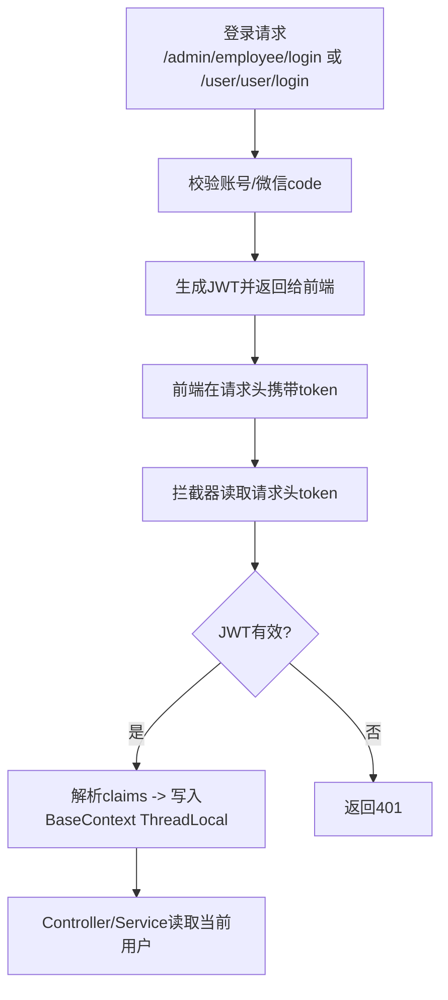
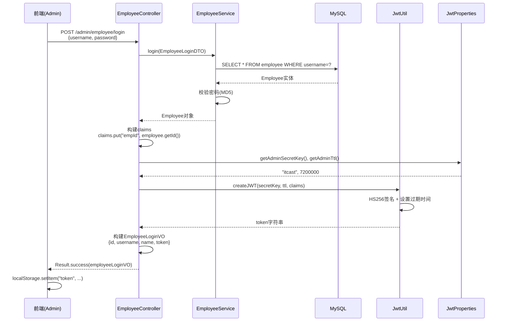
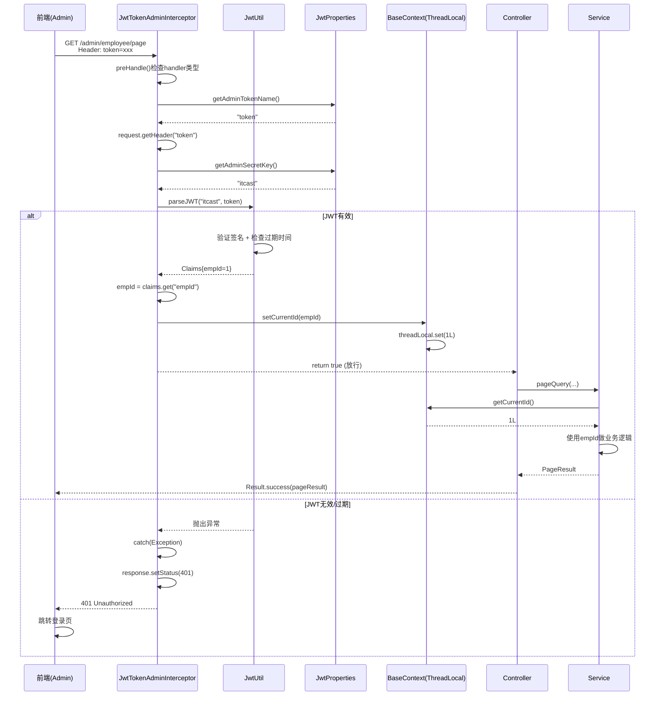
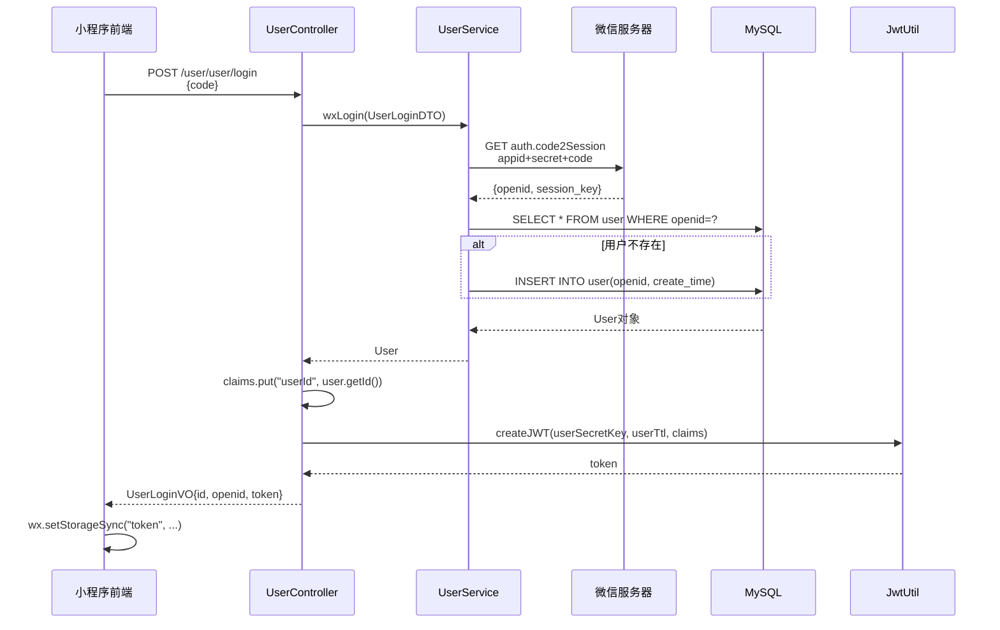
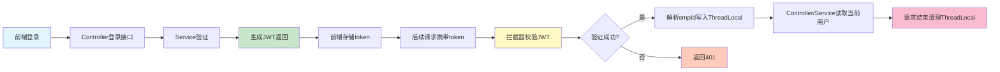

- [[《苍穹外卖》概述]]
- [[spring核心注解]]
- [[《苍穹外卖》登录模块]]
- [[JWT登录认证复盘]]

**核心业务流**
- 管理端：管理员账号密码登录 → 服务端生成JWT → 前端保存并在后续请求头携带 → 拦截器校验JWT → 解析出`empId`写入`ThreadLocal` → Controller/Service使用当前用户信息。
- C端：微信登录换取用户信息 → 生成JWT → 前端携带 → 拦截器校验 → 解析出`userId`写入`ThreadLocal` → 后续业务读取当前用户。



---

**关键代码位置（先看这些）**
- 登录生成JWT：管理员 `EmployeeController.java`，用户 `UserController.java`
- 校验JWT拦截器：管理员 `JwtTokenAdminInterceptor.java`，用户 `JwtTokenUserInterceptor.java`
- 拦截器注册与放行路径 `WebMvcConfiguration.java`
- JWT工具类 `JwtUtil.java`
- JWT配置项 `JwtProperties.java` 与 `application.yml`
- ThreadLocal上下文 `BaseContext.java`

---

JWT登录模块各个类的协作关系图。

```mermaid
graph TB
    subgraph "配置层 Config Layer"
        YML[application.yml<br/>JWT密钥/过期时间/Header名]
        Props[JwtProperties<br/>@ConfigurationProperties]
        WebMvc[WebMvcConfiguration<br/>注册拦截器+放行路径]
    end
    
    subgraph "工具层 Util Layer"
        JwtUtil[JwtUtil<br/>createJWT/parseJWT]
        Const[JwtClaimsConstant<br/>EMP_ID/USER_ID常量]
        BaseCtx[BaseContext<br/>ThreadLocal存储当前用户ID]
    end
    
    subgraph "拦截器层 Interceptor Layer"
        AdminInt[JwtTokenAdminInterceptor<br/>校验管理端JWT]
        UserInt[JwtTokenUserInterceptor<br/>校验C端JWT]
    end
    
    subgraph "控制器层 Controller Layer"
        EmpCtrl[EmployeeController<br/>管理员登录/生成JWT]
        UserCtrl[UserController<br/>微信登录/生成JWT]
    end
    
    subgraph "服务层 Service Layer"
        EmpSvc[EmployeeService<br/>验证账号密码]
        UserSvc[UserService<br/>微信授权登录]
    end
    
    YML -.配置绑定.-> Props
    Props --> EmpCtrl
    Props --> UserCtrl
    Props --> AdminInt
    Props --> UserInt
    
    WebMvc --> AdminInt
    WebMvc --> UserInt
    
    EmpCtrl --> EmpSvc
    EmpCtrl --> JwtUtil
    EmpCtrl --> Const
    
    UserCtrl --> UserSvc
    UserCtrl --> JwtUtil
    UserCtrl --> Const
    
    AdminInt --> JwtUtil
    AdminInt --> Props
    AdminInt --> BaseCtx
    AdminInt --> Const
    
    UserInt --> JwtUtil
    UserInt --> Props
    UserInt --> BaseCtx
    UserInt --> Const
    
    style YML fill:#e1f5ff
    style Props fill:#fff4e1
    style WebMvc fill:#fff4e1
    style JwtUtil fill:#e8f5e9
    style Const fill:#e8f5e9
    style BaseCtx fill:#e8f5e9
    style AdminInt fill:#fce4ec
    style UserInt fill:#fce4ec
    style EmpCtrl fill:#f3e5f5
    style UserCtrl fill:#f3e5f5
```

---

## **完整业务流程串联**

### **流程一：管理员登录（生成JWT）**



### **流程二：携带JWT访问受保护接口**



### **流程三：C端微信登录（原理类似）**



---

## **核心类职责清单**

| 类名 | 职责 | 关键方法/字段 |
|------|------|--------------|
| **JwtProperties** | 读取配置文件JWT相关参数 | `adminSecretKey`, `adminTtl`, `adminTokenName`<br/>`userSecretKey`, `userTtl`, `userTokenName` |
| **JwtUtil** | JWT生成与解析 | `createJWT(secretKey, ttl, claims)` 生成token<br/>`parseJWT(secretKey, token)` 解析并验证 |
| **JwtClaimsConstant** | 统一管理claims字段名 | `EMP_ID="empId"`, `USER_ID="userId"` |
| **BaseContext** | ThreadLocal存储当前用户ID | `setCurrentId(id)`, `getCurrentId()`, `removeCurrentId()` |
| **EmployeeController** | 管理员登录入口 | `login()` 调用Service验证并生成JWT |
| **UserController** | C端用户登录入口 | `login()` 微信授权并生成JWT |
| **JwtTokenAdminInterceptor** | 管理端JWT拦截器 | `preHandle()` 校验token并写入ThreadLocal |
| **JwtTokenUserInterceptor** | C端JWT拦截器 | `preHandle()` 校验token并写入ThreadLocal |
| **WebMvcConfiguration** | 注册拦截器并配置拦截/放行路径 | `addInterceptors()` 配置拦截规则 |

---

## **高频面试题与答案**

### **1. JWT的组成结构和验证原理是什么？**

**标准答案：**
JWT由三部分组成（用`.`分隔）：
- **Header（头部）**：`{"alg":"HS256","typ":"JWT"}` Base64编码，声明签名算法。
- **Payload（载荷）**：`{"empId":1,"exp":1234567890}` Base64编码，存放claims数据。
- **Signature（签名）**：`HMACSHA256(base64(header)+"."+base64(payload), secretKey)` 防篡改。

**验证流程：**
1. 服务端拿到token后分割成三部分。
2. 用相同的密钥和算法对`header+payload`重新计算签名。
3. 比对计算结果与token中的signature是否一致。
4. 检查`exp`过期时间。

**追问：JWT能主动撤销吗？**
- JWT本身是无状态的，服务端不存储token，无法主动撤销。
- 解决方案：引入**Redis黑名单**，把需要撤销的token加入黑名单，拦截器校验时额外检查。
- 或使用**短期access token + 长期refresh token**机制。

---

### **2. 拦截器(Interceptor)和过滤器(Filter)的区别？**

| 维度 | Filter | Interceptor |
|------|--------|-------------|
| **规范** | Servlet规范 | Spring MVC规范 |
| **触发时机** | DispatcherServlet之前 | DispatcherServlet之后，Controller之前 |
| **依赖注入** | 不支持Spring容器自动注入 | 支持`@Autowired` |
| **拦截粒度** | 只能拦截URL | 可以拦截到具体Handler(Controller方法) |
| **异常处理** | 需要手动try-catch | 可以被`@ControllerAdvice`捕获 |

**本项目中为什么用Interceptor？**
- 需要注入`JwtProperties`配置类 → Filter无法自动注入。
- 需要判断`handler instanceof HandlerMethod` → 只拦截Controller方法。
- 异常可以统一被全局异常处理器捕获。

---

### **3. ThreadLocal的原理和内存泄漏风险？**

**原理：**
- 每个`Thread`对象内部有一个`ThreadLocalMap`，key是`ThreadLocal`对象本身，value是存储的值。
- `ThreadLocal.set(value)` → `Thread.currentThread().threadLocals.put(this, value)`。
- 不同线程访问同一个`ThreadLocal`对象，实际存储在各自线程的Map中，互不干扰。

**内存泄漏风险：**
- `ThreadLocalMap`的key是**弱引用**，但value是**强引用**。
- 如果线程复用（线程池场景），线程不死，value不会被GC。
- 如果忘记调用`remove()`，上一次请求的用户ID可能被下一次请求读到。

**你们项目的风险点：**
- BaseContext.java 只有set/get,没有在请求结束时统一`remove()`。

**标准解决方案：**
```java
// 在拦截器的afterCompletion中统一清理
@Override
public void afterCompletion(HttpServletRequest request, HttpServletResponse response, 
                            Object handler, Exception ex) throws Exception {
    BaseContext.removeCurrentId(); // 清理ThreadLocal
}
```

**面试官追问：为什么弱引用key还会泄漏？**
- 弱引用只保证`ThreadLocal`对象本身被GC，但entry的value仍被`ThreadLocalMap`强引用。
- 需手动调用`remove()`触发清理逻辑。

---

### **4. 如何防止JWT被盗用？**

**常见手段：**
1. **HTTPS传输** → 防止中间人截取token。
2. **短期过期时间** → 项目中2小时（7200000ms），降低盗用窗口。
3. **Refresh Token机制** → access token 15分钟过期，refresh token 7天，降低主token暴露时长。
4. **IP/User-Agent校验** → 生成JWT时把IP写入claims，校验时比对。
5. **单设备登录** → Redis记录`userId → token`映射，新登录踢掉旧token。

**你们项目当前的问题：**
- JWT过期时间2小时偏长。
- 没有refresh token机制，用户必须重新登录。
- 没有IP绑定，token泄漏后任意设备可用。

---

### **5. @Value和@ConfigurationProperties的区别？**

| 维度 | @Value | @ConfigurationProperties |
|------|--------|--------------------------|
| **注入方式** | 字段级注入 | 类级绑定 |
| **类型安全** | 编译期不检查，运行时类型转换 | 强类型，IDE提示完整 |
| **松散绑定** | 不支持 | 支持`admin-secret-key`映射到`adminSecretKey` |
| **校验** | 不支持`@Validated` | 支持JSR303校验 |
| **配置提示** | 无 | 配合`spring-boot-configuration-processor`自动提示 |

**项目中为什么用@ConfigurationProperties？**
- 管理端和C端共6个配置项，用类统一管理更清晰。
- 支持`admin-secret-key`松散绑定到驼峰命名。
- 后续加校验更方便（如`@NotBlank(message="密钥不能为空")`）。

---

### **6. 拦截器执行顺序和放行逻辑？**

**执行顺序：**
```
请求 → Filter → DispatcherServlet → Interceptor1.preHandle 
     → Interceptor2.preHandle → Controller → Interceptor2.postHandle 
     → Interceptor1.postHandle → View渲染 → Interceptor2.afterCompletion 
     → Interceptor1.afterCompletion
```

**本项目注册顺序：**
```java
// WebMvcConfiguration.addInterceptors()
registry.addInterceptor(jwtTokenAdminInterceptor)  // 先注册管理端
registry.addInterceptor(jwtTokenUserInterceptor)   // 后注册C端
```

**放行逻辑（关键）：**
- 管理端拦截`/admin/**`，放行`/admin/employee/login`。
- C端拦截`/user/**`，放行`/user/user/login`和`/user/shop/status`。
- 两个拦截器拦截路径不重叠，不会互相干扰。

**追问：如果路径冲突怎么办？**
- 例如同时拦截`/admin/**`，则按注册顺序执行。
- 第一个拦截器`return false`会阻断后续拦截器和Controller。

---

### **7. 如何做JWT续期/刷新？**

**当前项目问题：**
- JWT过期后用户必须重新登录，体验差。

**双Token方案（标准做法）：**
```java
// 登录时返回两个token
{
  "accessToken": "xxx",  // 15分钟过期，携带此token访问API
  "refreshToken": "yyy"  // 7天过期，仅用于刷新accessToken
}

// 前端逻辑
if (response.status === 401) {
    // accessToken过期，调用刷新接口
    POST /auth/refresh {refreshToken: "yyy"}
    → 返回新的accessToken
    → 重试原请求
}
```

**后端实现要点：**
- `refreshToken`存入Redis，key=`refresh:${userId}`，value=token，TTL=7天。
- 刷新时校验Redis中的token是否匹配，防止旧token刷新。
- 刷新后旧`refreshToken`失效，写入新token。

---

### **8. 高并发场景下JWT校验的性能优化？**

**当前瓶颈：**
- 每次请求都调用`JwtUtil.parseJWT()`，涉及HMAC-SHA256签名验证，CPU密集。

**优化方案：**

**方案1：本地缓存已验证的JWT**
```java
// Caffeine缓存，key=token, value=Claims
Cache<String, Claims> jwtCache = Caffeine.newBuilder()
    .expireAfterWrite(5, TimeUnit.MINUTES)  // 5分钟过期
    .maximumSize(10000)
    .build();

Claims claims = jwtCache.get(token, key -> JwtUtil.parseJWT(secretKey, token));
```

**方案2：Redis缓存用户会话**
```java
// 登录时
String sessionId = UUID.randomUUID().toString();
redis.set("session:" + sessionId, empId, 2小时);
返回sessionId给前端;

// 拦截器
Long empId = redis.get("session:" + token);
if (empId != null) {
    BaseContext.setCurrentId(empId);
    return true;
}
```

**方案3：无状态 + 短期过期**
- access token 仅5分钟过期，签名验证成本分摊到更多用户。
- 配合refresh token，用户无感刷新。

---

## **你们项目代码需要立即修复的漏洞**

### **漏洞1：ThreadLocal未清理**
**风险：** 线程池复用时，用户A的请求设置的`empId`被用户B读到。

**修复方案：** 


```java
/**
* 请求完成后清理ThreadLocal，防止内存泄漏
*/

@Override
public void afterCompletion(HttpServletRequest request, HttpServletResponse response, Object handler, Exception ex) throws Exception {

BaseContext.removeCurrentId();

}

```
---

### **漏洞2：日志占位符缺失，empId不会打印**

已在上面修复（第50行日志从`log.info("当前员工id：", empId)`改为`log.info("当前员工id：{}", empId)`）。

---

## **总结：JWT登录模块完整链路**



**核心要点：**
1. **登录阶段**：验证身份 → 生成JWT → 返回前端。
2. **请求阶段**：拦截器校验JWT → 解析用户信息 → 写入ThreadLocal → 业务层读取 → 清理ThreadLocal。
3. **关键技术**：JWT无状态验证、拦截器统一认证、ThreadLocal线程隔离。

**面试万能回答模板：**
> "我们项目采用JWT做无状态认证。登录时Service验证通过后，Controller调用JwtUtil生成包含用户ID的JWT返回前端。后续请求前端在Header携带token，拦截器preHandle中调用JwtUtil.parseJWT验证签名和过期时间，成功后解析出用户ID写入ThreadLocal的BaseContext，这样整个请求链路中的Service都能通过BaseContext.getCurrentId()获取当前用户。请求结束时在拦截器afterCompletion中清理ThreadLocal防止内存泄漏。我们还针对管理端和C端配置了两套独立的JWT密钥和拦截器，实现了权限隔离。"

---

现在代码已修复ThreadLocal泄漏漏洞，面试八股文也准备好了。需要我继续深挖其他模块（Redis缓存/AOP/事务）的串联关系吗？**核心要点：**
1. **登录阶段**：验证身份 → 生成JWT → 返回前端。
2. **请求阶段**：拦截器校验JWT → 解析用户信息 → 写入ThreadLocal → 业务层读取 → 清理ThreadLocal。
3. **关键技术**：JWT无状态验证、拦截器统一认证、ThreadLocal线程隔离。

**面试万能回答模板：**
> "我们项目采用JWT做无状态认证。登录时Service验证通过后，Controller调用JwtUtil生成包含用户ID的JWT返回前端。后续请求前端在Header携带token，拦截器preHandle中调用JwtUtil.parseJWT验证签名和过期时间，成功后解析出用户ID写入ThreadLocal的BaseContext，这样整个请求链路中的Service都能通过BaseContext.getCurrentId()获取当前用户。请求结束时在拦截器afterCompletion中清理ThreadLocal防止内存泄漏。我们还针对管理端和C端配置了两套独立的JWT密钥和拦截器，实现了权限隔离。"

---
