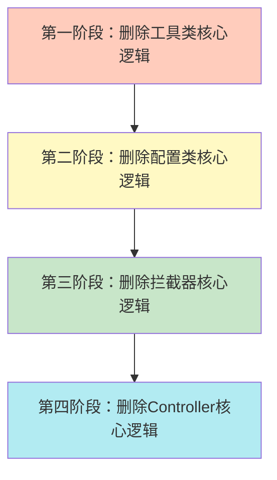
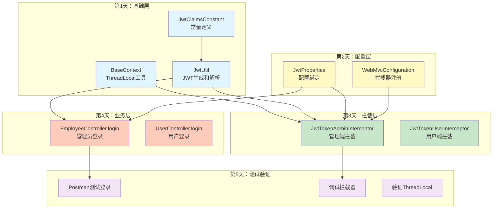

非常棒的学习方式！"删除-重写"比单纯看代码有效10倍。我给你一个**循序渐进、科学有效**的方案。

- [[JWT登录认证]]
- [[JWT登录认证复盘]]
- [[JWT登录模块架构设计]]

---

## **📋 一、删除策略（分层删除，保留框架）**

### **原则：删除核心逻辑，保留类结构和注解**



### **具体删除清单**

#### **阶段1：工具类（基础层）**

**1.1 JwtUtil.java - 删除方法体，保留方法签名**
```java
// 保留这个
public static String createJWT(String secretKey, long ttlMillis, Map<String, Object> claims) {
    // TODO: 实现JWT生成逻辑
    return null;
}

// 保留这个
public static Claims parseJWT(String secretKey, String token) {
    // TODO: 实现JWT解析逻辑
    return null;
}
```

**1.2 BaseContext.java - 删除方法体**
```java
public static ThreadLocal<Long> threadLocal = new ThreadLocal<>();

public static void setCurrentId(Long id) {
    // TODO: 实现ThreadLocal存储
}

public static Long getCurrentId() {
    // TODO: 实现ThreadLocal读取
    return null;
}

public static void removeCurrentId() {
    // TODO: 实现ThreadLocal清理
}
```

**1.3 JwtClaimsConstant.java - 保留常量定义（这个不删）**
```java
// 这个类不删，因为是常量定义，敲一遍能加深对字段名的记忆
```

**1.4 JwtProperties.java - 保留类结构（这个不删）**
```java
// 保留注解和字段，重点理解@ConfigurationProperties的作用
```

---

#### **阶段2：配置类**

**2.1 WebMvcConfiguration.java - 删除`addInterceptors`方法体**
```java
@Override
protected void addInterceptors(InterceptorRegistry registry) {
    log.info("开始注册自定义拦截器...");
    
    // TODO: 注册管理端拦截器，拦截/admin/**，放行/admin/employee/login
    
    // TODO: 注册用户端拦截器，拦截/user/**，放行登录和店铺状态接口
}
```

---

#### **阶段3：拦截器（核心层）**

**3.1 JwtTokenAdminInterceptor.java - 删除`preHandle`和`afterCompletion`方法体**
```java
@Override
public boolean preHandle(HttpServletRequest request, HttpServletResponse response, Object handler) throws Exception {
    // TODO: 1. 判断是否是Controller方法
    
    // TODO: 2. 从请求头获取token
    
    // TODO: 3. 验证JWT并解析empId
    
    // TODO: 4. 写入ThreadLocal
    
    // TODO: 5. 返回true放行
    
    return false;
}

@Override
public void afterCompletion(HttpServletRequest request, HttpServletResponse response, Object handler, Exception ex) throws Exception {
    // TODO: 清理ThreadLocal
}
```

**3.2 JwtTokenUserInterceptor.java - 同上**

---

#### **阶段4：控制器（业务层）**

**4.1 EmployeeController.java - 删除`login`方法体**
```java
@PostMapping("/login")
public Result<EmployeeLoginVO> login(@RequestBody EmployeeLoginDTO employeeLoginDTO) {
    log.info("员工登录：{}", employeeLoginDTO);

    // TODO: 1. 调用Service验证账号密码
    
    // TODO: 2. 构建claims，放入empId
    
    // TODO: 3. 调用JwtUtil生成token
    
    // TODO: 4. 构建EmployeeLoginVO返回
    
    return null;
}
```

**4.2 UserController.java - 删除`login`方法体（类似）**

---

## **✍️ 二、推荐敲代码顺序（从底层到上层）**

### **顺序图（按依赖关系）**



### **详细顺序与耗时估计**

| 顺序 | 类名 | 核心方法 | 预计耗时 | 为什么这样排序 |
|------|------|---------|---------|---------------|
| **1** | `JwtClaimsConstant` | 常量定义 | 5分钟 | 最基础，没有依赖 |
| **2** | `BaseContext` | set/get/remove | 10分钟 | 理解ThreadLocal原理 |
| **3** | `JwtUtil` | createJWT/parseJWT | 30分钟 | 核心工具，拦截器和Controller都依赖它 |
| **4** | `JwtProperties` | 字段定义 | 10分钟 | 理解配置绑定 |
| **5** | `WebMvcConfiguration` | addInterceptors | 15分钟 | 理解拦截规则和放行路径 |
| **6** | `JwtTokenAdminInterceptor` | preHandle/afterCompletion | 25分钟 | 核心校验逻辑 |
| **7** | `JwtTokenUserInterceptor` | preHandle/afterCompletion | 20分钟 | 类似上一个，更快 |
| **8** | `EmployeeController.login` | login方法 | 20分钟 | 生成JWT流程 |
| **9** | `UserController.login` | login方法 | 15分钟 | 类似上一个 |
| **10** | **测试验证** | Postman + 断点调试 | 30分钟 | 验证理解是否正确 |

**总计：约3小时**

---

## **🧠 三、敲代码时的思考清单**

### **通用思考框架（每行代码都问这3个问题）**

```
1. WHY（为什么）：为什么要写这行代码？不写会怎样？
2. WHAT（是什么）：这行代码做了什么？返回值是什么？
3. HOW（怎么做）：这行代码的执行顺序是什么？和上下文的关系？
```

---

### **具体思考指南（按顺序）**

#### **1. 敲 JwtClaimsConstant 时思考**
```java
public static final String EMP_ID = "empId";
```
- ❓ **WHY**: 为什么要定义常量而不是直接写字符串？
  - ✅ 答：避免硬编码，拼写错误编译期能发现，IDE有提示
- ❓ **WHAT**: 这个常量用在哪里？
  - ✅ 答：Controller生成JWT时作为claims的key，拦截器解析JWT时作为key
- ❓ **HOW**: 为什么是`empId`而不是`emp_id`？
  - ✅ 答：这是JWT的payload字段名，用驼峰，不是数据库字段名

---

#### **2. 敲 BaseContext 时思考**
```java
public static ThreadLocal<Long> threadLocal = new ThreadLocal<>();

public static void setCurrentId(Long id) {
    threadLocal.set(id);
}
```
- ❓ **WHY**: 为什么要用ThreadLocal？不能用Map<userId, empId>吗？
  - ✅ 答：多线程环境下，Map需要加锁，性能差；ThreadLocal天然线程隔离
- ❓ **WHAT**: 这个id是从哪来的？存到哪里？
  - ✅ 答：从JWT的claims中解析出来，存到当前线程的ThreadLocalMap中
- ❓ **HOW**: 什么时候set？什么时候get？什么时候remove？
  - ✅ 答：拦截器preHandle中set，Service中get，afterCompletion中remove

---

#### **3. 敲 JwtUtil.createJWT 时思考**
```java
SignatureAlgorithm signatureAlgorithm = SignatureAlgorithm.HS256;
```
- ❓ **WHY**: 为什么用HS256而不是RS256？
  - ✅ 答：HS256对称加密，性能高；RS256非对称加密，更安全但慢
- ❓ **WHAT**: 这行代码做了什么？
  - ✅ 答：指定签名算法为HMAC-SHA256

```java
long expMillis = System.currentTimeMillis() + ttlMillis;
Date exp = new Date(expMillis);
```
- ❓ **WHY**: 为什么要设置过期时间？
  - ✅ 答：防止token被盗用后长期有效，降低安全风险
- ❓ **WHAT**: expMillis是什么？
  - ✅ 答：当前时间戳 + 有效期 = 过期时间戳

```java
.setClaims(claims)
.signWith(signatureAlgorithm, secretKey.getBytes(StandardCharsets.UTF_8))
.setExpiration(exp);
```
- ❓ **WHY**: 为什么setClaims要在signWith之前？
  - ✅ 答：签名是对claims的签名，必须先设置claims再签名
- ❓ **WHAT**: secretKey转byte[]的作用？
  - ✅ 答：HMAC算法需要byte[]格式的密钥

---

#### **4. 敲 JwtUtil.parseJWT 时思考**
```java
Claims claims = Jwts.parser()
    .setSigningKey(secretKey.getBytes(StandardCharsets.UTF_8))
    .parseClaimsJws(token).getBody();
```
- ❓ **WHY**: 为什么这里会抛异常？
  - ✅ 答：签名不匹配或token过期会抛异常，需要在拦截器中catch
- ❓ **WHAT**: parseClaimsJws做了什么？
  - ✅ 答：验证签名、检查过期时间、解析payload
- ❓ **HOW**: 如果token被篡改会怎样？
  - ✅ 答：签名验证失败，抛SignatureException

---

#### **5. 敲 WebMvcConfiguration.addInterceptors 时思考**
```java
registry.addInterceptor(jwtTokenAdminInterceptor)
    .addPathPatterns("/admin/**")
    .excludePathPatterns("/admin/employee/login");
```
- ❓ **WHY**: 为什么要放行登录接口？
  - ✅ 答：登录时前端还没有token，如果拦截会导致永远无法登录
- ❓ **WHAT**: `/admin/**`和`/admin/*`的区别？
  - ✅ 答：`**`匹配多级路径，`*`只匹配单级
- ❓ **HOW**: 如果先注册userInterceptor会怎样？
  - ✅ 答：拦截路径不重叠，顺序无影响；如果重叠则先注册的先执行

---

#### **6. 敲 JwtTokenAdminInterceptor.preHandle 时思考**
```java
if (!(handler instanceof HandlerMethod)) {
    return true;
}
```
- ❓ **WHY**: 为什么要判断HandlerMethod？
  - ✅ 答：静态资源、错误页面不需要JWT校验，只拦截Controller方法
- ❓ **WHAT**: 不是HandlerMethod的是什么？
  - ✅ 答：可能是ResourceHttpRequestHandler（静态资源）

```java
String token = request.getHeader(jwtProperties.getAdminTokenName());
```
- ❓ **WHY**: 为什么从请求头读取？不能从请求参数读吗？
  - ✅ 答：请求头更安全，URL参数会被日志记录，容易泄漏token
- ❓ **WHAT**: adminTokenName的值是什么？
  - ✅ 答：配置文件中是`token`，前端会设置`Header: token=xxx`

```java
Claims claims = JwtUtil.parseJWT(jwtProperties.getAdminSecretKey(), token);
Long empId = Long.valueOf(claims.get(JwtClaimsConstant.EMP_ID).toString());
```
- ❓ **WHY**: 为什么要toString()再valueOf？
  - ✅ 答：claims.get()返回Object，需要转换成Long
- ❓ **WHAT**: 如果token过期会怎样？
  - ✅ 答：parseJWT抛ExpiredJwtException，被catch捕获，返回401

```java
BaseContext.setCurrentId(empId);
```
- ❓ **WHY**: 为什么要写入ThreadLocal？
  - ✅ 答：后续Service层需要获取当前用户ID，无法通过参数传递

```java
catch (Exception ex) {
    response.setStatus(401);
    return false;
}
```
- ❓ **WHY**: 为什么是401而不是403？
  - ✅ 答：401表示未认证（token无效），403表示已认证但无权限
- ❓ **WHAT**: return false会怎样？
  - ✅ 答：请求被拦截，不会执行Controller方法

---

#### **7. 敲 afterCompletion 时思考**
```java
@Override
public void afterCompletion(...) throws Exception {
    BaseContext.removeCurrentId();
}
```
- ❓ **WHY**: 为什么要清理ThreadLocal？
  - ✅ 答：Tomcat使用线程池，线程会复用，不清理会导致下次请求读到旧数据
- ❓ **WHAT**: 什么时候执行afterCompletion？
  - ✅ 答：Controller处理完成、视图渲染后、响应返回前
- ❓ **HOW**: 如果Controller抛异常，还会执行吗？
  - ✅ 答：会执行！afterCompletion无论如何都会执行

---

#### **8. 敲 EmployeeController.login 时思考**
```java
Employee employee = employeeService.login(employeeLoginDTO);
```
- ❓ **WHY**: 为什么要先调用Service？
  - ✅ 答：Controller只负责接收参数和返回结果，业务逻辑在Service
- ❓ **WHAT**: 如果账号密码错误会怎样？
  - ✅ 答：Service会抛异常，被全局异常处理器捕获，返回错误信息

```java
Map<String, Object> claims = new HashMap<>();
claims.put(JwtClaimsConstant.EMP_ID, employee.getId());
```
- ❓ **WHY**: 为什么用HashMap而不是直接传employee对象？
  - ✅ 答：JWT的payload只能是简单类型，不能序列化复杂对象
- ❓ **WHAT**: 可以放其他信息吗？比如username？
  - ✅ 答：可以，但JWT会变大，且无法撤销，敏感信息不建议放

```java
String token = JwtUtil.createJWT(
    jwtProperties.getAdminSecretKey(),
    jwtProperties.getAdminTtl(),
    claims);
```
- ❓ **WHY**: 为什么用adminSecretKey而不是userSecretKey？
  - ✅ 答：管理端和用户端密钥隔离，防止权限混淆
- ❓ **WHAT**: adminTtl是多少？
  - ✅ 答：7200000毫秒 = 2小时

```java
EmployeeLoginVO employeeLoginVO = EmployeeLoginVO.builder()
    .id(employee.getId())
    .userName(employee.getUsername())
    .name(employee.getName())
    .token(token)
    .build();
```
- ❓ **WHY**: 为什么要封装成VO而不是直接返回Employee？
  - ✅ 答：VO只包含前端需要的字段，避免泄漏敏感信息（如密码）
- ❓ **WHAT**: builder模式的优点？
  - ✅ 答：链式调用，可读性强，避免构造函数参数过多

---

## **✅ 四、什么样才算有效的敲代码？**

### **无效敲代码的特征（要避免）**
- ❌ 照着代码一字不差地抄，不思考为什么
- ❌ 敲完不运行，不测试，不调试
- ❌ 遇到报错直接复制粘贴原代码
- ❌ 敲完就删，下次又忘了

### **有效敲代码的标准（自检清单）**

#### **✅ Level 1：能解释（基础要求）**
每敲完一个方法，闭上眼睛能回答：
- [ ] 这个方法的**输入**是什么？
- [ ] 这个方法的**输出**是什么？
- [ ] 这个方法的**核心逻辑**是什么？
- [ ] 如果注释掉这行代码，会**报什么错**？

**实操建议：**
```java
// 敲完这行后，立即在旁边写注释
Claims claims = JwtUtil.parseJWT(jwtProperties.getAdminSecretKey(), token);
// 我的理解：用管理端密钥验证token，返回包含empId的claims对象
// 如果token无效会抛异常，需要catch
```

---

#### **✅ Level 2：能运行（实践要求）**
每敲完一个类，必须：
- [ ] **编译通过**（Ctrl+F9），解决所有红线
- [ ] **启动项目**（Shift+F10），看是否报错
- [ ] **打断点调试**（Shift+F9），看变量值是否正确
- [ ] **Postman测试**，看接口返回是否符合预期

**实操建议：**
```
敲完JwtUtil后 → 写个Main方法测试
敲完Interceptor后 → 启动项目，Postman发请求，看日志
敲完Controller后 → 完整测试登录流程
```

---

#### **✅ Level 3：能调试（进阶要求）**
遇到问题时，能通过断点调试找到原因：
- [ ] **打断点**：在关键行打断点（parseJWT、setCurrentId等）
- [ ] **单步执行**：F8逐行执行，看变量变化
- [ ] **查看调用栈**：看方法调用链路
- [ ] **计算表达式**：Alt+F8计算claims.get("empId")的值

**实操建议：**
```
1. 在JwtTokenAdminInterceptor.preHandle打断点
2. Postman发请求，触发断点
3. F8单步执行，观察：
   - token的值是什么？
   - parseJWT返回的claims包含哪些字段？
   - empId是否正确写入ThreadLocal？
4. 在Service中打断点，看getCurrentId()是否能读到empId
```

---

#### **✅ Level 4：能修改（高级要求）**
能根据需求修改代码：
- [ ] 把JWT过期时间改成15分钟，观察效果
- [ ] 在claims中加入username字段，拦截器中打印
- [ ] 故意输入错误的token，看拦截器是否返回401
- [ ] 注释掉afterCompletion，用JConsole观察ThreadLocal泄漏

**实操建议：**
```java
// 实验1：测试过期时间
admin-ttl: 60000  // 改成1分钟
等待1分钟后再访问接口，观察是否返回401

// 实验2：验证ThreadLocal泄漏
// 注释掉afterCompletion中的removeCurrentId()
// 连续发起两次请求，第二次请求在Service中打印getCurrentId()
// 看是否读到第一次请求的empId
```

---

#### **✅ Level 5：能讲解（大师要求）**
能给别人讲清楚：
- [ ] 画出JWT登录的完整流程图
- [ ] 用自己的话讲解每个类的职责
- [ ] 回答面试官的追问（ThreadLocal为什么会泄漏？）
- [ ] 指出代码的改进点（可以加缓存、双Token机制）

**实操建议：**
```
找一个同学/朋友（或者橡皮鸭），讲解：
1. JWT的三部分是什么？
2. 拦截器的执行顺序？
3. 为什么登录接口要放行？
4. ThreadLocal什么时候清理？

如果他听懂了 → 你真的掌握了
如果他没听懂 → 回到Level 1重新理解
```

---

## **🎯 五、推荐的实操步骤（3小时计划）**

### **第1小时：基础层（不要求完美，先跑通）**
```
1. 删除JwtUtil的方法体 → 敲代码 → 写Main方法测试
   String token = JwtUtil.createJWT("test", 3600000, Map.of("empId", 1L));
   Claims claims = JwtUtil.parseJWT("test", token);
   System.out.println(claims.get("empId"));  // 输出1

2. 删除BaseContext的方法体 → 敲代码 → 写Main方法测试
   BaseContext.setCurrentId(123L);
   System.out.println(BaseContext.getCurrentId());  // 输出123
   BaseContext.removeCurrentId();
   System.out.println(BaseContext.getCurrentId());  // 输出null

3. 重新敲JwtClaimsConstant（巩固记忆）
```

---

### **第2小时：拦截器+配置（重点理解）**
```
1. 删除WebMvcConfiguration.addInterceptors → 敲代码
   注意拦截路径和放行路径，敲完后启动项目看日志

2. 删除JwtTokenAdminInterceptor → 敲代码
   重点：preHandle的完整逻辑 + afterCompletion的清理
   
3. 敲完后测试：
   Postman: POST /admin/employee/login
   获取token后，访问 GET /admin/employee/page
   Header: token=xxx
   
4. 打断点调试：
   - preHandle中看token是否正确解析
   - Service中看getCurrentId()是否有值
   - afterCompletion中看是否调用了remove
```

---

### **第3小时：Controller+完整测试**
```
1. 删除EmployeeController.login → 敲代码
   重点：claims的构建 + JwtUtil的调用

2. 完整流程测试：
   ① 登录 POST /admin/employee/login {"username":"admin","password":"123456"}
   ② 复制返回的token
   ③ 访问受保护接口 GET /admin/employee/page，Header: token=xxx
   ④ 观察日志，看是否打印"当前员工id：1"

3. 异常测试：
   ① 不带token访问 → 应该返回401
   ② 带错误token访问 → 应该返回401
   ③ 带过期token访问 → 应该返回401

4. ThreadLocal测试：
   ① 在Service中打断点，看getCurrentId()
   ② 在afterCompletion中打断点，看是否执行remove
```

---

## **📌 最后的建议**

### **1. 不要一次性敲完所有代码**
- 每敲完一个类，立即测试
- 遇到问题立即调试，不要积累问题

### **2. 每天只敲1-2小时**
- 今天敲完基础层，明天再敲拦截器
- 睡觉前回忆今天敲的代码，加深记忆

### **3. 建立代码仓库**
```bash
git init jwt-learning
git add .
git commit -m "第1天：完成JwtUtil和BaseContext"
git commit -m "第2天：完成拦截器"
git commit -m "第3天：完成Controller和测试"
```

### **4. 写学习笔记**
每敲完一个类，写一段总结：
```
今天敲了JwtUtil，学到了：
1. JWT由header.payload.signature组成
2. HS256是对称加密算法
3. 过期时间通过setExpiration设置
4. parseJWT会自动验证签名和过期时间

遇到的坑：
1. secretKey要转byte[]
2. 忘记设置过期时间，导致token永久有效

明天计划：
1. 敲拦截器的preHandle
2. 理解为什么要判断HandlerMethod
```

---

**现在开始行动吧！建议你：**
1. **先不要删代码**，把我的方案看3遍
2. **制定计划**：第1天敲什么，第2天敲什么
3. **准备测试环境**：Postman、数据库、日志
4. **开始删除代码**，按照我的顺序一步步来

**准备好了吗？告诉我你打算从哪个类开始！** 🚀