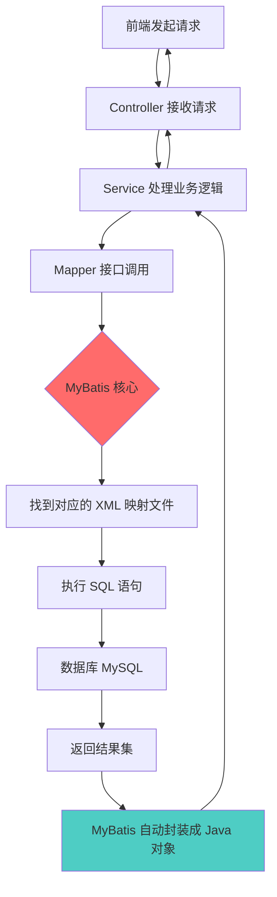

## 一、MyBatis 是什么？为什么这么流行？

**简单来说**：MyBatis 是一个**持久层框架**，它的作用就是**让 Java 对象和数据库表之间能够方便地相互转换**。

**为什么在 Spring Boot 中这么受欢迎？**
1. **半自动化 ORM**：不像 Hibernate 那样完全自动（太"黑盒"），MyBatis 让开发者自己写 SQL，更灵活可控
2. **易于优化**：可以手动优化 SQL，适合复杂查询和高性能场景
3. **学习成本低**：只要会写 SQL，上手很快
4. **与 Spring Boot 整合简单**：只需要添加依赖，自动配置即可

---

## 二、MyBatis 在项目中的核心应用逻辑（业务流程）

让我用最简单的语言来解释整个流程：



**流程说明**：
1. **用户操作**：前端提交"查询员工列表"请求
2. **Controller 层**：接收 HTTP 请求
3. **Service 层**：调用 `employeeMapper.pageQuery()`
4. **MyBatis 启动**：
   - 根据接口方法名找到 EmployeeMapper.xml 中的 `<select id="pageQuery">` 
   - 把方法参数自动映射到 SQL 的 `#{参数}`
   - 执行 SQL 查询数据库
   - 把查询结果自动转换成 `Employee` 对象
5. **返回结果**：层层返回到前端

---

## 三、具体在哪些类和方法上体现？

### 📌 1. **Mapper 接口**（核心入口）

**位置**：EmployeeMapper.java

```java
@Mapper  // ⬅️ 关键注解！告诉 Spring 这是 MyBatis 的 Mapper
public interface EmployeeMapper {
    
    // 根据用户名查询员工
    Employee getByUsername(@Param("username") String username);
    
    // 插入员工数据
    @AutoFill(OperationType.INSERT)
    void insert(Employee employee);
    
    // 员工分页查询
    Page<Employee> pageQuery(EmployeePageQueryDTO employeePageQueryDTO);
    
    // 更新员工信息
    @AutoFill(OperationType.UPDATE)
    void update(Employee employee);
}
```

**关键点**：
- `@Mapper` 注解让 Spring 扫描并创建这个接口的实现类（动态代理）
- 只需要定义接口方法，不需要写实现类！MyBatis 会自动生成

---

### 📌 2. **XML 映射文件**（SQL 实现）

**位置**：EmployeeMapper.xml

```xml
<mapper namespace="com.sky.mapper.EmployeeMapper">
    
    <!-- 根据用户名查询员工 -->
    <select id="getByUsername" resultType="com.sky.entity.Employee">
        select * from employee where username = #{username}
    </select>
    
    <!-- 员工分页查询 -->
    <select id="pageQuery" resultType="com.sky.entity.Employee">
        select * from employee
        <where>
            <if test="name != null and name != ''">
                and name like concat('%',#{name},'%')
            </if>
        </where>
    </select>
</mapper>
```

**关键点**：
- `namespace` 必须对应 Mapper 接口的全限定名
- `id` 必须对应接口中的方法名
- `#{username}` 会自动防止 SQL 注入（预编译）
- `<if>` 标签实现动态 SQL

---

### 📌 3. **Service 层调用**

**位置**：EmployeeServiceImpl.java

```java
@Service
public class EmployeeServiceImpl implements EmployeeService {
    
    @Autowired
    private EmployeeMapper employeeMapper;  // ⬅️ 注入 Mapper
    
    public Employee login(EmployeeLoginDTO employeeLoginDTO) {
        // 直接调用 Mapper 方法，就像调用普通方法一样
        Employee employee = employeeMapper.getByUsername(username);
        
        if (employee == null) {
            throw new AccountNotFoundException("账号不存在");
        }
        return employee;
    }
}
```

---

### 📌 4. **配置文件**

**位置**：application.yml

```yaml
mybatis:
  # XML 映射文件的位置
  mapper-locations: classpath:mapper/*.xml
  # 实体类的包路径（可以省略包名）
  type-aliases-package: com.sky.entity
  configuration:
    # 开启驼峰命名自动映射（user_name -> userName）
    map-underscore-to-camel-case: true
```

---

### 📌 5. **依赖配置**

**位置**：pom.xml

```xml
<dependency>
    <groupId>org.mybatis.spring.boot</groupId>
    <artifactId>mybatis-spring-boot-starter</artifactId>
    <version>2.2.0</version>
</dependency>
```

---

## 四、初学者需要掌握的核心内容

### ✅ **基础必会**（实习面试必考）

| 知识点 | 说明 | 项目体现 |
|--------|------|----------|
| **@Mapper 注解** | 标记 Mapper 接口 | 所有 Mapper 接口 |
| **namespace** | XML 与接口的绑定 | 所有 XML 文件 |
| **#{} 和 ${}** | 参数占位符的区别 | XML 中的 SQL |
| **resultType** | 结果映射类型 | `<select>` 标签 |
| **动态 SQL** | `<if>` `<where>` `<foreach>` | [EmployeeMapper.xml](sky-server/src/main/resources/mapper/EmployeeMapper.xml), [DishFlavorMapper.xml](sky-server/src/main/resources/mapper/DishFlavorMapper.xml#L7-L11) |

---

### 🔥 **实战重点**（项目中常用）

#### 1️⃣ **动态 SQL - `<if>` 标签**
```xml
<!-- 在 DishMapper.xml 中 -->
<update id="update">
    update dish
    <set>
        <if test="name != null">name = #{name},</if>
        <if test="price != null">price = #{price},</if>
    </set>
    where id = #{id}
</update>
```
**作用**：只更新不为 null 的字段

#### 2️⃣ **批量插入 - `<foreach>` 标签**
```xml
<!-- 在 DishFlavorMapper.xml 中 -->
<insert id="insertBatch">
    insert into dish_flavor (dish_id, name, value) VALUES
    <foreach collection="flavors" separator="," item="item">
        (#{item.dishId}, #{item.name}, #{item.value})
    </foreach>
</insert>
```
**作用**：批量插入多条口味数据

#### 3️⃣ **分页查询 - PageHelper**
```java
// 在 EmployeeServiceImpl 中
PageHelper.startPage(page, pageSize);  // 开启分页
Page<Employee> result = employeeMapper.pageQuery(dto);
```
**作用**：自动在 SQL 后面加 `LIMIT` 子句

---

## 五、面试中通常怎么问？

### 🎯 **高频面试题**

#### **Q1：MyBatis 的 #{} 和 ${} 有什么区别？**
**标准答案**：
- `#{}` 是**预编译**，会转换成 `?` 占位符，能防止 SQL 注入（**推荐**）
- `${}` 是**字符串替换**，直接拼接到 SQL 中，有 SQL 注入风险

**项目体现**：所有 XML 文件都用 `#{}`，比如 EmployeeMapper.xml

---

#### **Q2：MyBatis 如何实现接口和 XML 的绑定？**
**标准答案**：
1. XML 的 `namespace` 必须是接口的全限定名
2. XML 中的 `<select>/<insert>` 等标签的 `id` 必须是接口方法名
3. 方法参数和返回值必须匹配

**项目示例**：
```java
// 接口：com.sky.mapper.EmployeeMapper
Employee getByUsername(String username);
```
```xml
<!-- XML namespace 对应接口，id 对应方法名 -->
<mapper namespace="com.sky.mapper.EmployeeMapper">
    <select id="getByUsername" resultType="com.sky.entity.Employee">
        select * from employee where username = #{username}
    </select>
</mapper>
```

---

#### **Q3：MyBatis 的一级缓存和二级缓存是什么？**
**标准答案**：
- **一级缓存**：SqlSession 级别，默认开启，同一个 SqlSession 内查询结果会被缓存
- **二级缓存**：Mapper 级别，需要手动配置，多个 SqlSession 可以共享

**追问**：你们项目用了吗？
**回答**：我们项目用了 Redis 做缓存，没有用 MyBatis 自带的二级缓存（容易出现脏数据）

---

#### **Q4：在高并发场景下，如何优化 MyBatis？**
**回答思路**：
1. **批量操作**：用 `<foreach>` 批量插入（见 DishFlavorMapper.xml）
2. **分页查询**：避免一次查询大量数据（用 PageHelper）
3. **懒加载**：关联查询时按需加载
4. **连接池**：项目用了 Druid 连接池

---

## 六、给你的建议

作为大二学生准备实习，你需要：

### ✅ **必须掌握**
1. 能看懂项目中任意一个 Mapper 接口和 XML 的对应关系
2. 能独立写一个简单的 CRUD（增删改查）
3. 理解动态 SQL 的 `<if>` 和 `<foreach>`
4. 能解释清楚 `#{}` 和 `${}` 的区别

### 🎯 **加分项**
1. 了解 ResultMap（复杂结果映射）
2. 知道 `@Select`、`@Insert` 等注解方式（虽然项目主要用 XML）
3. 能说出 MyBatis 和 Hibernate 的区别

### ⚠️ **面试小技巧**
当面试官问"你们项目用 MyBatis 做了什么"时，可以这样回答：

> "我们项目用 MyBatis 作为持久层框架，所有数据库操作都通过 Mapper 接口完成。比如员工管理模块，我定义了 EmployeeMapper 接口，通过 XML 文件编写 SQL。为了优化性能，我用了 `<foreach>` 实现批量插入，用 PageHelper 实现分页查询。为了防止 SQL 注入，全部使用 #{} 预编译参数。"

---

现在你可以试着回答我几个问题来检验一下：
1. 在你的项目中，UserMapper.java 和 UserMapper.xml 是如何对应的？
2. 如果要实现模糊查询用户名，应该用 `#{}` 还是 `${}`？