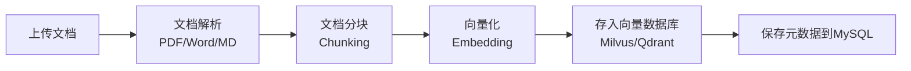
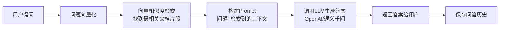

## 📌 一句话概括

**这是一个让企业内部的技术文档、代码能被 AI 智能问答的系统** —— 上传文档，AI 就能基于这些文档回答你的问题。

---

## 🎯 核心业务流程

整个系统分为**两大核心流程**：

### 1️⃣ **知识库构建流程**（文档入库）

**业务逻辑**：
- 用户上传技术文档（比如 Java 开发手册.pdf）
- 系统解析文档内容，按语义切成小段（chunk）
- 每一段文本转成向量（一串数字，代表语义）
- 向量存到向量数据库，方便后续相似度检索

---

### 2️⃣ **智能问答流程**（RAG检索增强生成）

**业务逻辑**：
- 用户问："Spring Boot 如何配置数据源？"
- 系统把问题转成向量，去向量库找最相似的文档片段（Top 3-5）
- 把问题 + 检索到的文档内容一起发给 AI 大模型
- AI 基于检索到的文档回答（不是瞎编，而是基于你的文档）
- 答案返回给用户，同时记录到问答历史

---

## 🏗️ 模块划分（5个子模块）

| 模块 | 职责 | 核心技术点 |
|------|------|-----------|
| **rag-common** | 公共基础能力 | 限流、幂等性、TraceId链路追踪、Redis工具 |
| **rag-auth** | 用户认证授权 | JWT Token、Spring Security、Token黑名单 |
| **rag-document** | 文档处理 | PDF/Word/MD解析、文档分块（Chunking） |
| **rag-core** | RAG核心引擎 | 向量嵌入（Embedding）、向量检索、LLM调用 |
| **rag-admin** | 接口层/入口 | Controller（问答、知识库管理、历史查询） |

---

## 💡 技术亮点（面试会问的核心点）

### ⚡ **高并发相关**
- **Redis 限流**：防止接口被刷爆（滑动窗口算法）
- **幂等性控制**：防止重复提交（基于 Redis）
- **异步任务**：文档处理用异步，不阻塞接口响应

### 🔐 **安全认证**
- **JWT Token**：无状态认证，Token 存储用户信息
- **Token 黑名单**：登出时把 Token 加入黑名单（Redis）
- **Spring Security**：拦截器链路，权限控制

### 🧠 **RAG 核心**
- **向量嵌入（Embedding）**：文本转向量的模型选择（OpenAI、通义千问、BGE本地）
- **向量数据库**：Milvus/Qdrant/Elasticsearch 三选一
- **Prompt 工程**：如何构建好的 Prompt 让 LLM 回答更准确

### 🔍 **可观测性**
- **TraceId 链路追踪**：一个请求从进入到结束的完整日志追踪
- **Flyway 数据库迁移**：版本化管理数据库变更

---

## 🎤 面试会怎么问？

### 问题 1：**RAG 和普通 LLM 调用有什么区别？**
**回答方向**：  
- 普通 LLM：只基于训练数据回答，可能幻觉（胡编乱造）
- RAG：先检索相关文档，再让 LLM 基于检索内容回答，**准确性高**

### 问题 2：**你们的限流是怎么实现的？为什么不用 Guava？**
**回答方向**：  
- 单机用 Guava RateLimiter，分布式用 Redis + Lua
- **滑动窗口算法**比固定窗口更平滑
- 提示词：面试官可能追问"令牌桶 vs 漏桶 vs 滑动窗口的区别"

---

## 🚀 快速上手建议

1. **先跑起来**：按 README 的环境准备 → 启动 MySQL/Redis → 启动项目
2. **先看主流程代码**：
   - QAController.java - 问答接口入口
   - RAGService.java - RAG 核心业务
3. **再深入细节**：文档解析、向量嵌入、限流幂等等
4. **边调试边学**：**打断点走一遍问答流程**，理解最快！

---

有任何模块想深入了解，随时告诉我！比如：
- "讲讲 JWT 认证流程"
- "文档是怎么分块的？"
- "限流具体怎么实现的？"