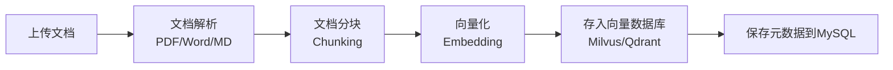
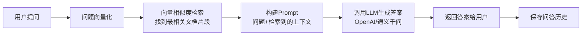

## 📌 一句话概括

**这是一个让企业内部的技术文档、代码能被 AI 智能问答的系统** —— 上传文档，AI 就能基于这些文档回答你的问题。

---

## 🎯 核心业务流程

整个系统分为**两大核心流程**：

### 1️⃣ **知识库构建流程**（文档入库）


```mermaid
graph LR
    A[上传文档] --> B[文档解析<br/>PDF/Word/MD]
    B --> C[文档分块<br/>Chunking]
    C --> D[向量化<br/>Embedding]
    D --> E[存入向量数据库<br/>Milvus/Qdrant]
    E --> F[保存元数据到MySQL]
```

**业务逻辑**：
- 用户上传技术文档（比如 Java 开发手册.pdf）
- 系统解析文档内容，按语义切成小段（chunk）
- 每一段文本转成向量（一串数字，代表语义）
- 向量存到向量数据库，方便后续相似度检索

---

### 2️⃣ **智能问答流程**（RAG检索增强生成）


```mermaid
graph LR
    A[用户提问] --> B[问题向量化]
    B --> C[向量相似度检索<br/>找到最相关文档片段]
    C --> D[构建Prompt<br/>问题+检索到的上下文]
    D --> E[调用LLM生成答案<br/>OpenAI/通义千问]
    E --> F[返回答案给用户]
    F --> G[保存问答历史]
```

**业务逻辑**：
- 用户问："Spring Boot 如何配置数据源？"
- 系统把问题转成向量，去向量库找最相似的文档片段（Top 3-5）
- 把问题 + 检索到的文档内容一起发给 AI 大模型
- AI 基于检索到的文档回答（不是瞎编，而是基于你的文档）
- 答案返回给用户，同时记录到问答历史

---

## 🏗️ 模块划分（5个子模块）

| 模块 | 职责 | 核心技术点 |
|------|------|-----------|
| **rag-common** | 公共基础能力 | 限流、幂等性、TraceId链路追踪、Redis工具 |
| **rag-auth** | 用户认证授权 | JWT Token、Spring Security、Token黑名单 |
| **rag-document** | 文档处理 | PDF/Word/MD解析、文档分块（Chunking） |
| **rag-core** | RAG核心引擎 | 向量嵌入（Embedding）、向量检索、LLM调用 |
| **rag-admin** | 接口层/入口 | Controller（问答、知识库管理、历史查询） |

---

## 💡 技术亮点（面试会问的核心点）

### ⚡ **高并发相关**
- **Redis 限流**：防止接口被刷爆（滑动窗口算法）
- **幂等性控制**：防止重复提交（基于 Redis）
- **异步任务**：文档处理用异步，不阻塞接口响应

### 🔐 **安全认证**
- **JWT Token**：无状态认证，Token 存储用户信息
- **Token 黑名单**：登出时把 Token 加入黑名单（Redis）
- **Spring Security**：拦截器链路，权限控制

### 🧠 **RAG 核心**
- **向量嵌入（Embedding）**：文本转向量的模型选择（OpenAI、通义千问、BGE本地）
- **向量数据库**：Milvus/Qdrant/Elasticsearch 三选一
- **Prompt 工程**：如何构建好的 Prompt 让 LLM 回答更准确

### 🔍 **可观测性**
- **TraceId 链路追踪**：一个请求从进入到结束的完整日志追踪
- **Flyway 数据库迁移**：版本化管理数据库变更

---

## 项目全景分析

```
rag-qa-system (多模块 Maven 项目)
├── rag-common    # 公共基础设施层
│   ├── async/    # 异步任务 + MQ 抽象
│   ├── idempotency/ # 幂等性 (AOP + Redis)
│   ├── ratelimit/   # 限流 (滑动窗口)
│   ├── trace/       # 分布式链路追踪
│   └── exception/   # 全局异常处理
├── rag-auth      # 认证授权层
│   └── JWT + Spring Security 6
├── rag-document  # 文档处理层
│   └── 文档解析、分块 (Chunk)
├── rag-core      # RAG 核心层
│   ├── embedding/   # 向量化 (BGE 模型)
│   └── vectorstore/ # Milvus / Qdrant / ES
└── rag-admin     # API 入口层
    ├── 知识库管理
    └── 问答 + 历史记录
```

---

## 学习路线（按优先级分阶段）

### 第一阶段：Java Web 基础夯实（2周）

**目标：能看懂项目每一行代码**

| 知识点 | 在本项目的体现 | 学习资源 |
|--------|--------------|---------|
| Spring Boot 3 自动装配 | 所有 `@Configuration` 类 | 官方文档 |
| Spring MVC 请求流程 | rag-admin 所有 Controller | 跟断点走一遍 |
| MyBatis Plus CRUD | `**Mapper.java` + `**ServiceImpl.java` | MP 官方文档 |
| Lombok 注解 | 全项目 `@Data` `@Builder` `@Slf4j` | 5分钟即可掌握 |
| Java 17 新特性 | Record、sealed（关注项目用了哪些） | - |

**第一阶段任务**：把 KnowledgeBaseServiceImpl.java 通读一遍，理解增删改查流程。

---

### 第二阶段：核心中间件逐个攻克（3周）

按以下顺序学习，每个知识点对应项目里的真实代码：

#### 1. Redis（最高频考点）
- **项目对应**：RedisUtil.java、`RedisConfig.java`、`RedisKeyConstants.java`
- **重点**：连接池（Lettuce vs Jedis）、序列化配置、Key 设计规范
- **面试必问**：Redis 缓存穿透/击穿/雪崩怎么解决？

#### 2. JWT + Spring Security 6
- **项目对应**：整个 rag-auth 模块
- **学习顺序**：`JwtTokenProvider` → `JwtAuthenticationFilter` → `SecurityConfig` → `TokenBlacklistService`
- **面试必问**：JWT 无状态，如何实现退出登录？（本项目用 Redis 黑名单，这是亮点！）

#### 3. AOP 切面编程
- **项目对应**：`IdempotencyAspect.java`（幂等性切面）
- **重点**：`@Around` 环绕通知、切点表达式、注解驱动AOP
- **面试必问**：AOP 的底层原理是什么（JDK 动态代理 vs CGLIB）？

#### 4. 异步 + 线程池
- **项目对应**：`AsyncConfig.java`、`AsyncTaskManager.java`、`RedisAsyncTaskManager.java`
- **重点**：`@Async` 原理、线程池参数配置、拒绝策略
- **面试必问**：核心线程数怎么设置？任务队列满了怎么办？

#### 5. 限流（进阶亮点）
- **项目对应**：`SlidingWindowRateLimiter.java`（滑动窗口算法）
- **重点**：令牌桶 vs 滑动窗口算法区别
- **面试必问**：分布式限流如何实现？（本项目是基于 Redis 的）

---

### 第三阶段：RAG 业务逻辑（2周）

**目标：能流畅讲出系统的核心链路** 


**RAG 学习重点**：
- 理解 **Embedding（向量化）** 是什么，为什么余弦相似度能衡量语义相关性
- 理解 **Chunk 分块策略**（固定大小 vs 语义分块），对应 rag-document 模块
- 理解 **向量数据库**（Milvus/Qdrant）和传统 MySQL 的本质区别

---

### 第四阶段：面试亮点集中突击（1周）

本项目有以下**高频面试亮点**，务必深挖：

#### 亮点1：幂等性设计（`IdempotencyAspect`）
> 对应文件：IdempotencyAspect.java

**面试话术**：
> "文档上传接口用了 AOP + Redis 实现幂等性，通过请求唯一Key在Redis中做原子性的 SET NX 操作，避免网络重试导致重复入库，TTL 设置为业务前台等待超时时间的 2 倍。"

#### 亮点2：令牌黑名单（JWT 退出登录）
> 对应文件：TokenBlacklistService.java

**面试话术**：
> "JWT 本身无状态无法主动失效，我们通过 Redis 维护一个 Token 黑名单，退出时将 Token 存入 Redis 并设置与 Token 剩余有效期一致的 TTL，每次请求在 Filter 中先校验黑名单。"

#### 亮点3：滑动窗口限流
> 对应：SlidingWindowRateLimiter.java

**面试话术**：
> "对问答接口用 Redis ZSet 实现了滑动窗口限流，Score 是时间戳，每次请求时清除窗口外的过期成员，然后统计窗口内成员数量，用 Lua 脚本保证原子性。"

#### 亮点4：分布式链路追踪
> 对应：TraceFilter.java、`TraceContext.java`

**面试话术**：
> "用 ThreadLocal 在请求级别存储 TraceId，通过 Filter 在请求进入时生成/传递 TraceId，打入 MDC 日志上下文，方便排查问题。"

---

## 每周聚焦计划（总计 8 周）

| 周次 | 目标 | 具体任务 |
|------|-----|---------|
| 第1周 | 跑通项目 | 搭本地环境（MySQL + Redis），理解多模块 Maven 结构 |
| 第2周 | 读懂CRUD | 通读知识库增删改查全链路（Controller→Service→Mapper） |
| 第3周 | 搞懂认证 | 逐行读 rag-auth，画出 JWT 认证的 Filter 调用链 |
| 第4周 | 攻克 AOP | 读 `IdempotencyAspect`，自己手写一个日志打印切面 |
| 第5周 | Redis 深挖 | 读完所有 Redis 相关代码，整理 Key 设计文档 |
| 第6周 | 异步与限流 | 读懂 `AsyncTaskManager` 和 `SlidingWindowRateLimiter` |
| 第7周 | RAG 核心 | 跑通文档上传→向量化→问答的完整 E2E 流程 |
| 第8周 | 面试话术 | 每个亮点能脱稿说 2 分钟，准备"项目介绍"标准版 |

---

## 简历项目描述 Demo

> **RAG 企业知识库问答系统**（Spring Boot 3 + MyBatis Plus + Redis + Milvus）
- 基于 RAG（检索增强生成）架构，实现企业文档的语义检索与 AI 问答
- 设计并实现了基于 Redis ZSet 的**滑动窗口限流**，防止 API 滥用
- 使用 AOP + Redis 实现**接口幂等性**，避免文档重复入库
- JWT + Redis 黑名单方案解决 Token 主动失效问题，支持安全退出
- ThreadLocal + Filter + MDC 完成全链路 **TraceId** 注入，提升排查效率

---

**建议马上开始**：先把项目在本地跑起来，然后从 KnowledgeBaseController.java 入手，用 Debug 模式走一遍"创建知识库"的完整请求链路。遇到不懂的类随时来问我！💪