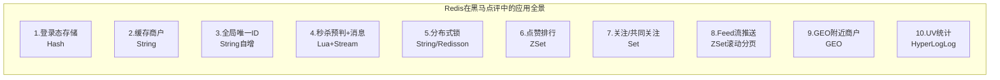
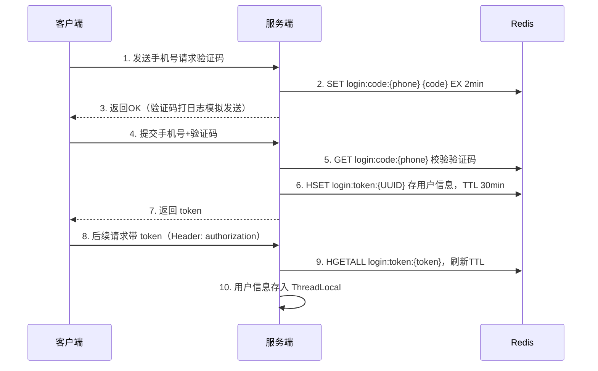
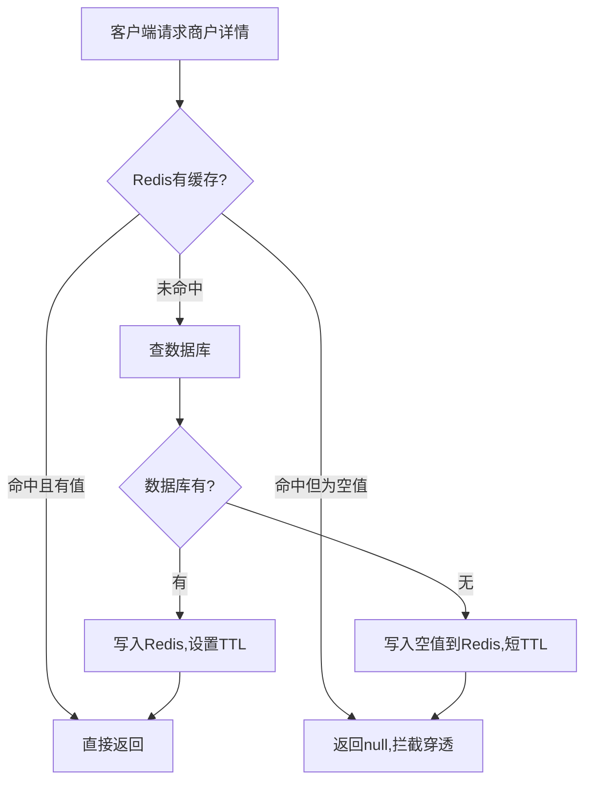
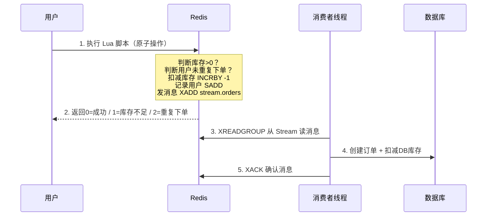

## 🗺️ Redis 在项目中的七大核心应用



下面逐个给你拆解 **业务场景 → 用了什么Redis数据结构 → 为什么这么用 → 面试怎么问**：

---

### 📌 1. 用户登录态：替代 Session（Hash）

**业务流程：**



**为什么用 Hash 而不是 String 存 JSON？**
- Hash 可以对单个字段独立读写（比如只取昵称），不用整体反序列化
- 节省内存（Redis 对小 Hash 有 ziplist 优化）

**关键代码位置：**
- 发码 & 登录：UserServiceImpl.java
- Token 拦截器 & 续命：RefreshTokenInterceptor.java

> 🔥 **面试高频追问：**
> 1. **"为什么不用 Session 而用 Redis 存 Token？"** → 集群部署时 Session 不共享，Redis 天然是集中式存储，支持水平扩展
> 2. **"Token 续命是怎么实现的？不续命会怎样？"** → 每次请求刷新 TTL。不续命的话，活跃用户30分钟也会被踢下线

---

### 📌 2. 商户缓存：解决穿透 / 击穿 / 雪崩（String）

这是项目中 Redis 用得**最深的模块**，覆盖了缓存三大经典问题：

| 问题 | 含义 | 项目解法 |
|------|------|----------|
| **缓存穿透** | 查一个数据库也没有的数据，请求直接打到DB | **缓存空值**（空字符串""，TTL 2min） |
| **缓存击穿** | 热点Key过期的瞬间，大量请求涌入DB | **互斥锁** 或 **逻辑过期** |
| **缓存雪崩** | 大面积Key同时过期 | 给TTL加随机值 |



**更新策略：** 先更新DB，再删Redis缓存（Cache Aside Pattern）

**关键代码位置：**
- 缓存工具类（封装了穿透/击穿方案）：CacheClient.java
- 商户缓存更新（先改DB再删缓存 + `@Transactional`）：[ShopServiceImpl.java](src/main/java/com/hmdp/service/impl/ShopServiceImpl.java)

> 🔥 **面试高频追问：**
> 1. **"先删缓存还是先更新数据库？为什么？"** → 先更新DB再删缓存。如果先删缓存，另一个线程可能读到旧DB数据写回缓存，造成不一致
> 2. **"逻辑过期方案的缺点是什么？"** → 数据不一致窗口期内返回旧数据，牺牲强一致性换高可用

---

### 📌 3. 全局唯一ID生成器（String INCR）

**业务需求：** 秒杀订单需要全局唯一、趋势递增的订单ID（不能直接用自增主键——暴露信息量、分库分表有冲突）

**设计方案：** 64位 = 1位符号位 + 31位时间戳 + 32位序列号

```
0 - 00000000 00000000 00000000 0000000 - 00000000 00000000 00000000 00000000
符号   31位秒级时间戳（可用约68年）         32位序列号（Redis INCR，按天分Key）
```

**关键代码：** RedisIdWorker.java
```java
Long count = stringRedisTemplate.opsForValue().increment("icr:" + keyPrefix + ":" + today);
return timestamp << 32 | count;
```

> 🔥 **面试高频追问：**
> 1. **"为什么用 Redis 的 INCR 而不是 UUID？"** → UUID 无序，对 B+Tree 索引不友好；INCR 趋势递增，插入性能高
> 2. **"这个方案每天最多支持多少个订单？"** → $2^{32} \approx 42.9$ 亿条/天/业务

---

### 📌 4. 秒杀：Lua 脚本 + Stream 消息队列（异步下单）

这是项目技术含量**最高**的模块，体现了「Redis 判资格，异步写DB」的思想：



**为什么要用 Lua 脚本？** → 判库存、判一人一单、扣库存这三步必须**原子性**执行，否则并发下会超卖

**关键代码位置：**
- Lua脚本：seckill.lua
- 消费者线程（Stream 读取 + PendingList 处理）：VoucherOrderServiceImpl.java

> 🔥 **面试高频追问：**
> 1. **"为什么不直接用数据库乐观锁？要先走Redis？"** → 数据库QPS有限（几千），Redis可以扛十几万QPS。先在Redis挡住绝大部分请求，只有合法请求才异步写DB
> 2. **"如果消费者宕机了，消息会丢吗？"** → 不会。Stream 的消费者组机制有 PendingList，未 ACK 的消息会重新消费

---

### 📌 5. 分布式锁（String SETNX → Redisson）

项目展示了**锁的演进过程**：

| 阶段 | 实现 | 问题 |
|------|------|------|
| V1 简易锁 | `SETNX key value EX timeout` | 释放锁不是原子操作（判断+删除中间可能锁过期被别人拿了） |
| V2 Lua脚本释放 | 释放时先GET比对线程标识再DEL（原子性） | 不可重入、不可重试、无主从一致性 |
| V3 Redisson | `redissonClient.getLock()` | 生产级方案：可重入、看门狗续期、Pub/Sub重试 |

**关键代码：**
- 简易锁：SimpleRedisLock.java, unlock.lua
- Redisson锁（秒杀兜底）：VoucherOrderServiceImpl.java

> 🔥 **面试高频追问：**
> 1. **"Redisson 看门狗机制是什么？"** → 默认锁30秒，每10秒续期一次。如果持有锁的线程挂了，不续期则30秒后自动释放
> 2. **"Redis主从切换时分布式锁会不会失效？"** → 会！Master加锁后宕机，Slave晋升时可能没同步到锁。解决方案是 RedLock（多节点加锁）

---

### 📌 6. 点赞排行（ZSet）

**为什么用 ZSet 而不是 Set？** → 需要按点赞时间排序，ZSet 的 score 存时间戳

```
ZADD blog:liked:{blogId} {timestamp} {userId}     -- 点赞
ZREM blog:liked:{blogId} {userId}                  -- 取消
ZSCORE blog:liked:{blogId} {userId}                -- 判断是否已赞
ZRANGE blog:liked:{blogId} 0 4                     -- Top5
```

**关键代码：** BlogServiceImpl.java

---

### 📌 7. 共同关注（Set 求交集）

```
SADD follows:{userId} {followUserId}           -- 关注
SREM follows:{userId} {followUserId}           -- 取关
SINTER follows:{我的id} follows:{他的id}        -- 共同关注
```

**关键代码：** FollowServiceImpl.java

---

### 📌 8. Feed 流推送 + 滚动分页（ZSet）

用推模式（发布时推给粉丝信箱），用 `ZREVRANGEBYSCORE` 实现基于时间戳的滚动分页（避免传统分页的数据重复/遗漏问题）。

---

### 📌 9 & 10. GEO附近商户 + HyperLogLog UV统计

- **GEO**：`GEOADD` 存商户坐标，`GEOSEARCH` 按距离查附近商户
- **HyperLogLog**：百万UV去重统计，内存只需12KB，误差率约0.81%

---

## 📊 Redis 数据结构使用总结

| 数据结构 | 应用场景 | Key 示例 |
|----------|----------|----------|
| **String** | 验证码、缓存商户JSON、分布式锁、ID自增 | `login:code:{phone}`, `cache:shop:{id}`, `lock:shop:{id}` |
| **Hash** | 用户登录态 | `login:token:{token}` |
| **List** | 商户类型缓存 | `cache:type` |
| **Set** | 关注列表、秒杀一人一单判重 | `follows:{userId}`, `seckill:order:{voucherId}` |
| **ZSet** | 点赞排行、Feed流信箱 | `blog:liked:{blogId}`, `feed:{userId}` |
| **Stream** | 秒杀异步消息队列 | `stream.orders` |
| **GEO** | 附近商户 | `shop:geo:{typeId}` |
| **HyperLogLog** | UV统计 | 自定义 |

---

## 🎯 学习建议

按这个顺序深入，**每个模块搞懂三件事**：
1. **业务流程**是什么？（能画出来）
2. **为什么选这个数据结构？** 换一个行不行？
3. **面试怎么问？** 能答出底层原理

你想先深入哪个模块？我建议从 **「1.登录态 + 拦截器」** 或 **「2.商户缓存三大问题」** 开始，这两个是面试命中率最高的。告诉我你想从哪个开始，我带你逐行拆代码！
