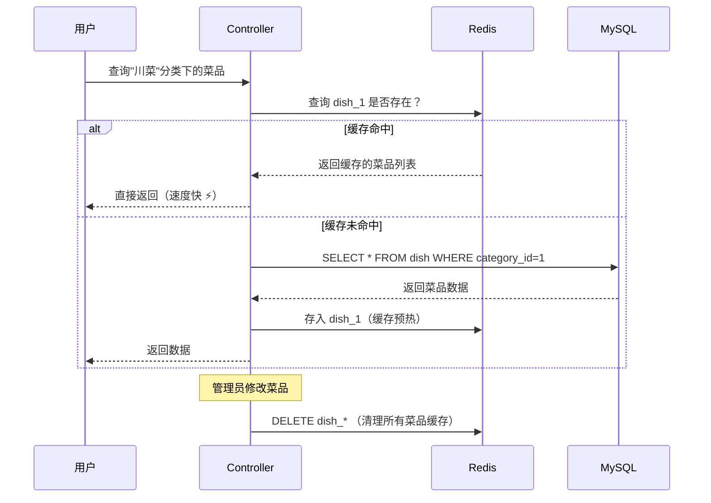

## 📍 一、缓存使用的核心类和方法（全景图） 

### 🔍 缓存模块使用位置分布表

| 业务场景 | 类路径 | 核心方法 | 缓存方案 | Key设计 |
|---------|--------|---------|---------|---------|
| **店铺营业状态** | admin/ShopController.java | `setStatus()` | RedisTemplate | `SHOP_STATUS` |
|  | user/ShopController.java | `getStatus()` | RedisTemplate | `SHOP_STATUS` |
| **菜品查询缓存** | DishController.java | `list(categoryId)` | RedisTemplate | `dish_{categoryId}` |
| **菜品缓存清理** | admin/DishController.java | `save()`, `update()`, `delete()`, `startOrStop()` | RedisTemplate | `dish_*` 模糊删除 |
| **套餐查询缓存** | SetmealController.java | `@Cacheable` | Spring Cache | `setmealCache::{categoryId}` |
| **套餐缓存清理** | admin/SetmealController.java | `@CacheEvict(allEntries=true)` | Spring Cache | 全部清空 |

---

## 🎯 二、业务需求与设计方案（白话解释）

### **业务流程图（用户查菜品为例）**



---

### **场景1：店铺营业状态（最简单）**

#### 需求背景
老板打烊后，用户端看到的店铺状态要实时同步，不能让用户下单后才发现店铺关门了。

#### 设计方案
```java
// 管理端：设置营业状态
redisTemplate.opsForValue().set("SHOP_STATUS", 1); // 1营业 0打烊

// 用户端：获取营业状态
Integer status = redisTemplate.opsForValue().get("SHOP_STATUS");
```

#### 为什么用Redis？
- **实时性**：修改后立即生效，不需要重启服务器
- **高频访问**：每个用户打开首页都要查询状态，数据库扛不住

---

### **场景2：菜品列表缓存（经典案例）**

#### 需求背景
用户点开"川菜"分类，假设有50个菜品，每个菜品有口味数据（辣度、温度等），一次查询涉及 **dish** 和 **dish_flavor** 两张表的联表查询，慢！

#### 设计方案（Cache Aside Pattern - 旁路缓存）
```java
// 用户端查询（Controller层直接操作Redis）
String key = "dish_" + categoryId; // 例如：dish_1
List<DishVO> list = redisTemplate.opsForValue().get(key);

if (list != null && list.size() > 0) {
    return Result.success(list); // 缓存命中，直接返回
}

// 缓存未命中，查数据库
list = dishService.listWithFlavor(dish);
redisTemplate.opsForValue().set(key, list); // 写入缓存
```

#### 缓存清理策略（管理端修改菜品时）
```java
// DishController - 新增菜品
String key = "dish_" + dishDTO.getCategoryId();
clearCache(key); // 只删除该分类的缓存

// DishController - 修改/删除/起售停售
clearCache("dish_*"); // 删除所有菜品缓存（简单粗暴）

// 实现方法
private void clearCache(String pattern) {
    Set keys = redisTemplate.keys(pattern); // ⚠️ 面试重点：这行有坑！
    redisTemplate.delete(keys);
}
```

---

### **场景3：套餐缓存（Spring Cache注解）**

#### 与菜品缓存的区别
套餐使用了 **@Cacheable** 和 **@CacheEvict** 注解，代码更优雅：

```java
// 用户端查询 - 自动缓存
@Cacheable(cacheNames = "setmealCache", key = "#categoryId")
public Result<List<Setmeal>> list(Long categoryId) {
    // 第一次查询时会执行这里并缓存结果
    // 后续直接从Redis返回，不进方法
}

// 管理端修改 - 自动清缓存
@CacheEvict(cacheNames = "setmealCache", allEntries = true)
public Result update(@RequestBody SetmealDTO setmealDTO) {
    // 方法执行后自动删除 setmealCache 下的所有key
}
```

---

## ⚠️ 三、现有方案的5大问题（面试官必问！）

| 问题 | 位置 | 危害等级 | 优化方案 |
|------|-----|---------|---------|
| **1. 缓存穿透风险** | `DishController.list()` | 🔥🔥🔥 | 缓存空对象/布隆过滤器 |
| **2. 缓存雪崩风险** | 所有缓存无过期时间 | 🔥🔥🔥🔥 | 设置随机过期时间 |
| **3. keys命令阻塞** | `clearCache("dish_*")` | 🔥🔥🔥🔥🔥 | 改用SCAN命令 |
| **4. 缓存一致性弱** | 先删缓存再改数据库 | 🔥🔥🔥 | 延迟双删/Canal |
| **5. 序列化未配置** | `RedisConfiguration` | 🔥🔥 | 设置Value序列化器 |

---

### **问题1：缓存穿透（恶意攻击场景）**

```java
// 现状：查询一个不存在的categoryId=9999
String key = "dish_9999";
List<DishVO> list = redisTemplate.opsForValue().get(key); // null

// 每次都查数据库，数据库也返回空
list = dishService.listWithFlavor(dish); // 空列表

// ❌ 不缓存空结果，下次请求又打到数据库！
```

**优化方案：缓存空对象**
```java
if (list == null || list.size() == 0) {
    // 缓存空列表，设置短过期时间
    redisTemplate.opsForValue().set(key, new ArrayList<>(), 5, TimeUnit.MINUTES);
}
```

---

### **问题2：缓存雪崩（大量Key同时失效）**

现状：所有缓存 **永不过期**，如果Redis突然挂了，所有请求瞬间打到MySQL，数据库直接崩溃。

**优化方案：设置随机过期时间**
```java
// 基础时间30分钟 + 随机10分钟，避免同时失效
long expireTime = 30 + new Random().nextInt(10);
redisTemplate.opsForValue().set(key, list, expireTime, TimeUnit.MINUTES);
```

---

### **问题3：keys命令阻塞（生产事故高发）**

```java
// ❌ 危险代码！Redis是单线程，keys会阻塞所有请求
Set keys = redisTemplate.keys("dish_*");
```

**为什么危险？**
- Redis有100万个Key，`keys dish_*` 需要扫描全部Key
- 期间Redis被阻塞，所有用户都无法访问，系统卡死

**优化方案：使用SCAN命令**
```java
private void clearCache(String pattern) {
    ScanOptions options = ScanOptions.scanOptions()
        .match(pattern).count(100).build();
    
    Cursor<byte[]> cursor = redisTemplate.getConnectionFactory()
        .getConnection().scan(options);
    
    while (cursor.hasNext()) {
        redisTemplate.delete(new String(cursor.next()));
    }
}
```

---

### **问题4：缓存一致性问题（高并发场景）**

当前流程：
```java
// 1. 管理员修改菜品
dishService.updateWithFlavor(dishDTO); // 更新数据库
clearCache("dish_*");                  // 删除缓存

// 2. 并发场景
// 线程A：删除缓存
// 线程B：查询未命中，读旧数据，写入缓存（脏数据！）
// 线程A：更新数据库完成
```

**优化方案：延迟双删**
```java
clearCache("dish_*");                    // 第一次删除
dishService.updateWithFlavor(dishDTO);   // 更新数据库
Thread.sleep(500);                       // 延迟500ms
clearCache("dish_*");                    // 第二次删除
```

---

### **问题5：序列化配置不完整**

```java
// 现状：只配置了Key序列化器
redisTemplate.setKeySerializer(new StringRedisSerializer());

// ❌ Value使用默认的JDK序列化，可读性差，占用空间大
```

**优化方案：使用JSON序列化**
```java
@Bean
public RedisTemplate<String, Object> redisTemplate(RedisConnectionFactory factory) {
    RedisTemplate<String, Object> template = new RedisTemplate<>();
    template.setConnectionFactory(factory);
    
    // Key序列化
    template.setKeySerializer(new StringRedisSerializer());
    template.setHashKeySerializer(new StringRedisSerializer());
    
    // Value序列化 - 使用Jackson
    Jackson2JsonRedisSerializer<Object> serializer = 
        new Jackson2JsonRedisSerializer<>(Object.class);
    ObjectMapper mapper = new ObjectMapper();
    mapper.setVisibility(PropertyAccessor.ALL, JsonAutoDetect.Visibility.ANY);
    mapper.activateDefaultTyping(
        LaissezFaireSubTypeValidator.instance,
        ObjectMapper.DefaultTyping.NON_FINAL);
    serializer.setObjectMapper(mapper);
    
    template.setValueSerializer(serializer);
    template.setHashValueSerializer(serializer);
    
    return template;
}
```

---

## 🎤 四、Redis缓存高频面试题（必背！）

### **基础题（P5-P6必问）**

#### Q1：说说你在项目中是怎么使用Redis的？

**标准回答模板：**
> 我在《苍穹外卖》项目中主要用Redis做了三个场景的缓存：
> 1. **店铺营业状态缓存** - 用String类型存储，Key是`SHOP_STATUS`，避免高频查询数据库
> 2. **菜品列表缓存** - 用户查询某个分类下的菜品时，先查Redis的`dish_{categoryId}`，未命中再查库并写入缓存
> 3. **套餐列表缓存** - 使用Spring Cache注解，自动管理缓存的增删
>
> 在管理端修改菜品时，我会调用`clearCache()`方法清理缓存，保证数据一致性。

---

#### Q2：你的缓存有设置过期时间吗？为什么？

**当前项目的答案：**
> ❌ **老实回答**：我现在的项目没设置过期时间（会被质疑）
> 
> ✅ **优化后的回答**：
> 最开始没设置，后来发现这会导致两个问题：
> 1. **缓存雪崩** - 如果Redis挂了，所有请求瞬间打到数据库
> 2. **数据冗余** - 过期菜品的缓存会一直占用内存
>
> 所以我优化为：**30分钟基础时间 + 随机10分钟**，既保证缓存命中率，又避免同时失效。

---

#### Q3：如果有人恶意查询一个不存在的菜品ID，会发生什么？

**考察点：缓存穿透**

> 这是典型的 **缓存穿透** 问题。目前的代码确实有这个漏洞：
> - 查询`categoryId=9999`（不存在）
> - Redis没有 → 查数据库 → 返回空
> - 没有缓存空结果，下次请求又查数据库
>
> **解决方案有两种：**
> 1. **缓存空对象**：把空结果也缓存5分钟，`set(key, [], 5分钟)`
> 2. **布隆过滤器**：启动时把所有存在的categoryId加载到布隆过滤器，请求先判断是否存在

---

### **进阶题（P6-P7必问）**

#### Q4：你用的keys命令有什么问题？生产环境能用吗？

**考察点：Redis生产环境禁止使用keys**

> ⚠️ **严重问题！** `redisTemplate.keys("dish_*")` 在生产环境是禁用命令！
>
> **原因：**
> - Redis是单线程模型，keys需要遍历所有key
> - 如果有100万个key，会阻塞几秒，期间所有请求都卡死
> - 这是我之前不知道的知识盲区
>
> **正确做法：**
> 改用 **SCAN命令**，它是渐进式遍历，每次返回一小批key，不会阻塞主线程：
> ```java
> ScanOptions options = ScanOptions.scanOptions()
>     .match("dish_*").count(100).build();
> Cursor<byte[]> cursor = connection.scan(options);
> ```

---

#### Q5：如果管理员修改菜品时，刚好有用户在查询，会出现什么问题？

**考察点：缓存一致性**

> 这是 **缓存与数据库一致性** 问题，可能出现脏数据：
>
> **时序：**
> 1. 管理员执行：`clearCache("dish_1")` - 删缓存
> 2. 用户查询：发现缓存没了，查数据库（此时数据库还是旧数据）
> 3. 用户把旧数据写入缓存：`set("dish_1", 旧数据)`
> 4. 管理员更新数据库：`UPDATE dish SET...`（已经晚了！）
>
> **解决方案：延迟双删**
> ```java
> clearCache("dish_1");           // 第一次删
> dishService.update(dish);        // 更新DB
> Thread.sleep(500);               // 等待并发查询完成
> clearCache("dish_1");            // 第二次删（删掉脏数据）
> ```
>
> **更好的方案：** 使用 **Canal** 监听MySQL的binlog，数据库变更后自动清理缓存。

---

#### Q6：为什么套餐用@Cacheable，菜品却用RedisTemplate？

**考察点：设计决策**

> 这是一个 **技术选型** 问题：
>
> **@Cacheable（Spring Cache）优点：**
> - 代码简洁，一个注解搞定
> - 自动管理缓存生命周期
> - 支持SpEL表达式
>
> **RedisTemplate优点：**
> - 更灵活，可以自定义逻辑
> - 支持复杂的数据结构（Hash、Set、ZSet）
> - 可以精确控制序列化
>
> **我的理解：**
> 菜品业务更复杂（涉及口味、图片等多表关联），需要在Controller层手动控制缓存策略；套餐相对简单，用注解足够优雅。
>
> **但更好的做法是：** 统一用Spring Cache + 自定义CacheManager，保持代码风格一致。

---

#### Q7：Redis挂了怎么办？

**考察点：高可用**

> **当前项目的问题：**
> Redis挂了 → 所有查询打到MySQL → 数据库崩溃 → 系统瘫痪
>
> **生产环境的解决方案：**
> 1. **Redis集群** - 主从 + 哨兵模式，自动故障转移
> 2. **降级策略** - 捕获RedisConnectionException，直接查数据库
> ```java
> try {
>     list = redisTemplate.opsForValue().get(key);
> } catch (Exception e) {
>     log.error("Redis故障，降级查询数据库", e);
>     list = dishService.listWithFlavor(dish);
> }
> ```
> 3. **限流** - 使用Sentinel限制数据库查询QPS，避免击垮
> 4. **本地缓存兜底** - Caffeine做二级缓存

---

### **架构题（P7+深挖）**

#### Q8：如果菜品数据量特别大（10万+），你的缓存方案还合适吗？

**考察点：大数据量优化**

> **当前方案的瓶颈：**
> - 每个分类缓存一个List，最大的分类可能有几千个菜品
> - 序列化后可能几MB，网络传输慢
> - 用户大概率只看前20条，缓存全部是浪费
>
> **优化方案：**
> 1. **分页缓存**：只缓存第一页（20条），`dish_{categoryId}_page_1`
> 2. **Hash结构**：
> ```java
> // Key: dish:{categoryId}
> // Field: dishId
> // Value: JSON(DishVO)
> redisTemplate.opsForHash().put("dish:1", "101", dishVO);
> ```
> 3. **热点数据监控**：只缓存访问量Top100的分类，冷门数据直接查库
> 4. **CDN加速**：图片、详情等静态资源走CDN

---

#### Q9：你知道缓存击穿、缓存穿透、缓存雪崩的区别吗？

**最经典的Redis三连问！**

| 问题 | 场景 | 危害 | 解决方案 |
|------|------|-----|---------|
| **缓存穿透** | 查询不存在的数据（如categoryId=9999） | 每次都打DB | ① 缓存空对象 ② 布隆过滤器 |
| **缓存击穿** | 热点key过期瞬间大量并发查询 | DB压力暴增 | ① 热点key永不过期 ② 互斥锁 |
| **缓存雪崩** | 大量key同时过期或Redis宕机 | DB瞬间崩溃 | ① 随机过期时间 ② 服务降级 ③ Redis集群 |

**你项目中的体现：**
- ❌ **已存在穿透风险**：不缓存空结果
- ❌ **已存在雪崩风险**：没设置过期时间
- ✅ **没有击穿问题**：因为你根本没设过期时间😅

---

## 🚀 五、最佳实践方案（可直接写进简历）

基于上述分析，我给你一个 **优化后的完整方案**：

```java
/**
 * 用户端菜品查询 - 优化版
 */
@GetMapping("/list")
public Result<List<DishVO>> list(Long categoryId) {
    String key = "dish_" + categoryId;
    
    // 1. 查缓存
    List<DishVO> list = (List<DishVO>) redisTemplate.opsForValue().get(key);
    if (list != null) {
        return Result.success(list); // 缓存命中
    }
    
    // 2. 缓存未命中，加互斥锁防止缓存击穿
    String lockKey = "lock:dish:" + categoryId;
    try {
        Boolean lock = redisTemplate.opsForValue()
            .setIfAbsent(lockKey, "1", 10, TimeUnit.SECONDS);
        
        if (lock) {
            // 获取到锁，查询数据库
            Dish dish = new Dish();
            dish.setCategoryId(categoryId);
            dish.setStatus(StatusConstant.ENABLE);
            list = dishService.listWithFlavor(dish);
            
            if (list == null || list.isEmpty()) {
                // 缓存空对象，防止缓存穿透
                redisTemplate.opsForValue().set(key, new ArrayList<>(), 
                    5, TimeUnit.MINUTES);
                return Result.success(new ArrayList<>());
            }
            
            // 设置随机过期时间，防止缓存雪崩
            long expireTime = 30 + new Random().nextInt(10);
            redisTemplate.opsForValue().set(key, list, 
                expireTime, TimeUnit.MINUTES);
            
            return Result.success(list);
        } else {
            // 没获取到锁，等待后重试
            Thread.sleep(50);
            return list(categoryId); // 递归重试
        }
    } finally {
        redisTemplate.delete(lockKey); // 释放锁
    }
}

/**
 * 管理端清除缓存 - 优化版（使用SCAN）
 */
private void clearCache(String pattern) {
    RedisConnection connection = redisTemplate.getConnectionFactory()
        .getConnection();
    
    ScanOptions options = ScanOptions.scanOptions()
        .match(pattern).count(100).build();
    
    Cursor<byte[]> cursor = connection.scan(options);
    List<String> keys = new ArrayList<>();
    
    while (cursor.hasNext()) {
        keys.add(new String(cursor.next()));
        if (keys.size() >= 100) {
            redisTemplate.delete(keys);
            keys.clear();
        }
    }
    
    if (!keys.isEmpty()) {
        redisTemplate.delete(keys);
    }
}
```

---

## 📝 六、面试时的回答策略

当面试官问："说说你项目的Redis缓存"时，按这个结构回答：

### 1️⃣ **先说用在哪里**（30秒）
> "我在《苍穹外卖》中用Redis做了3个缓存场景：店铺状态、菜品列表、套餐查询，核心是提升用户端查询性能，减少数据库压力。"

### 2️⃣ **再说设计思路**（1分钟）
> "以菜品缓存为例，我使用了经典的Cache Aside Pattern：查询时先查Redis，未命中再查库并写入缓存；管理端修改时删除缓存，下次查询自动重建。Key的设计是`dish_{categoryId}`，这样可以精确失效某个分类。"

### 3️⃣ **主动说出优化点**（1分钟）
> "但最初的方案确实有问题：①没设置过期时间有雪崩风险；②用了keys命令会阻塞Redis；③没处理缓存穿透。后来我优化为：设置随机过期时间、改用SCAN命令、缓存空对象，还加了互斥锁防止击穿。"

### 4️⃣ **结合业务拔高**（30秒）
> "这个项目让我理解了缓存不只是简单的'查缓存-查库'，还要考虑高并发下的一致性、穿透、击穿、雪崩等问题，以及keys这种命令在生产环境的危害。"

---

## 💪 七、你的作业（实战强化）

1. **重构DishController.list()方法**，加上我上面优化版的所有改进点
2. **写一个SCAN的工具类**，封装模糊删除逻辑
3. **画一个时序图**，展示"管理员修改菜品"时，用户查询导致脏数据的全过程

**我帮你review代码？需要我直接帮你把优化代码写进项目吗？** 🚀---

## 📝 六、面试时的回答策略

当面试官问："说说你项目的Redis缓存"时，按这个结构回答：

### 1️⃣ **先说用在哪里**（30秒）
> "我在《苍穹外卖》中用Redis做了3个缓存场景：店铺状态、菜品列表、套餐查询，核心是提升用户端查询性能，减少数据库压力。"

### 2️⃣ **再说设计思路**（1分钟）
> "以菜品缓存为例，我使用了经典的Cache Aside Pattern：查询时先查Redis，未命中再查库并写入缓存；管理端修改时删除缓存，下次查询自动重建。Key的设计是`dish_{categoryId}`，这样可以精确失效某个分类。"

### 3️⃣ **主动说出优化点**（1分钟）
> "但最初的方案确实有问题：①没设置过期时间有雪崩风险；②用了keys命令会阻塞Redis；③没处理缓存穿透。后来我优化为：设置随机过期时间、改用SCAN命令、缓存空对象，还加了互斥锁防止击穿。"

### 4️⃣ **结合业务拔高**（30秒）
> "这个项目让我理解了缓存不只是简单的'查缓存-查库'，还要考虑高并发下的一致性、穿透、击穿、雪崩等问题，以及keys这种命令在生产环境的危害。"

---

## 💪 七、你的作业（实战强化）

1. **重构DishController.list()方法**，加上我上面优化版的所有改进点
2. **写一个SCAN的工具类**，封装模糊删除逻辑
3. **画一个时序图**，展示"管理员修改菜品"时，用户查询导致脏数据的全过程

**我帮你review代码？需要我直接帮你把优化代码写进项目吗？** 🚀
