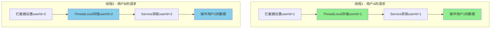
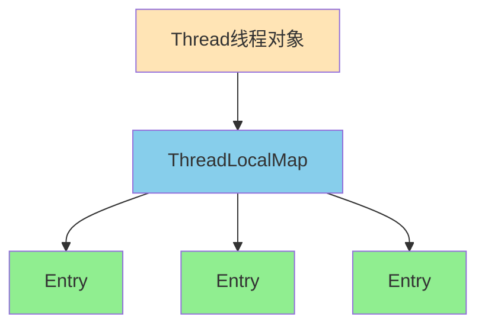
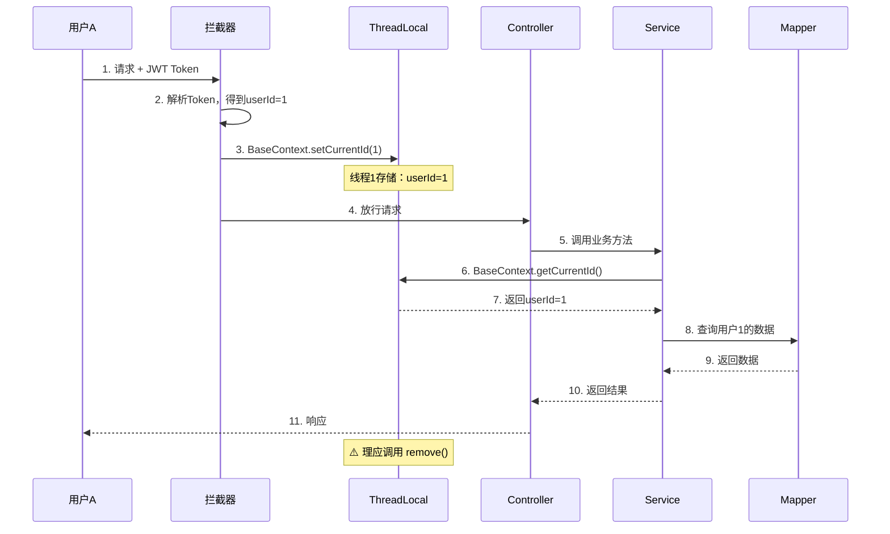
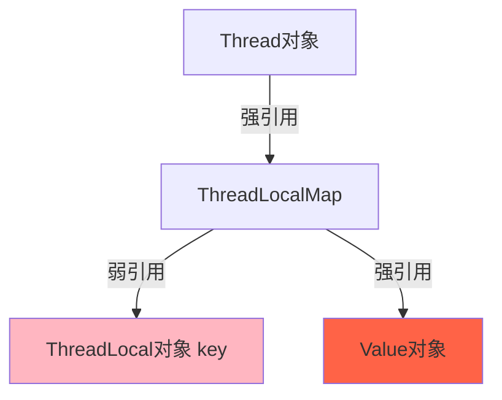

# 🎯 第一部分：ThreadLocal 基础知识

## 一、什么是ThreadLocal？

**通俗理解：** ThreadLocal就像是**每个线程的专属储物柜**🔐

想象一个场景：
- 公司有100个员工（100个线程）
- 每个员工都有自己的工位储物柜（ThreadLocal）
- 张三在自己柜子里放的东西，李四拿不到



**核心特点：**
1. **线程隔离**：每个线程有自己独立的副本
2. **无需传参**：不需要层层传递参数
3. **线程安全**：避免了多线程并发问题

---

## 二、ThreadLocal 的核心API

```java
public class ThreadLocal<T> {
    
    public void set(T value)      // 设置当前线程的值
    public T get()                 // 获取当前线程的值
    public void remove()           // 清除当前线程的值（重要！）
}
```

**简单示例：**

```java
// 创建一个ThreadLocal
ThreadLocal<Long> userIdHolder = new ThreadLocal<>();

// 线程1执行
userIdHolder.set(100L);  
System.out.println(userIdHolder.get()); // 输出：100

// 线程2执行（完全独立）
userIdHolder.set(200L);  
System.out.println(userIdHolder.get()); // 输出：200

// 清理
userIdHolder.remove();
```

---

## 三、ThreadLocal 的底层原理

### 1️⃣ 数据结构



**核心原理：**
- 每个`Thread`对象内部有一个`ThreadLocalMap`
- `ThreadLocalMap`是一个特殊的Map，key是`ThreadLocal`对象，value是存储的值
- 当调用`threadLocal.set(value)`时，实际上是：
  ```java
  Thread.currentThread().threadLocalMap.put(threadLocal, value);
  ```

### 2️⃣ 源码简化版

```java
public class ThreadLocal<T> {
    
    public void set(T value) {
        Thread t = Thread.currentThread();  // 获取当前线程
        ThreadLocalMap map = t.threadLocals; // 获取线程的Map
        if (map != null)
            map.set(this, value);  // this是ThreadLocal对象本身
        else
            t.threadLocals = new ThreadLocalMap(this, value);
    }
    
    public T get() {
        Thread t = Thread.currentThread();
        ThreadLocalMap map = t.threadLocals;
        if (map != null) {
            Entry e = map.getEntry(this);
            return (T) e.value;
        }
        return null;
    }
}
```

---

# 🚀 第二部分：ThreadLocal在项目中的核心应用

## 一、项目中的使用场景 - BaseContext

项目封装了一个工具类：BaseContext.java

```java
public class BaseContext {
    
    // 存储当前登录用户ID
    public static ThreadLocal<Long> threadLocal = new ThreadLocal<>();
    
    // 设置当前用户ID（拦截器中调用）
    public static void setCurrentId(Long id) {
        threadLocal.set(id);
    }
    
    // 获取当前用户ID（Service中调用）
    public static Long getCurrentId() {
        return threadLocal.get();
    }
    
    // 清除（防止内存泄漏）
    public static void removeCurrentId() {
        threadLocal.remove();
    }
}
```

---

## 二、完整的业务流程



---

## 三、项目中的3个核心应用场景

### 场景1️⃣：拦截器中设置用户ID

**文件：** JwtTokenAdminInterceptor.java

```java
@Component
public class JwtTokenAdminInterceptor implements HandlerInterceptor {
    
    public boolean preHandle(HttpServletRequest request, ...) {
        // 1. 从请求头获取Token
        String token = request.getHeader(jwtProperties.getAdminTokenName());
        
        // 2. 解析Token，获取员工ID
        Claims claims = JwtUtil.parseJWT(jwtProperties.getAdminSecretKey(), token);
        Long empId = Long.valueOf(claims.get(JwtClaimsConstant.EMP_ID).toString());
        
        // 3. 存入ThreadLocal 🔥
        BaseContext.setCurrentId(empId);
        
        return true;
    }
}
```

---

### 场景2️⃣：Service层获取当前用户ID（购物车案例）

**文件：** ShoppingCartServiceImpl.java

```java
@Service
public class ShoppingCartServiceImpl implements ShoppingCartService {
    
    @Override
    public void addShoppingCart(ShoppingCartDTO shoppingCartDTO) {
        ShoppingCart shoppingCart = new ShoppingCart();
        BeanUtils.copyProperties(shoppingCartDTO, shoppingCart);
        
        // 🔥 无需传参，直接从ThreadLocal获取当前用户ID
        shoppingCart.setUserId(BaseContext.getCurrentId());
        
        // 只能查询自己的购物车数据
        List<ShoppingCart> list = shoppingCartMapper.list(shoppingCart);
        // ...
    }
    
    @Override
    public List<ShoppingCart> showShoppingCart() {
        // 🔥 查询购物车时，自动关联当前用户
        return shoppingCartMapper.list(
            ShoppingCart.builder()
                .userId(BaseContext.getCurrentId())  
                .build()
        );
    }
}
```

**注意看：** 这个方法的参数里**没有userId**，但是能准确查询当前用户的购物车！这就是ThreadLocal的魔力。

---

### 场景3️⃣：AOP中自动填充公共字段

**文件：** AutoFillAspect.java

```java
@Aspect
@Component
public class AutoFillAspect {
    
    @Before("autoFillPointCut()")
    public void autoFill(JoinPoint joinPoint) {
        // 获取当前时间
        LocalDateTime now = LocalDateTime.now();
        
        // 🔥 从ThreadLocal获取当前操作人ID
        Long currentId = BaseContext.getCurrentId();
        
        // 通过反射自动填充 createUser、updateUser
        if (operationType == OperationType.INSERT) {
            setCreateUser.invoke(entity, currentId);  // 创建人
            setUpdateUser.invoke(entity, currentId);  // 更新人
        }
    }
}
```

**业务含义：** 
- 当员工新增菜品时，自动填充`createUser`为当前登录员工ID
- 不需要手动传参，AOP自动完成

---

## 四、为什么要用ThreadLocal？

### 对比方案：传统方式

**❌ 不用ThreadLocal的代码：**

```java
// Controller
@PostMapping("/cart/add")
public Result add(@RequestBody CartDTO dto, Long userId) {  // 需要传userId
    cartService.add(dto, userId);
    return Result.success();
}

// Service
public void add(CartDTO dto, Long userId) {  // 需要传userId
    ShoppingCart cart = new ShoppingCart();
    cart.setUserId(userId);  // 手动设置
    // ...
}
```

**层层传递的问题：**
1. Controller → Service → Mapper 每一层都要传`userId`
2. 容易漏传或传错
3. 代码臃肿，参数列表过长

---

**✅ 使用ThreadLocal的代码：**

```java
// Controller
@PostMapping("/cart/add")
public Result add(@RequestBody CartDTO dto) {  // 不需要传userId
    cartService.add(dto);
    return Result.success();
}

// Service
public void add(CartDTO dto) {  // 不需要传userId
    ShoppingCart cart = new ShoppingCart();
    cart.setUserId(BaseContext.getCurrentId());  // 直接获取
    // ...
}
```

**优势：**
1. ✅ 代码简洁
2. ✅ 解耦，Controller不需要关心用户ID
3. ✅ 安全，用户ID从Token解析，不能伪造

---

# 🔥 第三部分：ThreadLocal在面试中的重要性

## ⭐ 重要性等级：★★★★★（五星满分）

**为什么这么重要？**

1. **考察频率超高**：90%的Java面试都会问
2. **区分度明显**：
   - 初级：只知道用法 → **你现在的水平**
   - 中级：知道原理（ThreadLocalMap）
   - 高级：知道内存泄漏问题和解决方案 → **面试加分项**
3. **综合能力体现**：涉及到JVM、多线程、GC等知识

---

# 📝 第四部分：面试题全解析

## ❓ 面试题1：请介绍一下ThreadLocal（基础必问）

**标准回答（三段式）：**

**第一段 - 是什么：**
ThreadLocal是Java提供的线程局部变量，它为每个线程提供独立的变量副本，实现线程间的数据隔离。

**第二段 - 怎么用（结合项目）：**
在我们的外卖项目中，用ThreadLocal存储当前登录用户的ID。当用户请求到达时，拦截器解析JWT Token获取用户ID并存入ThreadLocal，后续Service层直接通过`BaseContext.getCurrentId()`获取，无需层层传参。比如查询购物车时，自动关联当前用户，避免了数据越权访问。

**第三段 - 原理：**
每个Thread对象内部有一个ThreadLocalMap，key是ThreadLocal对象，value是存储的值。调用`set()`时实际是往当前线程的Map中存数据，所以线程间互不影响。

---

## ❓ 面试题2：ThreadLocal的原理是什么？（中级必问）

**答：**

ThreadLocal的核心是**ThreadLocalMap**，结构如下：

```java
Thread {
    ThreadLocalMap threadLocals = new ThreadLocalMap();
}

ThreadLocalMap {
    Entry[] table;  // 数组 + 开放寻址法
}

Entry {
    ThreadLocal key;   // 弱引用 WeakReference
    Object value;      // 强引用
}
```

**调用流程：**

```java
threadLocal.set(value);
↓
1. 获取当前线程 Thread t = Thread.currentThread();
2. 获取Map：ThreadLocalMap map = t.threadLocals;
3. 以ThreadLocal对象为key存入：map.set(this, value);
```

**为什么线程安全？**
- 每个线程操作的是**自己的Map**
- 不存在竞争关系，天然线程安全

---

## ❓ 面试题3：ThreadLocal会内存泄漏吗？（高频！）

**答：⚠️ 会！而且这是面试的重点！**

### 原因分析：



**问题链条：**

1. **ThreadLocal对象被GC回收**（因为key是弱引用）
2. **Entry的key变成null**
3. **但value还是强引用**，无法被GC
4. **线程池场景下**，线程不销毁，value永远不会被回收 → **内存泄漏**

### 严重吗？

**在线程池场景下非常严重！**
- Web应用使用Tomcat线程池
- 线程复用，`threadLocalMap`一直存在
- 每次请求set，不remove，越堆越多

---

### 解决方案：**必须调用remove()！**

```java
try {
    threadLocal.set(value);
    // 业务代码
} finally {
    threadLocal.remove();  // 🔥 必须清理
}
```

---

## ⚠️ 项目中的严重问题（我要严厉指出！）

**你的项目代码有内存泄漏风险！**

看这段代码：JwtTokenAdminInterceptor.java

```java
public boolean preHandle(...) {
    // ...
    BaseContext.setCurrentId(empId);  // ✅ 设置了
    return true;
}

// ❌ 没有 afterCompletion() 方法调用 remove()！
```

**后果：**
- Tomcat线程池复用线程
- 每次请求set，不remove
- userId堆积 → 内存泄漏
- 更严重：可能取到上一个请求的userId → **数据错乱**

---

## 🔧 正确的写法（面试加分项！）

**方案1：在拦截器中清理**

```java
@Component
public class JwtTokenAdminInterceptor implements HandlerInterceptor {
    
    @Override
    public boolean preHandle(...) {
        // 解析Token，设置userId
        BaseContext.setCurrentId(empId);
        return true;
    }
    
    @Override
    public void afterCompletion(HttpServletRequest request, 
                                HttpServletResponse response, 
                                Object handler, 
                                Exception ex) {
        // 🔥 请求结束后清理
        BaseContext.removeCurrentId();
    }
}
```

**方案2：Filter中清理（更推荐）**

```java
@Component
public class ThreadLocalCleanFilter implements Filter {
    
    @Override
    public void doFilter(ServletRequest request, 
                        ServletResponse response, 
                        FilterChain chain) throws IOException, ServletException {
        try {
            chain.doFilter(request, response);
        } finally {
            BaseContext.removeCurrentId();  // 🔥 确保清理
        }
    }
}
```

---

## ❓ 面试题4：ThreadLocal的应用场景有哪些？

**答：**

| 场景 | 说明 | 示例 |
|------|------|------|
| **用户上下文传递** | 存储登录用户信息 | 你的项目 `BaseContext` |
| **数据库连接管理** | 存储Connection，保证同一线程用同一连接 | Spring的`@Transactional` |
| **日期格式化** | `SimpleDateFormat`线程不安全，用ThreadLocal包装 | `ThreadLocal<SimpleDateFormat>` |
| **链路追踪** | 存储traceId，跨方法传递 | SkyWalking、分布式追踪 |

---

## ❓ 面试题5：ThreadLocal和synchronized的区别？

**答：**

| 对比项 | ThreadLocal | synchronized |
|--------|-------------|--------------|
| **目的** | 线程隔离（每个线程有自己的副本） | 线程同步（多线程访问同一资源） |
| **原理** | 空间换时间 | 时间换空间 |
| **性能** | 无锁，性能好 | 有锁，性能差 |
| **使用场景** | 避免参数传递 | 避免并发冲突 |

**比喻：**
- ThreadLocal：每人一个苹果，互不影响
- synchronized：大家抢一个苹果，排队拿

---

## ❓ 面试题6：InheritableThreadLocal是什么？

**答：**

`InheritableThreadLocal`可以让**子线程继承父线程的值**。

```java
ThreadLocal<String> threadLocal = new ThreadLocal<>();
threadLocal.set("父线程的值");

new Thread(() -> {
    System.out.println(threadLocal.get());  // null
}).start();

// 使用 InheritableThreadLocal
InheritableThreadLocal<String> inheritableThreadLocal = new InheritableThreadLocal<>();
inheritableThreadLocal.set("父线程的值");

new Thread(() -> {
    System.out.println(inheritableThreadLocal.get());  // "父线程的值"
}).start();
```

**应用场景：** 异步任务需要用到父线程的上下文信息。

**注意：** 线程池场景下会失效，需要用阿里的`TransmittableThreadLocal`。

---

# 🎓 面试回答模板

**当面试官问："你们项目中是怎么用ThreadLocal的？"**

**完美回答：**

> "我们项目用ThreadLocal实现了用户上下文的传递。具体流程是：
> 
> 1️⃣ 用户登录后生成JWT Token，后续请求都携带Token  
> 2️⃣ 拦截器解析Token获取用户ID，通过`BaseContext.setCurrentId()`存入ThreadLocal  
> 3️⃣ Service层通过`BaseContext.getCurrentId()`获取，无需层层传参  
> 4️⃣ 这样既保证了线程安全，又简化了代码
> 
> **原理上**，每个线程有自己的ThreadLocalMap，key是ThreadLocal对象，value是用户ID，所以并发请求互不影响。
> 
> **安全性上**，我们在拦截器的`afterCompletion()`方法中调用`remove()`清理，避免了内存泄漏。"

**面试官追问："如果不清理会怎样？"**

> "在生产环境通常使用Tomcat线程池，线程会复用。如果不清理：
> 1. 内存泄漏：ThreadLocalMap中的value无法被GC
> 2. 数据错乱：下次请求复用线程时，可能取到上一个用户的ID
> 3. 严重的话会导致数据越权访问，这是安全漏洞"

---

# 🎯 总结：掌握ThreadLocal的三个层次

| 层次 | 掌握内容 | 面试定位 |
|------|----------|----------|
| **初级** | 知道ThreadLocal的用法（set/get） | 勉强及格 |
| **中级** | 理解ThreadLocalMap原理 | 中等偏上 |
| **高级** | 知道内存泄漏原理+解决方案+实际应用 | 面试加分 |

---

**现在你想：**
1. 🔧 **修复项目代码** - 我帮你给拦截器加上`remove()`清理逻辑
2. 💡 **看更多应用** - 学习ThreadLocal在事务管理中的应用
3. 🎯 **下一个知识点** - 学习JWT认证的完整流程

选择你的学习路径吧！💪