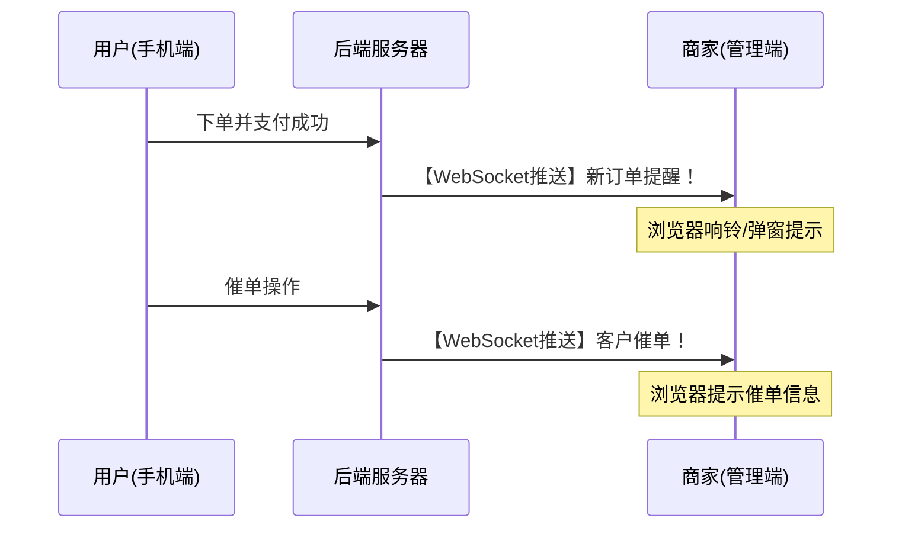
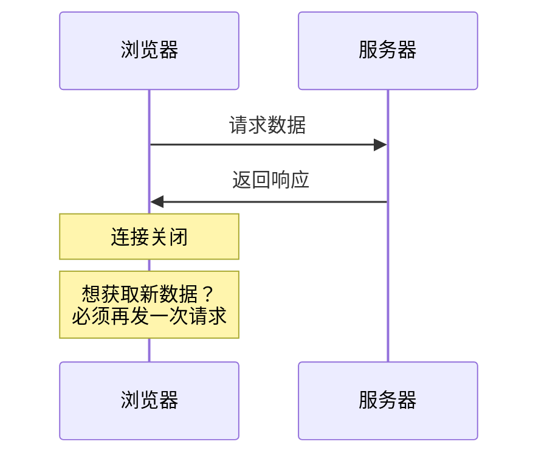
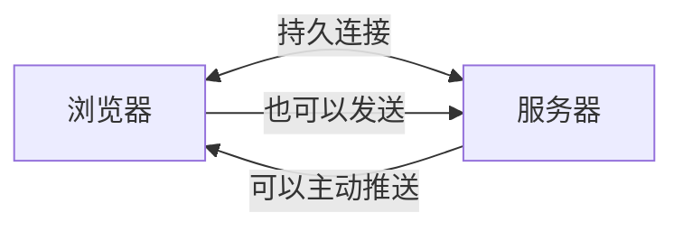
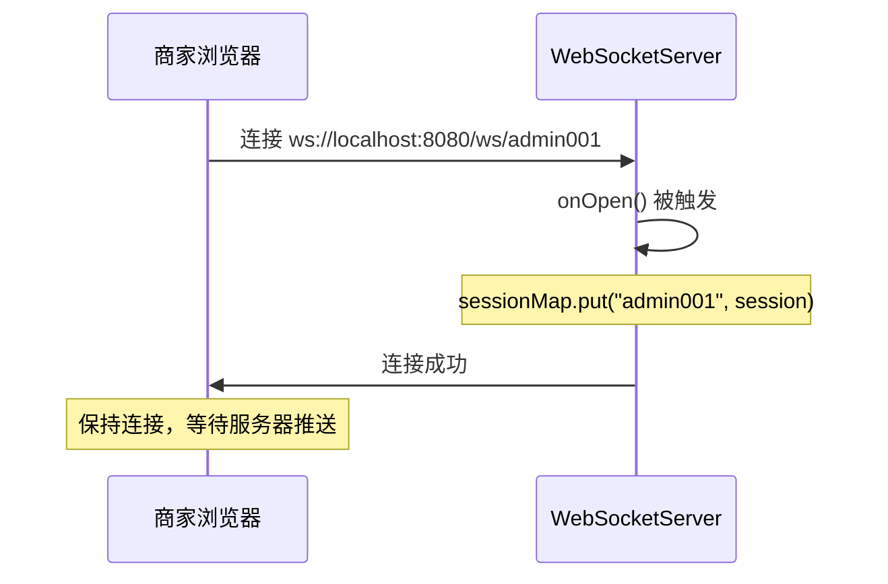
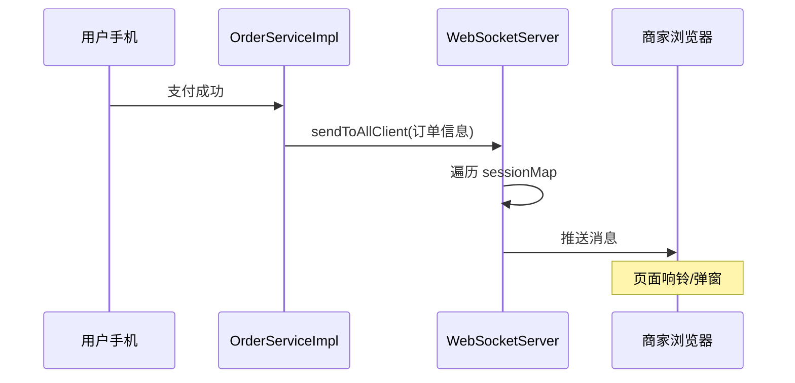

## 一、核心业务逻辑（简单理解）

**WebSocket 是什么？**
想象你和朋友打电话，可以双向实时对话，不需要挂断再拨打。WebSocket 就是这样的技术——服务器和浏览器之间建立一个**持久的双向通道**，服务器可以主动推送消息给客户端。

**在"苍穹外卖"项目中的核心应用场景：**



**核心价值：**
- **实时性**：用户下单后，商家页面立即收到通知，无需刷新页面
- **双向通信**：服务器可以主动推送消息到商家的浏览器
- **避免轮询**：传统方式需要每隔几秒请求一次服务器，浪费资源

---

## 二、具体实现的类和方法

### 1. **配置类**：WebSocketConfiguration.java

**作用**：注册 WebSocket 的端点导出器

```java
@Configuration
public class WebSocketConfiguration {
    @Bean
    public ServerEndpointExporter serverEndpointExporter() {
        return new ServerEndpointExporter(); // 扫描并注册 @ServerEndpoint 注解的类
    }
}
```

---

### 2. **核心服务类**：WebSocketServer.java

**关键方法：**

| 方法 | 触发时机 | 作用 |
|------|---------|------|
| `onOpen(Session, String sid)` | 客户端连接时 | 保存客户端会话到 sessionMap |
| `onMessage(String, String sid)` | 收到客户端消息时 | 处理客户端发来的消息 |
| `onClose(String sid)` | 客户端断开时 | 从 sessionMap 移除会话 |
| `sendToAllClient(String message)` | 业务代码调用 | **群发消息给所有连接的客户端** |

**核心数据结构：**
```java
private static Map<String, Session> sessionMap = new HashMap();
// key: 客户端唯一标识(sid)
// value: WebSocket会话对象
```

---

### 3. **业务应用场景**：OrderServiceImpl.java

#### **场景1：用户支付成功后推送新订单提醒**（OrderServiceImpl.java）

```java
HashMap map = new HashMap();
map.put("type", 1);        // 消息类型：1=来单提醒
map.put("orderId", orders.getId());
map.put("content", "订单号：" + outTradeNo);
// 通过WebSocket实现来电提醒，向客户端浏览器推送消息
webSocketServer.sendToAllClient(JSON.toJSONString(map));
```

#### **场景2：用户催单时推送提醒**（OrderServiceImpl.java）

```java
HashMap map = new HashMap();
map.put("type", 2);        // 消息类型：2=客户催单
map.put("orderId", id);
map.put("content", "订单号：" + orders.getNumber());
webSocketServer.sendToAllClient(JSON.toJSONString(map));
```

---

### 4. **定时任务示例**：WebSocketTask.java

（可能是测试用的，每5秒推送一次时间）

```java
@Scheduled(cron = "0/5 * * * * ?")
public void sendMessageToClient() {
    webSocketServer.sendToAllClient("这是来自服务端的消息：" + 当前时间);
}
```

---

## 三、初学者学习路径

### **第1步：理解传统 HTTP 的局限**


**问题**：服务器无法主动推送，只能客户端不断轮询（每隔几秒请求一次）

---

### **第2步：理解 WebSocket 的设计**


**关键特点：**
- 一次握手，长期连接
- 全双工通信（双方可同时发送）
- 低延迟、低开销

---

### **第3步：结合项目代码理解**

**连接建立流程：**


**推送消息流程：**


---

### **第4步：动手实践建议**

1. **前端连接测试**（可以在浏览器控制台输入）：
```javascript
let ws = new WebSocket("ws://localhost:8080/ws/test001");
ws.onmessage = function(event) {
    console.log("收到消息：", event.data);
};
```

2. **修改测试代码**：
   - 调整 WebSocketTask.java 的定时任务时间
   - 观察浏览器控制台是否每5秒收到一次消息

3. **模拟下单流程**：
   - 启动项目，打开商家管理端
   - 用手机端或 Postman 模拟下单
   - 观察管理端是否实时收到新订单提醒

---

## 四、面试重点（必看！）

### **面试官通常会这样问：**

#### **Q1: WebSocket 和 HTTP 的区别是什么？**

**标准答案框架：**
| 维度 | HTTP | WebSocket |
|------|------|-----------|
| 连接方式 | 短连接（请求-响应后关闭） | 长连接（一次握手，持久连接） |
| 通信方向 | 单向（客户端主动） | 双向（服务器可主动推） |
| 协议标识 | http:// / https:// | ws:// / wss:// |
| 应用场景 | 普通请求 | 实时通信（聊天、通知、股票） |

**追问可能性：**
- "WebSocket 底层是 TCP 还是 HTTP？"  
  **答**：基于 TCP，但初始握手借用 HTTP 协议（Upgrade 请求）

---

#### **Q2: 你项目中的 WebSocket 是如何管理多个客户端连接的？**

**答题要点：**
1. 使用 `Map<String, Session> sessionMap` 存储所有连接
2. `onOpen` 时加入，`onClose` 时移除
3. `sendToAllClient` 遍历 sessionMap 群发消息

**追问可能性：**
- "如果要给指定客户端发消息怎么办？"  
  **答**：新增 `sendToClient(String sid, String message)` 方法，根据 sid 从 sessionMap 取出指定 session

---

#### **Q3: 高并发场景下，你的 WebSocket 实现有什么问题？**

**当前代码的潜在问题：**
1. **线程安全**：`HashMap` 不是线程安全的，高并发下可能出现问题  
   **优化**：改用 `ConcurrentHashMap`

2. **单点故障**：静态变量 sessionMap 在分布式部署时无法共享  
   **优化**：使用 Redis + 消息队列（如 RabbitMQ）实现分布式推送

3. **连接管理**：没有心跳检测，无法识别僵尸连接  
   **优化**：定时 ping-pong 检测

---

## 五、总结

**核心要记住的：**
1. **WebSocket = 服务器主动推送**（不用客户端轮询）
2. **项目应用 = 新订单提醒 + 催单提醒**
3. **关键类**：
   - 配置类：`WebSocketConfiguration`  
   - 服务类：`WebSocketServer`  
   - 使用位置：`OrderServiceImpl` 的支付成功、催单方法

**学习建议：**
- 先理解为什么需要实时通信（对比 HTTP）
- 再理解生命周期（连接、消息、断开）
- 最后动手调试代码，观察消息推送过程

有任何疑问随时问我！比如想深入理解某个方法，或者想知道如何优化代码。