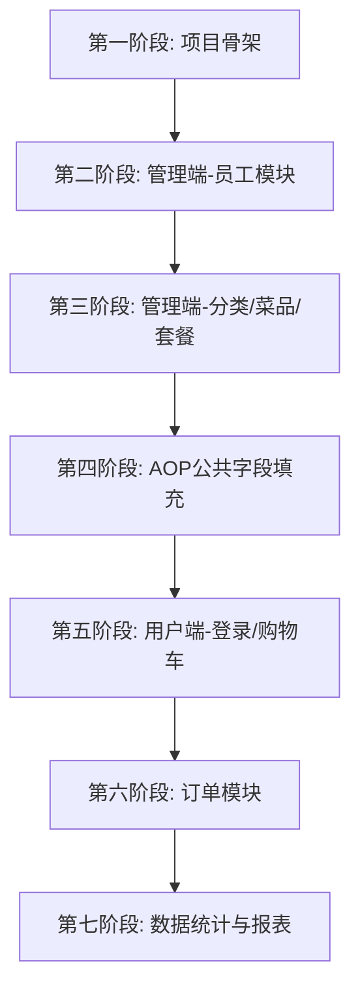

正在收集工作区信息# 苍穹外卖 sky-server 重敲路线图

> 同学你好！这份路线图是专门为你量身定制的，按照"先骨架、后血肉"的原则排列。每个模块我都会告诉你**手敲顺序**和**面试考点**。加油！💪

---

## 总体脉络（先看这里）



---

## 第一阶段：项目骨架（地基，必须第一个完成）

### 1.1 配置类与拦截器

**手敲顺序：**
1. WebMvcConfiguration.java — 注册拦截器、配置 Swagger/Knife4j、静态资源映射
2. JwtTokenAdminInterceptor.java — JWT 校验逻辑  
3. GlobalExceptionHandler.java — 全局异常处理器

**手敲时注意：**
- 先看 application.yml 中 JWT 配置项，理解 [`JwtProperties`](sky-common/src/main/java/com/sky/properties/JwtProperties.java) 如何通过 `@ConfigurationProperties` 绑定
- 理解 [`BaseContext`](sky-common/src/main/java/com/sky/context/BaseContext.java) 中 `ThreadLocal` 的作用——拦截器解析 JWT 后将 `empId` 存入，Service 层取用
- 在拦截器里，把验证 Token 的代码注释掉，随便传个假 Token 过去，看看 GlobalExceptionHandler 是怎么把异常捕获并返回给前端的。

> ⭐ **面试高频考点：ThreadLocal**
>
> **面试通常这样问：**
> - "ThreadLocal 是什么？它解决了什么问题？会有内存泄漏吗？"
> - "拦截器里用 ThreadLocal 存用户ID，为什么不用全局变量？"
>
> 你敲这段代码时，要搞清楚：**为什么存完 empId 之后，请求结束要调用 `removeCurrentId()`**（提示：线程池复用问题）

---

### 1.2 员工登录（第一个可运行的接口）

**手敲顺序：**
```
查看 employee 表结构
  → DTO: EmployeeLoginDTO
  → VO: EmployeeLoginVO  
  → Mapper: EmployeeMapper（@Select 注解方式）
  → EmployeeMapper.xml（空文件先放着）
  → Service 接口: EmployeeService
  → Service 实现: EmployeeServiceImpl#login
  → Controller: EmployeeController#login / logout
```

**手敲时注意：**
- `login` 方法中有三步校验：账号是否存在 → 密码是否正确 → 账号是否被锁定，注意**校验顺序**的业务含义
- 代码中有一个 `TODO`：密码现在是**明文比对**，后期要改成 MD5

> ⭐ **面试高频考点：JWT**
>
> **面试通常这样问：**
> - "JWT 由哪三部分组成？你们项目是如何使用的？"
> - "JWT 和 Session 的区别是什么？"

---

## 第二阶段：管理端-员工模块（CRUD + 分页）

### 2.1 新增员工

**手敲顺序：**
```
DTO: EmployeeDTO
  → Mapper: EmployeeMapper#insert（XML 动态 SQL）
  → Service: EmployeeServiceImpl#save
  → Controller: EmployeeController#save
```

**手敲时注意：**
- 新增时需要设置默认密码（参考 `PasswordConstant`），密码要做 **MD5 加密**
- 需要设置 `createTime`、`updateTime`、`createUser`、`updateUser` — 这里**暂时手动设置**，后面第四阶段用 AOP 重构

> ⭐ **面试高频考点：密码加密**
>
> **面试通常这样问：**
> - "用户密码如何存储才安全？MD5 够不够？"
> - （进阶）"MD5 加盐是什么意思？BCrypt 和 MD5 的区别？"

---

### 2.2 员工分页查询

**手敲顺序：**
```
DTO: EmployeePageQueryDTO
  → PageResult（sky-common 里已有，直接用）
  → Mapper: EmployeeMapper#pageQuery（XML 动态 SQL，LIKE 模糊查询）
  → Service: EmployeeServiceImpl#pageQuery（结合 PageHelper）
  → Controller: EmployeeController#page
```

> ⭐ **面试高频考点：分页插件原理**
>
> **面试通常这样问：**
> - "PageHelper 的分页原理是什么？它是如何拦截 SQL 的？"

---

### 2.3 启用/禁用员工 & 编辑员工 & 按ID查询

**手敲顺序（这三个比较简单，可以连着敲）：**
```
Mapper: update（动态 SQL，复用于启禁/编辑）
  → Service: startOrStop / update / getById
  → Controller: 对应三个方法
```

**手敲时注意：** `update` 方法要写**动态 SQL**（`<if>` 标签），这是 MyBatis 核心用法

> ⭐ **面试高频考点：MyBatis 动态 SQL**
>
> **面试通常这样问：**
> - "MyBatis 中 `#{}` 和 `${}` 的区别？"
> - "`<if>`、`<where>`、`<set>` 标签分别解决什么问题？"

---

## 第三阶段：管理端-分类/菜品/套餐

> 💡 这三个模块**结构高度相似**，建议按顺序敲，后面的会越来越快。

**第三阶段（分类/菜品/套餐）**：**只敲“菜品（Dish）”模块**。为什么？因为菜品涉及 `dish` 和 `dish_flavor` 两张表，能逼着你写带 `@Transactional` 的事务控制和 MyBatis 的批量插入 `<foreach>`。只要把这个硬骨头啃下来，“分类”和“套餐”在你眼里就是透明的，**直接把完整版代码 Copy 过来，跳过手敲**。

### 3.1 分类管理（Category）

结构最简单，作为练手。按 **新增→分页→启禁→修改→删除** 顺序敲。

---

### 3.2 菜品管理（Dish）⚠️ 涉及多表操作

**手敲顺序（以"新增菜品"为例）：**
```
查看 dish 表 + dish_flavor 表结构
  → DTO: DishDTO（包含 flavors 列表）
  → Mapper: DishMapper（insert）+ DishFlavorMapper（batchInsert）
  → Service: DishServiceImpl#saveWithFlavor（注意@Transactional）
  → Controller: DishController#save
```

> ⭐ **面试高频考点：Spring 事务 @Transactional**
>
> **面试通常这样问：**
> - "@Transactional 注解加在什么位置？事务失效的场景有哪些？"
> - "Spring 事务的传播行为有哪几种？`REQUIRED` 和 `REQUIRES_NEW` 的区别？"
>
> 在高并发场景中，这里通常会优化为：**批量插入口味时，使用 `foreach` 标签一次性插入，而不是循环调用**。

---

### 3.3 套餐管理（Setmeal）

与菜品类似，涉及 `setmeal` + `setmeal_dish` 两张表，同样需要事务。

**重点关注：** 启售套餐时，需要校验套餐内的菜品是否都已启售，否则要抛出 `SetmealEnableFailedException`

---

## 第四阶段：AOP 公共字段自动填充（重构时刻！）

这是一个非常重要的**重构节点**。前面你是手动 `setCreateTime()`，现在用 AOP 统一处理。
在做 AOP 公共字段填充时，故意把 `@Before` 改成 `@After`，观察数据库插入时会报什么错（NullPointerException 还是 SQL 约束异常？）。

**手敲顺序：**
```
自定义注解: @AutoFill（标记 INSERT/UPDATE 类型）
  → AOP 切面: AutoFillAspect
    （通过反射调用 setCreateTime/setUpdateTime/setCreateUser/setUpdateUser）
  → 回头给 DishMapper、EmployeeMapper 等的 insert/update 方法加上 @AutoFill
  → 删除 Service 层中之前手动设置公共字段的代码
```

> ⭐ **面试高频考点：AOP + 反射**
>
> **面试通常这样问：**
> - "你在项目中哪里用到了 AOP？解释一下 JoinPoint、切入点表达式。"
> - "AOP 的底层原理是什么？JDK 动态代理和 CGLIB 的区别？"
> - "你在切面中用反射调用方法，为什么不直接调用？"

---

## 第五阶段：用户端（小程序端）

在进行到**第五/六阶段**时，必须停下来，重点吃透 **Spring Cache**（`@Cacheable`, `@CacheEvict`）和 **RedisTemplate** 的用法。

-  _破坏性测试_：当你在做“查询店铺营业状态”或者“缓存菜品数据”时，故意把 Redis 容器关掉，看看你的系统是怎么崩溃的。体会一下什么是“缓存雪崩”，然后再把 Redis 启动起来。

### 5.1 微信登录

**手敲顺序：**
```
UserLoginDTO（只有 code）
  → UserLoginVO（id + openid + token）
  → 调用微信 API（HttpClientUtil.doGet）换取 openid
  → UserMapper：根据 openid 查询用户，不存在则自动注册
  → 生成用户端 JWT（注意和管理端用不同的 secretKey！）
  → JwtTokenUserInterceptor（用户端拦截器，存 userId 到 ThreadLocal）
  → 在 WebMvcConfiguration 中注册用户端拦截器
```

---

### 5.2 购物车

**手敲顺序：**`添加 → 查看 → 删减一个 → 清空`

**重点关注：** `添加购物车`的逻辑：先查购物车中是否已存在该商品（菜品需匹配口味）→ **存在则 number+1，不存在则 insert**。这是一个典型的"查后写"问题。

> 在更高并发场景中，这里通常用 **Redis 缓存购物车**来替代数据库操作，提高性能。

---

## 第六阶段：订单模块（核心业务）

### 6.1 用户下单

**手敲顺序：**
```
OrdersSubmitDTO → OrderSubmitVO
  → OrderMapper + OrderDetailMapper
  → Service: OrderServiceImpl#submitOrder
    （校验地址→查购物车→计算金额→插入orders→批量插入order_detail→清空购物车）
  → @Transactional（多表操作必须加！）
```

---

### 6.2 订单支付（了解即可，重点放在理解流程）

理解 `WeChatPayUtil` 的调用流程，以及**支付回调**（Webhook）的处理逻辑。不需要手敲代码。

---

### 6.3 管理端订单管理

按 **接单/拒单/派送/完成/取消** 顺序敲，每个动作都是一次**状态流转**。

> ⭐ **面试高频考点：订单状态机**
>
> **面试通常这样问：**
> - "订单状态是怎么流转的？如何防止订单状态被非法跳转？"

---

## 全局面试考点索引

| 阶段 | 技术点 | 重要程度 |
|------|--------|--------|
| 第一阶段 | ThreadLocal、JWT | ⭐⭐⭐⭐⭐ |
| 第二阶段 | MyBatis 动态SQL、分页插件 | ⭐⭐⭐⭐ |
| 第三阶段 | Spring @Transactional 事务 | ⭐⭐⭐⭐⭐ |
| 第四阶段 | AOP + 反射 | ⭐⭐⭐⭐⭐ |
| 第五阶段 | Redis 缓存（菜品缓存） | ⭐⭐⭐⭐ |
| 第六阶段 | 事务 + 订单状态机 | ⭐⭐⭐⭐ |

---

> 💡 **给你的建议：** 每敲完一个模块，先用 Postman 或 Knife4j（访问 `http://localhost:8080/doc.html`）测试通过，再进入下一个模块。遇到 BUG 是正常的，别跳过它，调试的过程本身就是最好的学习！有任何模块需要深入讲解，随时告诉我。