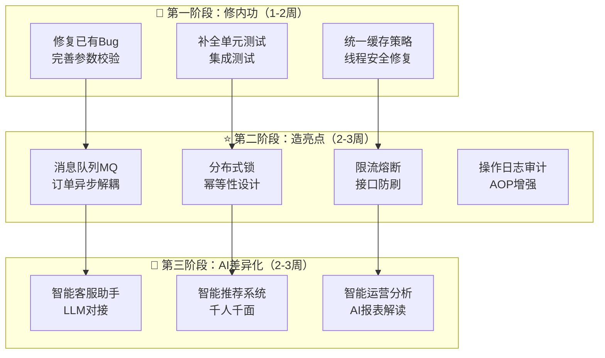
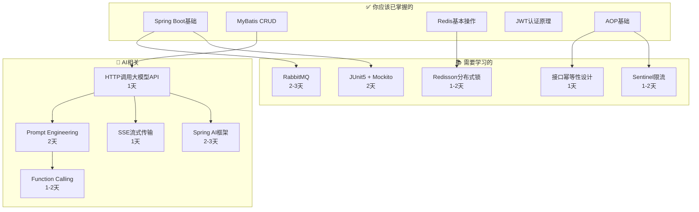

## 一、面试官看到"苍穹外卖"时的真实心理

> 作为面试了上百人的面试官，我可以直说：**看到苍穹外卖我不会减分，但也完全不会加分**。真正让我眼前一亮的是——你在这个项目基础上**做了什么不一样的事**。

---

## 二、改造方案总览（按投入产出比排序） 



## 三、第一阶段：修内功 ——「面试官一看就知道你不是照抄的」

### 3.1 修复项目中的真实Bug（我审计出的问题）

我在审计代码时发现了**多个货真价实的Bug**，修了这些你就能在面试时说："我在学习过程中发现了原项目的几个Bug并修复了。"——这句话**杀伤力极大**。

| Bug | 位置 | 严重程度 |
|-----|------|----------|
| `complete()` 状态设为 `CONFIRMED` 而非 `COMPLETED`，且ID赋值为null | `OrderServiceImpl` | 🔴 严重 |
| `checkOutOfRange()` 解析 `"result"` 字符串而非变量 | `OrderServiceImpl` | 🔴 严重 |
| WebSocket用 `HashMap` 而非 `ConcurrentHashMap`，并发不安全 | `WebSocketServer` | 🟡 中等 |
| 拦截器日志缺 `{}` 占位符，empId不打印 | `JwtTokenAdminInterceptor` | 🟡 中等 |
| `confirm()` 接口参数类型用了 `OrdersCancelDTO` 而非 `OrdersConfirmDTO` | `admin/OrderController` | 🟡 中等 |
| 无参数校验（`@Valid`/`@Validated`） | 全局 Controller | 🟡 中等 |

### 3.2 补全单元测试 + 集成测试

> **面试官追问**："你项目测试覆盖率多少？" —— 你现在的答案是 0%。

增加 JUnit 5 + Mockito 的 Service 层测试，加上 MockMvc 的 Controller 层集成测试。

### 3.3 统一缓存策略

当前菜品用 `RedisTemplate` 手动操作，套餐用 `@Cacheable` 注解——风格不统一。面试官会问你："为什么两种方式混用？" 你答不上来就暴露了。

---

## 四、第二阶段：造亮点 ——「体现你有分布式和工程化思维」

### 4.1 ⭐⭐⭐ 引入消息队列（RabbitMQ / RocketMQ）

**改造点**： 


**为什么必须加这个**：面试中"你用过消息队列吗？在哪个场景用的？"是高频问题。整个苍穹外卖项目最致命的短板就是**全同步调用**，订单提交这种链路天然适合异步解耦。

**面试追问**：
- 消息丢失了怎么办？（持久化 + 确认机制 + 本地消息表）
- 消费者幂等怎么保证？（唯一订单号 + 数据库唯一索引）

### 4.2 ⭐⭐⭐ 分布式锁 + 接口幂等性

**改造点**：当前项目的定时任务 `OrderTask` 如果部署多个实例，会**重复处理同一批超时订单**。

```
改造方案：
├── Redisson 分布式锁（包装定时任务）
├── 接口幂等性（Token令牌机制）
│   ├── 下单接口 → 防止重复下单
│   └── 支付接口 → 防止重复支付
└── 自定义 @Idempotent 注解 + AOP 实现
```

**面试追问**：
- Redis做分布式锁有什么问题？（主从切换锁丢失 → RedLock）
- 你的幂等方案能扛多大并发？

### 4.3 ⭐⭐ 限流熔断 + 接口防刷

**改造点**：当前项目**没有任何限流措施**，一个恶意用户可以无限调用下单接口。

```
改造方案：
├── Sentinel / Guava RateLimiter
│   ├── 全局限流（QPS上限）
│   └── 用户级限流（单用户每秒最多N次）
├── 自定义 @RateLimit 注解 + AOP
└── 接口防刷（滑动窗口 Redis 计数）
```

### 4.4 ⭐⭐ 操作日志审计系统（AOP增强）

项目已有 `AutoFillAspect`，在此基础上设计一个 **操作日志切面**——每个管理端操作（增/删/改/起售/停售）都自动记录到日志表。

```
改造方案：
├── @OperationLog 自定义注解
├── OperationLogAspect 环绕通知
│   ├── 记录操作人（从ThreadLocal获取）
│   ├── 记录操作类型/方法/参数
│   ├── 记录操作前后数据快照（diff）
│   └── 异步写入日志表（不影响主流程性能）
└── 管理端日志查询接口
```

这东西简历上写出来，面试官一看就知道你是真写过AOP的。

---

## 五、第三阶段：AI差异化 ——「2025-2026年最核心的竞争力」

### 5.1 ⭐⭐⭐⭐⭐ 智能客服助手（LLM对接）

**这是我最推荐的改造点**。原理简单但简历效果拔群。 


**具体实现思路**：

```
功能清单：
├── 用户问"我的订单到哪了" → 查订单状态 + 自然语言回复
├── 用户问"有什么推荐的菜" → 查热销菜品 + 个性化推荐
├── 用户问"怎么退款" → 判断订单状态 + 自动引导操作
├── 管理端：智能回复模板建议
└── 流式输出（SSE/WebSocket）

技术方案：
├── 大模型选型：DeepSeek API / 通义千问（国产、便宜、合规）
├── Prompt Engineering：系统提示词 + 用户上下文注入
├── Function Calling：让大模型调用你的业务接口（查订单/查菜品）
├── 对话历史：Redis 存储多轮对话上下文
├── 流式响应：SSE（Server-Sent Events）实现打字机效果
└── 降级兜底：大模型超时/异常时返回预设FAQ
```

**面试追问**：
- 大模型幻觉怎么解决？（RAG、Prompt约束、结果校验）
- 大模型调用延迟高怎么办？（流式输出、缓存高频问答、异步）
- Token 成本怎么控制？（对话轮次限制、Context Window裁剪）

### 5.2 ⭐⭐⭐⭐ 智能菜品推荐

```
推荐策略（由浅到深选一个即可）：
├── 基础版：基于用户历史订单的热门推荐（SQL统计即可）
├── 进阶版：协同过滤（用户-菜品矩阵）
├── AI版：把用户画像 + 菜品信息喂给大模型，生成个性化推荐理由
│
技术实现：
├── 用户画像构建：口味偏好、价格区间、下单时段
├── 推荐接口：/user/recommend → RecommendService
├── 缓存策略：推荐结果Redis缓存 + 定时更新
└── A/B测试思路（加分项，面试时提一嘴即可）
```

### 5.3 ⭐⭐⭐ 智能运营分析

当前 `ReportService` 只有枯燥的数据统计。增加AI分析：

```
改造方案：
├── 将营业数据（营业额趋势、订单量、热销菜品）构建为Prompt
├── 调用大模型生成"今日运营分析报告"
│   ├── "今日营业额较昨日增长12%，主要由套餐A贡献"
│   ├── "建议：周三下午订单量偏低，可考虑限时折扣"
│   └── "预警：菜品B退单率达15%，建议检查品控"
└── 管理端展示AI分析面板
```

---

## 六、改造方案优先级建议（时间有限的话）

| 排名 | 模块 | 投入时间 | 简历加分 | 面试聊天价值 | 推荐指数 |
|------|------|----------|----------|-------------|---------|
| 1 | 🤖 智能客服（LLM对接） | 2周 | ⭐⭐⭐⭐⭐ | ⭐⭐⭐⭐⭐ | **必做** |
| 2 | 📨 消息队列（订单异步） | 1周 | ⭐⭐⭐⭐ | ⭐⭐⭐⭐⭐ | **必做** |
| 3 | 🔒 分布式锁 + 幂等 | 1周 | ⭐⭐⭐⭐ | ⭐⭐⭐⭐ | **强烈推荐** |
| 4 | 🐛 修Bug + 参数校验 | 3天 | ⭐⭐⭐ | ⭐⭐⭐⭐ | **强烈推荐** |
| 5 | 📝 操作日志审计 | 3天 | ⭐⭐⭐ | ⭐⭐⭐ | 推荐 |
| 6 | 🚦 限流熔断 | 3天 | ⭐⭐⭐ | ⭐⭐⭐ | 推荐 |
| 7 | 🍽️ 智能推荐 | 1.5周 | ⭐⭐⭐⭐ | ⭐⭐⭐ | 推荐 |
| 8 | 🧪 单元测试 | 3天 | ⭐⭐ | ⭐⭐⭐ | 有余力再做 |

---

## 七、学习计划与前置知识

### 7.1 知识图谱 




### 7.2 详细学习计划（8周版）

#### **Week 1-2：修内功 + 消息队列**

| 日 | 内容 | 学习资源 |
|----|------|----------|
| D1-D2 | 修复项目Bug，完善参数校验（`@Valid`） | 我可以直接带你改代码 |
| D3-D4 | RabbitMQ 核心：Exchange/Queue/Binding、消息确认 | 官方Tutorial前5节 |
| D5-D6 | RabbitMQ 整合 Spring Boot，改造订单提交和支付回调 | `spring-boot-starter-amqp` |
| D7 | 消息可靠性：持久化、手动ACK、死信队列处理失败消息 | — |

**交付物**：订单流程走MQ异步化，死信队列处理失败订单

#### **Week 3：分布式锁 + 幂等**

| 日 | 内容 |
|----|------|
| D1-D2 | Redisson 分布式锁原理与实战，改造 `OrderTask` 定时任务 |
| D3-D4 | 幂等性设计：Token令牌 + `@Idempotent` 注解 + AOP |
| D5 | 限流：Guava `RateLimiter` 或 Redis 滑动窗口 |

**交付物**：定时任务安全、下单/支付幂等、核心接口限流

#### **Week 4：操作日志 + 测试**

| 日 | 内容 |
|----|------|
| D1-D2 | 设计并实现 `@OperationLog` + `OperationLogAspect` |
| D3-D5 | JUnit5 + Mockito 为核心 Service 写测试 |

#### **Week 5-6：⭐ 智能客服助手（核心亮点）**

| 日 | 内容 |
|----|------|
| D1 | 注册 DeepSeek / 通义千问 API，了解接口文档 |
| D2-D3 | 学习 Prompt Engineering 基础，设计客服系统提示词 |
| D4-D5 | 实现 `ChatService`：构建上下文 → 调用大模型 → 返回结果 |
| D6-D7 | 实现 Function Calling：让大模型主动调用查订单/查菜品接口 |
| D8-D9 | SSE 流式输出实现（打字机效果）|
| D10 | 对话历史 Redis 管理 + 降级兜底方案 |

**交付物**：完整的智能客服系统，支持多轮对话、流式输出、业务数据查询

#### **Week 7：智能推荐 / 运营分析（二选一）**

| 方向 | 实现 |
|------|------|
| 推荐系统 | 用户画像构建 + 基于历史订单的推荐 + 大模型生成推荐理由 |
| 运营分析 | 营业数据 → Prompt构建 → 大模型生成分析报告 |

#### **Week 8：联调 + 简历打磨**

整体测试 → 写README → 简历项目描述打磨

---

## 八、改造后简历项目描述建议

> **苍穹外卖 Plus — 基于 AI 增强的外卖点餐系统**
> 
> 技术栈：Spring Boot / MyBatis / MySQL / Redis / RabbitMQ / Redisson / WebSocket / DeepSeek API / SSE
> 
> - 基于苍穹外卖开源项目重构，**发现并修复原项目 6 个Bug**（订单状态机错误、并发安全等）
> - 引入 RabbitMQ 实现**订单异步解耦**，支持消息持久化、手动ACK、死信队列兜底
> - 基于 Redisson 实现**分布式锁**，解决定时任务多实例重复执行问题；设计 Token 令牌机制保证**接口幂等性**
> - 对接 DeepSeek 大模型 API 实现**智能客服助手**，支持 Function Calling 查询订单/菜品数据、多轮对话、SSE 流式输出
> - 自定义 `@OperationLog` 注解 + AOP 实现**操作审计日志**系统

面试官看到这份描述，至少会问你 5-6 个深度问题——**而你每个都有代码级别的答案**。

---

## 九、最后的忠告

1. **不要贪多**：上面的方案你能完成60%就已经超过90%的竞争者了。**做深比做广重要一万倍**。
2. **每个改造点，你必须能回答"为什么这么做"**：面试官不在乎你用了什么技术，在乎的是你**为什么选择这个方案而不是别的**。
3. **AI模块是2025-2026年最大的简历差异化武器**：大部分同学的苍穹外卖停留在CRUD，你加了大模型对接，面试官一定会追问——这就是你的主场。

---

**想从哪个模块开始动手？** 我可以：
- 🔧 直接带你改代码（比如先把那几个Bug修了）
- 📖 深入讲解某个改造点的技术原理
- 🏗️ 帮你搭建某个新模块的骨架代码