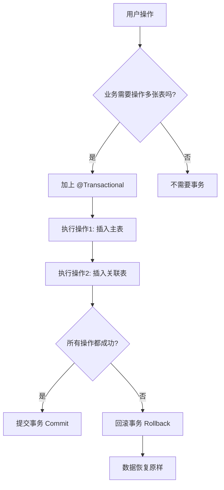

## 一、@Transactional 的核心应用逻辑（业务角度）

**简单来说**：`@Transactional` 是保证**一组数据库操作**要么**全部成功**，要么**全部失败回滚**的机制。

在"苍穹外卖"项目中，事务主要用于处理**一次业务操作涉及多张表**的情况：



---

## 二、项目中具体使用的类和方法

我在项目中找到了 **4 处**事务使用，都在 Service 层的实现类中：

### 1️⃣ **DishServiceImpl（菜品服务）**

#### 方法1：`saveWithFlavor` - 新增菜品 + 口味
**位置**：DishServiceImpl.java

```java
@Transactional
public void saveWithFlavor(DishDTO dishDTO) {
    // 操作1：向菜品表插入 1 条数据
    dishMapper.insert(dish);
    
    // 操作2：向口味表插入 n 条数据
    dishFlavorMapper.insertBatch(flavors);
}
```

**业务场景**：
- 用户添加一道菜品（如"麻婆豆腐"），同时要添加多种口味（不辣、微辣、重辣）
- 如果口味插入失败，菜品也不应该存在，需要一起回滚

---

#### 方法2：`deleteBatch` - 批量删除菜品
**位置**：DishServiceImpl.java

```java
@Transactional
public void deleteBatch(List<Long> ids) {
    ids.forEach(id->{
        // 操作1：删除菜品表中的数据
        dishMapper.deleteById(id);
        
        // 操作2：删除菜品关联的口味数据
        dishFlavorMapper.deleteByDishId(id);
    });
}
```

**业务场景**：
- 删除菜品时，必须同时删除关联的口味信息
- 如果删除到一半失败，会导致数据不一致（菜品删了，口味还在）

---

#### 方法3：`startOrStop` - 菜品起售/停售
**位置**：DishServiceImpl.java

```java
@Transactional
public void startOrStop(Integer status, Long id) {
    // 操作1：更新菜品状态
    dishMapper.update(dish);
    
    if (status == StatusConstant.DISABLE) {
        // 操作2：如果是停售，还要将包含该菜品的套餐也停售
        setmealMapper.update(setmeal);
    }
}
```

**业务场景**（重要）：
- 如果一道菜品停售了，包含这道菜的套餐也必须停售
- 比如"鱼香肉丝"停售，那"川菜套餐"也要自动停售
- 这里涉及**级联更新**，必须保证原子性

---

### 2️⃣ **SetmealServiceImpl（套餐服务）**

#### 方法4：`saveWithDish` - 新增套餐 + 关联菜品
**位置**：SetmealServiceImpl.java

```java
@Transactional
public void saveWithDish(SetmealDTO setmealDTO) {
    // 操作1：向套餐表插入数据
    setmealMapper.insert(setmeal);
    
    // 操作2：保存套餐和菜品的关联关系
    setmealDishMapper.insertBatch(setmealDishes);
}
```

**业务场景**：
- 创建一个"商务套餐"，包含"宫保鸡丁 + 米饭 + 饮料"
- 需要同时插入套餐表和套餐-菜品关联表
- 如果关联关系插入失败，套餐也不应该存在

---

## 三、初学者如何学习和理解？（循序渐进）

### 🎯 第一步：理解"为什么需要事务"

**类比**：网购转账场景
```
没有事务：
1. 你的账户扣款 500 元 ✅
2. 商家账户增加 500 元 ❌（网络故障）
结果：你的钱没了，商家没收到 💥

有事务：
1. 你的账户扣款 500 元
2. 商家账户增加 500 元失败
→ 自动回滚，你的账户恢复 500 元 ✅
```

### 🎯 第二步：掌握事务的 4 大特性（ACID）

| 特性 | 中文 | 通俗解释 | 
|------|------|----------|
| **A**tomicity | 原子性 | 要么全做，要么全不做 |
| **C**onsistency | 一致性 | 数据从一个正确状态到另一个正确状态 |
| **I**solation | 隔离性 | 并发时互不干扰 |
| **D**urability | 持久性 | 提交后永久保存 |

### 🎯 第三步：@Transactional 的常用配置

```java
@Transactional(
    propagation = Propagation.REQUIRED,  // 传播行为（默认）
    isolation = Isolation.DEFAULT,       // 隔离级别（默认）
    rollbackFor = Exception.class,       // 遇到任何异常都回滚
    timeout = 30                          // 超时时间（秒）
)
```

### 🎯 第四步：动手实验

**实验1**：在 `saveWithFlavor` 方法中，故意在插入口味后抛出异常
```java
@Transactional
public void saveWithFlavor(DishDTO dishDTO) {
    dishMapper.insert(dish);              // 插入菜品
    dishFlavorMapper.insertBatch(flavors); // 插入口味
    
    // 模拟异常
    if (true) {
        throw new RuntimeException("模拟失败");
    }
}
```
**观察结果**：菜品和口味都不会被插入到数据库 ✅

---

## 四、面试中会怎么问？⚠️

### 🔥 高频问题 1：`@Transactional` 什么情况下会失效？

**参考答案**：
1. **方法不是 public**：只有 public 方法才能被 Spring AOP 代理
2. **同类内部调用**：A() 调用 B()，B() 上的事务会失效（因为没走代理）
3. **异常被捕获**：如果你 catch 了异常但不抛出，事务不会回滚
4. **数据库不支持事务**：如 MySQL 的 MyISAM 引擎

```java
// ❌ 反例：事务会失效
@Transactional
public void methodA() {
    try {
        methodB(); // methodB 上的 @Transactional 会失效
    } catch (Exception e) {
        // 捕获异常不抛出，事务不会回滚
    }
}
```

### 🔥 高频问题 2：事务的传播行为是什么？

**常见的 3 种**：
| 传播行为 | 说明 | 使用场景 |
|---------|------|---------|
| `REQUIRED`（默认） | 如果有事务就加入，没有就新建 | 绝大部分场景 |
| `REQUIRES_NEW` | 无论如何都新建事务 | 记录日志（不希望因为主业务失败而不记录） |
| `NOT_SUPPORTED` | 以非事务方式执行 | 查询操作 |

### 🔥 高频问题 3：你们项目中哪些场景用了事务？

**参考回答模板**（面试时可以这么说）：
> "在我们的外卖项目中，凡是涉及**一主多从表**的操作都加了事务。比如：
> 1. **新增菜品**：需要同时插入 `dish` 表和 `dish_flavor` 表
> 2. **删除菜品**：需要同时删除菜品和口味数据
> 3. **菜品停售**：需要级联停售包含该菜品的套餐
> 
> 这样保证了数据的一致性。如果其中任何一步失败，所有操作都会回滚。"

### 🔥 进阶问题：高并发场景下，事务可能带来什么问题？

**答**：事务持有数据库连接时间过长，可能导致：
1. **连接池耗尽**：大量请求等待连接
2. **死锁**：两个事务互相等待对方释放锁

**优化方案**：
- 减小事务范围（把不必要的操作移出事务）
- 控制事务超时时间
- 使用乐观锁代替悲观锁

---

## 五、总结：学习建议 📝

1. **先理解概念**：知道什么是事务，为什么需要事务
2. **看项目代码**：重点看上面 4 个方法，理解为什么加 @Transactional
3. **做对比实验**：去掉 @Transactional，看看会发生什么
4. **准备面试话术**：用自己的话总结项目中的使用场景

**推荐学习路线**：
```
基础概念（ACID） → 观察项目代码 → 手动测试回滚 → 学习失效场景 → 了解传播行为
```

需要我详细讲解某个特定方法的事务逻辑吗？或者你有其他关于事务的疑问？😊