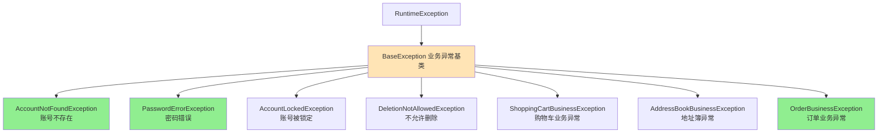
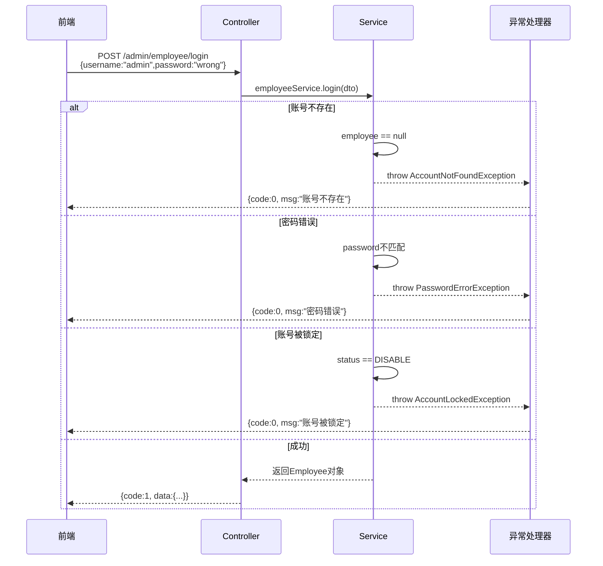
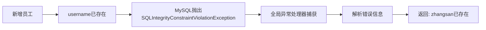

# 🎯 第一部分：全局异常处理器在哪里？

## 核心类：GlobalExceptionHandler

**文件位置：** GlobalExceptionHandler.java

```java
@RestControllerAdvice  // 🔥 核心注解：全局控制器增强
@Slf4j
public class GlobalExceptionHandler {
    
    /**
     * 捕获业务异常（自定义异常）
     */
    @ExceptionHandler  // 🔥 标记异常处理方法
    public Result exceptionHandler(BaseException ex) {
        log.error("异常信息：{}", ex.getMessage());
        return Result.error(ex.getMessage());
    }
    
    /**
     * 捕获SQL约束异常（如用户名重复）
     */
    @ExceptionHandler
    public Result exceptionHandler(SQLIntegrityConstraintViolationException ex) {
        // Duplicate entry 'zhangsan' for key 'employee.idx_username'
        String message = ex.getMessage();
        if (message.contains("Duplicate entry")) {
            String[] split = message.split(" ");
            String username = split[2];
            String msg = username + MessageConstant.ALREADY_EXISTS;
            return Result.error(msg);
        } else {
            return Result.error(MessageConstant.UNKNOWN_ERROR);
        }
    }
}
```

---

# 🏗️ 第二部分：项目中抛出异常的完整链路

## 一、异常体系结构



**所有自定义异常都在这里：** exception

---

## 二、典型应用场景（带完整流程）

### 场景1️⃣：员工登录（最经典）

**完整流程图：**



**代码实现：**

**① Service层抛出异常** - EmployeeServiceImpl.java

```java
@Service
public class EmployeeServiceImpl implements EmployeeService {
    
    public Employee login(EmployeeLoginDTO employeeLoginDTO) {
        String username = employeeLoginDTO.getUsername();
        String password = employeeLoginDTO.getPassword();
        
        // 1. 根据用户名查询
        Employee employee = employeeMapper.getByUsername(username);
        
        // 2. 处理异常情况 🔥
        if (employee == null) {
            // 抛出自定义异常
            throw new AccountNotFoundException(MessageConstant.ACCOUNT_NOT_FOUND);
        }
        
        // 密码比对
        password = DigestUtils.md5DigestAsHex(password.getBytes());
        if (!password.equals(employee.getPassword())) {
            throw new PasswordErrorException(MessageConstant.PASSWORD_ERROR);
        }
        
        if (employee.getStatus() == StatusConstant.DISABLE) {
            throw new AccountLockedException(MessageConstant.ACCOUNT_LOCKED);
        }
        
        // 3. 返回实体对象
        return employee;
    }
}
```

**② Controller层调用** - EmployeeController.java

```java
@RestController
@RequestMapping("/admin/employee")
public class EmployeeController {
    
    @PostMapping("/login")
    public Result<EmployeeLoginVO> login(@RequestBody EmployeeLoginDTO dto) {
        log.info("员工登录：{}", dto);
        
        // ✅ 不需要 try-catch，异常会被全局处理器捕获
        Employee employee = employeeService.login(dto);
        
        // 生成JWT Token
        String token = JwtUtil.createJWT(...);
        
        return Result.success(employeeLoginVO);
    }
}
```

**③ 全局异常处理器捕获** 

```java
@RestControllerAdvice
public class GlobalExceptionHandler {
    
    @ExceptionHandler
    public Result exceptionHandler(BaseException ex) {
        log.error("异常信息：{}", ex.getMessage());
        // 统一格式：{code: 0, msg: "账号不存在"}
        return Result.error(ex.getMessage());
    }
}
```

---

### 场景2️⃣：菜品删除（业务逻辑校验）

**文件：** DishServiceImpl.java

```java
@Service
public class DishServiceImpl implements DishService {
    
    @Override
    @Transactional
    public void deleteBatch(List<Long> ids) {
        // 判断当前菜品是否能够删除 - 是否存在起售中的菜品？
        ids.forEach(id -> {
            Dish dish = dishMapper.getById(id);
            if (dish.getStatus() == StatusConstant.ENABLE) {
                // 🔥 起售中的菜品不能删除
                throw new DeletionNotAllowedException(MessageConstant.DISH_ON_SALE);
            }
        });
        
        // 判断当前菜品是否能够删除 - 是否被套餐关联了？
        List<Long> setmealIds = setmealDishMapper.getSetmealIdsByDishIds(ids);
        if (setmealIds != null && setmealIds.size() > 0) {
            // 🔥 被套餐关联的菜品不能删除
            throw new DeletionNotAllowedException(MessageConstant.DISH_BE_RELATED_BY_SETMEAL);
        }
        
        // 删除菜品数据
        ids.forEach(id -> {
            dishMapper.deleteById(id);
            dishFlavorMapper.deleteByDishId(id);
        });
    }
}
```

---

### 场景3️⃣：用户下单（多重校验）

**文件：** OrderServiceImpl.java

```java
@Service
public class OrderServiceImpl implements OrderService {
    
    @Override
    public OrderSubmitVO submitOrder(OrdersSubmitDTO ordersSubmitDTO) {
        // 1. 异常情况的处理 - 收货地址为空
        AddressBook addressBook = addressBookMapper.getById(ordersSubmitDTO.getAddressBookId());
        if (addressBook == null) {
            throw new AddressBookBusinessException(MessageConstant.ADDRESS_BOOK_IS_NULL);
        }
        
        // 2. 检查用户的收货地址是否超出配送范围
        checkOutOfRange(addressBook.getCityName() + addressBook.getDistrictName() + addressBook.getDetail());
        
        // 3. 查询当前用户的购物车数据
        List<ShoppingCart> shoppingCartList = shoppingCartMapper.list(shoppingCart);
        if (shoppingCartList == null || shoppingCartList.size() == 0) {
            throw new ShoppingCartBusinessException(MessageConstant.SHOPPING_CART_IS_NULL);
        }
        
        // 构造订单数据...
    }
}
```

---

### 场景4️⃣：SQL约束异常（用户名重复）

**流程：**



**代码：** GlobalExceptionHandler.java

```java
@ExceptionHandler
public Result exceptionHandler(SQLIntegrityConstraintViolationException ex) {
    // 原始错误：Duplicate entry 'zhangsan' for key 'employee.idx_username'
    String message = ex.getMessage();
    
    if (message.contains("Duplicate entry")) {
        // 提取用户名："zhangsan"
        String[] split = message.split(" ");
        String username = split[2];
        
        // 🔥 友好的错误信息：zhangsan已存在
        String msg = username + MessageConstant.ALREADY_EXISTS;
        return Result.error(msg);
    } else {
        return Result.error(MessageConstant.UNKNOWN_ERROR);
    }
}
```

---

## 三、项目中抛出异常的统计

根据我的代码扫描，项目中共有**20+处**抛出自定义异常：

| Service类 | 抛出异常数量 | 主要场景 |
|-----------|-------------|---------|
| `EmployeeServiceImpl` | 3处 | 登录校验（账号不存在、密码错误、账号锁定） |
| `OrderServiceImpl` | 8处 | 下单校验（地址为空、购物车空、订单状态错误等） |
| `DishServiceImpl` | 2处 | 菜品删除校验（起售中、被套餐关联） |
| `CategoryServiceImpl` | 2处 | 分类删除校验（关联菜品、关联套餐） |
| `SetmealServiceImpl` | 若干处 | 套餐相关业务校验 |

---

# ❌ 第三部分：如果没有全局异常处理会发生什么？

## 一、没有全局异常处理器的代码（噩梦）

### 方案1：每个Controller都try-catch（代码臃肿）

```java
@PostMapping("/login")
public Result login(@RequestBody EmployeeLoginDTO dto) {
    try {
        Employee employee = employeeService.login(dto);
        return Result.success(employeeLoginVO);
        
    } catch (AccountNotFoundException e) {
        return Result.error("账号不存在");
        
    } catch (PasswordErrorException e) {
        return Result.error("密码错误");
        
    } catch (AccountLockedException e) {
        return Result.error("账号被锁定");
        
    } catch (Exception e) {
        return Result.error("系统异常");
    }
}

// ❌ 问题：
// 1. 每个接口都要写一遍 try-catch
// 2. 代码重复，难以维护
// 3. 容易遗漏异常处理
```

### 方案2：不处理异常（用户体验极差）

```java
@PostMapping("/login")
public Result login(@RequestBody EmployeeLoginDTO dto) {
    // 不捕获异常
    Employee employee = employeeService.login(dto);
    return Result.success(employeeLoginVO);
}

// ❌ 如果密码错误，前端收到的响应：
{
  "timestamp": "2026-02-15T10:30:00.000+00:00",
  "status": 500,
  "error": "Internal Server Error",
  "message": "密码错误",
  "path": "/admin/employee/login"
}

// 前端无法判断是什么类型的错误！
```

---

## 二、对比：有无全局异常处理

| 对比项 | 没有全局异常处理 | 有全局异常处理 ✅ |
|--------|----------------|------------------|
| **代码量** | 每个Controller都要try-catch | Controller干净简洁 |
| **维护性** | 异常处理逻辑分散，难以统一修改 | 集中管理，易于维护 |
| **响应格式** | 不统一，有的是Spring默认格式，有的是自定义 | 统一格式 `Result` |
| **日志记录** | 可能遗漏 | 统一记录到日志 |
| **前端处理** | 需要判断多种响应格式 | 只需判断 `code` 字段 |

---

## 三、具体影响示例

### 示例1：登录失败

**❌ 没有全局异常处理（Spring默认响应）：**
```json
{
  "timestamp": "2026-02-15T10:30:00.000+00:00",
  "status": 500,
  "error": "Internal Server Error",
  "message": "账号不存在",
  "path": "/admin/employee/login"
}
```

**✅ 有全局异常处理（统一格式）：**
```json
{
  "code": 0,
  "msg": "账号不存在",
  "data": null
}
```

**前端代码对比：**

```javascript
// ❌ 没有全局异常处理 - 前端需要判断多种情况
axios.post('/login', data).then(res => {
    if (res.status === 200 && res.data.code === 1) {
        // 成功
    } else if (res.status === 500) {
        // 服务器错误
    } else {
        // 其他情况
    }
}).catch(err => {
    // 还要处理网络错误
});

// ✅ 有全局异常处理 - 前端只需判断 code
axios.post('/login', data).then(res => {
    if (res.data.code === 1) {
        // 成功
        console.log(res.data.data);
    } else {
        // 失败，显示错误信息
        alert(res.data.msg);
    }
});
```

---

### 示例2：删除菜品

**业务场景：** 删除一个起售中的菜品

**❌ 没有全局异常处理：**
```
后端日志：
Exception in thread "http-nio-8080-exec-1" com.sky.exception.DeletionNotAllowedException: 起售中的菜品不能删除
    at com.sky.service.impl.DishServiceImpl.deleteBatch(DishServiceImpl.java:92)
    ...

前端收到：
HTTP 500 Internal Server Error
{
  "timestamp": "2026-02-15T10:30:00",
  "status": 500,
  "error": "Internal Server Error",
  "message": "",
  "path": "/admin/dish"
}

用户看到：服务器内部错误，请联系管理员
```

**✅ 有全局异常处理：**
```
后端日志：
2026-02-15 10:30:00.123 ERROR [GlobalExceptionHandler] 异常信息：起售中的菜品不能删除

前端收到：
{
  "code": 0,
  "msg": "起售中的菜品不能删除",
  "data": null
}

用户看到：起售中的菜品不能删除（友好的业务提示）
```

---

# 🎓 第四部分：核心注解详解

## `@RestControllerAdvice`

**作用：** 全局控制器增强 + 自动转JSON

**组成：**
```java
@RestControllerAdvice 
= @ControllerAdvice  // 控制器增强
+ @ResponseBody       // 返回值转JSON
```

**扫描范围：** 默认扫描所有`@Controller`和`@RestController`

**可以指定范围：**
```java
@RestControllerAdvice(basePackages = "com.sky.controller")  // 只扫描这个包
@RestControllerAdvice(assignableTypes = {EmployeeController.class})  // 只针对某些Controller
```

---

## `@ExceptionHandler`

**作用：** 标记异常处理方法

**匹配规则：**
1. **精确匹配优先**：先找能处理该异常类型的方法
2. **父类匹配**：如果没有，找能处理父类异常的方法
3. **通用匹配**：都没有，找`Exception`类型的处理方法

**示例：**

```java
@RestControllerAdvice
public class GlobalExceptionHandler {
    
    // 处理自定义业务异常
    @ExceptionHandler(BaseException.class)
    public Result handleBusinessException(BaseException ex) {
        return Result.error(ex.getMessage());
    }
    
    // 处理SQL异常
    @ExceptionHandler(SQLIntegrityConstraintViolationException.class)
    public Result handleSQLException(SQLIntegrityConstraintViolationException ex) {
        // 特殊处理...
        return Result.error("数据库操作失败");
    }
    
    // 处理所有未被捕获的异常（兜底）
    @ExceptionHandler(Exception.class)
    public Result handleException(Exception ex) {
        log.error("系统异常", ex);
        return Result.error("系统繁忙，请稍后再试");
    }
}
```

---

# 🔥 第五部分：面试高频考点

## ❓ 面试题1：全局异常处理的原理是什么？

**答（三段式）：**

**第一段 - 基于AOP实现：**
Spring通过AOP拦截所有Controller方法的执行，当方法抛出异常时，会被`ExceptionHandlerExceptionResolver`捕获。

**第二段 - 匹配处理器：**
根据异常类型，从所有标注了`@ExceptionHandler`的方法中找到最匹配的处理方法，精确匹配优先，然后是父类匹配。

**第三段 - 统一响应：**
执行处理方法，返回统一格式的`Result`对象，避免了Spring默认的错误响应。

---

## ❓ 面试题2：`@ControllerAdvice`和`@RestControllerAdvice`的区别？

**答：**

| 注解 | 返回值处理 | 使用场景 |
|------|-----------|---------|
| `@ControllerAdvice` | 需要手动加`@ResponseBody` | 返回视图 |
| `@RestControllerAdvice` | 自动转JSON（内含`@ResponseBody`） | 返回JSON（RESTful API）|

```java
// @ControllerAdvice
@ControllerAdvice
public class GlobalExceptionHandler {
    
    @ExceptionHandler(BaseException.class)
    @ResponseBody  // 需要手动加
    public Result handleException(BaseException ex) {
        return Result.error(ex.getMessage());
    }
}

// @RestControllerAdvice（推荐）
@RestControllerAdvice
public class GlobalExceptionHandler {
    
    @ExceptionHandler(BaseException.class)  // 不需要@ResponseBody
    public Result handleException(BaseException ex) {
        return Result.error(ex.getMessage());
    }
}
```

---

## ❓ 面试题3：如何处理参数校验异常？

**答：** 

在项目中可以扩展全局异常处理器，增加对`MethodArgumentNotValidException`的处理：

```java
@RestControllerAdvice
public class GlobalExceptionHandler {
    
    // 处理 @Validated 校验失败
    @ExceptionHandler(MethodArgumentNotValidException.class)
    public Result handleValidException(MethodArgumentNotValidException ex) {
        // 获取第一个校验失败的错误信息
        String message = ex.getBindingResult()
                .getFieldError()
                .getDefaultMessage();
        return Result.error(message);
    }
}
```

---

## ❓ 面试题4：为什么自定义异常要继承RuntimeException？

**答：**

| 异常类型 | 是否必须捕获 | 事务回滚 |
|---------|------------|---------|
| `Exception`（受检异常） | 必须try-catch或throws | **默认不回滚** |
| `RuntimeException`（非受检异常） | 不强制捕获 | **默认回滚** |

```java
// ✅ 继承 RuntimeException（推荐）
public class BaseException extends RuntimeException {
    public BaseException(String msg) {
        super(msg);
    }
}

// Service中直接抛出，不需要throws
public void delete(Long id) {
    if (dish.getStatus() == ENABLE) {
        throw new DeletionNotAllowedException("起售中的菜品不能删除");
        // 事务自动回滚 ✅
    }
}

// ❌ 继承 Exception
public class BaseException extends Exception {
    // ...
}

// Service中必须声明 throws，麻烦
public void delete(Long id) throws BaseException {
    if (dish.getStatus() == ENABLE) {
        throw new DeletionNotAllowedException("起售中的菜品不能删除");
        // 事务默认不回滚！需要配置 rollbackFor ❌
    }
}
```

---

## ❓ 面试题5：说说你们项目中的异常处理最佳实践

**答（结合项目回答）：**

> "我们项目采用了分层的异常处理策略：
> 
> **1. 自定义异常体系**  
> 定义了`BaseException`作为所有业务异常的父类，针对不同业务场景派生出`AccountNotFoundException`、`OrderBusinessException`等子类，语义清晰。
> 
> **2. 全局异常处理器**  
> 用`@RestControllerAdvice`统一捕获异常，根据异常类型返回不同的错误信息。比如SQL约束异常会解析具体的字段名，返回"xxx已存在"。
> 
> **3. Service层职责明确**  
> Service层专注于业务逻辑校验，不符合规则直接抛出异常。Controller层不需要任何try-catch，代码非常简洁。
> 
> **4. 统一响应格式**  
> 无论成功还是失败，都返回`Result`对象，前端只需判断`code`字段，大大简化了前端的错误处理逻辑。
> 
> **5. 日志记录**  
> 全局异常处理器中统一记录日志，方便排查问题。"

---

# 📊 总结对比表

| 对比项 | Controller手动处理 | 全局异常处理 ✅ |
|--------|-------------------|----------------|
| **代码量** | 每个方法都要try-catch | Controller零额外代码 |
| **可维护性** | 异常处理逻辑分散 | 集中在GlobalExceptionHandler |
| **响应格式** | 可能不统一 | 统一Result格式 |
| **日志记录** | 容易遗漏 | 统一记录 |
| **业务分离** | 业务逻辑和异常处理混在一起 | 职责清晰分离 |
| **扩展性** | 新增异常类型需要改多处 | 只需在Handler中加一个方法 |

---

**现在你想：**
1. 🔧 **实战练习** - 新增一个异常类型（如用户余额不足）并处理
2. 📚 **深入学习** - 学习JWT登录认证的完整流程
3. 🎯 **下一个知识点** - 学习统一响应封装Result的设计

选择你的学习路径！💪

Similar code found with 1 license type