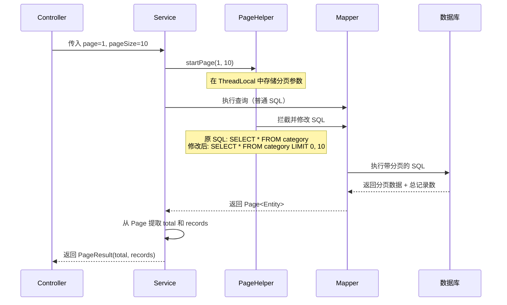

## 一、PageHelper 是什么？核心原理

**PageHelper 是 MyBatis 的一个分页插件**，它通过拦截你的 SQL 语句，自动在后面加上 `LIMIT offset, size`（MySQL）来实现物理分页。

### 🎯 核心工作流程（用 Mermaid 图理解）



---

## 二、项目中的核心应用逻辑

### ✅ 标准三步走（以分类查询为例）

#### **第 1 步：在 Service 层调用 `PageHelper.startPage()`**
CategoryServiceImpl.java
```java
public PageResult pageQuery(CategoryPageQueryDTO categoryPageQueryDTO) {
    // 关键！必须在执行查询前设置分页参数
    PageHelper.startPage(categoryPageQueryDTO.getPage(), categoryPageQueryDTO.getPageSize());
    
    // 紧接着执行查询，PageHelper 会拦截这条 SQL
    Page<Category> page = categoryMapper.pageQuery(categoryPageQueryDTO);
    
    // 从 Page 对象中提取数据
    return new PageResult(page.getTotal(), page.getResult());
}
```

#### **第 2 步：Mapper 方法返回类型必须是 `Page<T>`**
CategoryMapper.java
```java
// 注意返回类型是 Page，不是 List！
Page<Category> pageQuery(CategoryPageQueryDTO categoryPageQueryDTO);
```

#### **第 3 步：XML 中写正常的查询 SQL**
CategoryMapper.xml
```xml
<select id="pageQuery" resultType="com.sky.entity.Category">
    select * from category
    <where>
        <if test="name != null and name != ''">
            and name like concat('%',#{name},'%')
        </if>
        <if test="type != null">
            and type = #{type}
        </if>
    </where>
    order by sort asc , create_time desc
</select>
```

**重点**：你不需要手动写 `LIMIT`，PageHelper 会自动帮你加！

---

## 三、项目中的具体应用位置

| 模块 | Service 类 | 方法 | 业务场景 |
|------|-----------|------|----------|
| 员工管理 | EmployeeServiceImpl.java | `pageQuery()` | 员工列表分页 |
| 分类管理 | CategoryServiceImpl.java | `pageQuery()` | 菜品/套餐分类分页 |
| 菜品管理 | DishServiceImpl.java | `pageQuery()` | 菜品列表分页 |
| 套餐管理 | SetmealServiceImpl.java | `pageQuery()` | 套餐列表分页 |
| 订单管理 | OrderServiceImpl.java | `pageQueryForUser()` | 用户端订单历史查询 |
| 订单管理 | OrderServiceImpl.java | `conditionSearch()` | 管理端订单搜索 |

---

## 四、面试中会怎么问？

### 🎤 常见问题 1：PageHelper 的原理是什么？
**标准回答**：  
PageHelper 基于 **MyBatis 拦截器（Interceptor）** 实现。它在 SQL 执行前拦截，通过 `ThreadLocal` 获取之前设置的分页参数，然后根据数据库类型（MySQL/Oracle/PostgreSQL）自动修改 SQL：
- MySQL：加 `LIMIT offset, size`
- Oracle：用 `ROWNUM`
- 同时还会执行一条 `COUNT(*)` 查询获取总记录数

### 🎤 常见问题 2：为什么 `PageHelper.startPage()` 要紧跟在查询前？
**标准回答**：  
因为 PageHelper 使用 **ThreadLocal** 存储分页参数，只对 **紧接着执行的第一条 SQL** 生效。如果中间插入其他数据库操作，分页参数就会被消耗掉。

**错误示例**：
```java
PageHelper.startPage(1, 10);
dishMapper.selectById(1);  // ❌ 这条语句会消耗分页参数
Page<Dish> page = dishMapper.pageQuery(dto); // ❌ 这里就没有分页了！
```

### 🎤 常见问题 3：高并发场景下 PageHelper 有什么问题？（深度追问）
**标准回答**：  
1. **每次都要查两次数据库**（一次 COUNT，一次查数据），在数据量大时会慢
2. **深分页问题**：查询第 10000 页时，MySQL 还是要扫描前 100000 条数据

**优化方案**：
- 使用 **游标分页**（基于上次的最大 ID）
- 前端限制最大页数
- Redis 缓存总记录数

---

## 五、初学者学习建议

### 📚 Step 1：理解核心概念（10 分钟）
1. **物理分页 vs 逻辑分页**
   - 物理分页：数据库只返回当前页数据（PageHelper 用这种）
   - 逻辑分页：一次查出所有数据，在内存中截取（性能差）

2. **ThreadLocal 的作用**
   - 看懂为什么 `PageHelper.startPage()` 只影响当前线程的下一条 SQL

### 🛠️ Step 2：动手实践（30 分钟）
1. 在你的项目中选一个模块（比如员工管理）
2. 打断点在 EmployeeServiceImpl.java
3. **Debug 模式运行**，观察：
   - `PageHelper.startPage()` 执行后，ThreadLocal 里存了什么？
   - `employeeMapper.pageQuery()` 执行时，SQL 被改成了什么样？
   - 返回的 `Page` 对象里有哪些数据？

### 🔍 Step 3：对比学习（15 分钟）
看看不同模块的分页查询有什么共同点：
- CategoryServiceImpl.java（最简单）
- OrderServiceImpl.java（带条件搜索）

你会发现套路都一样！

### 📖 Step 4：扩展阅读
- 官方文档：https://pagehelper.github.io/
- 思考：如果不用 PageHelper，你要自己写 `LIMIT` 和 `COUNT`，会是什么样的代码？

---

## 六、核心记忆点（面试前背 3 遍）

1. **三步走**：`startPage()` → 执行查询 → 提取 `Page.getTotal()` 和 `Page.getResult()`
2. **原理**：MyBatis 拦截器 + ThreadLocal + SQL 改写
3. **注意**：`startPage()` 必须紧跟查询，否则失效
4. **返回类型**：Mapper 方法必须返回 `Page<T>`，不是 `List<T>`

---

有什么不清楚的地方吗？我可以帮你：
1. Debug 演示某个具体的分页方法
2. 画更详细的流程图
3. 解释项目中某个特殊的分页场景（比如订单查询为什么还要额外封装成 OrderVO？）

Similar code found with 1 license type