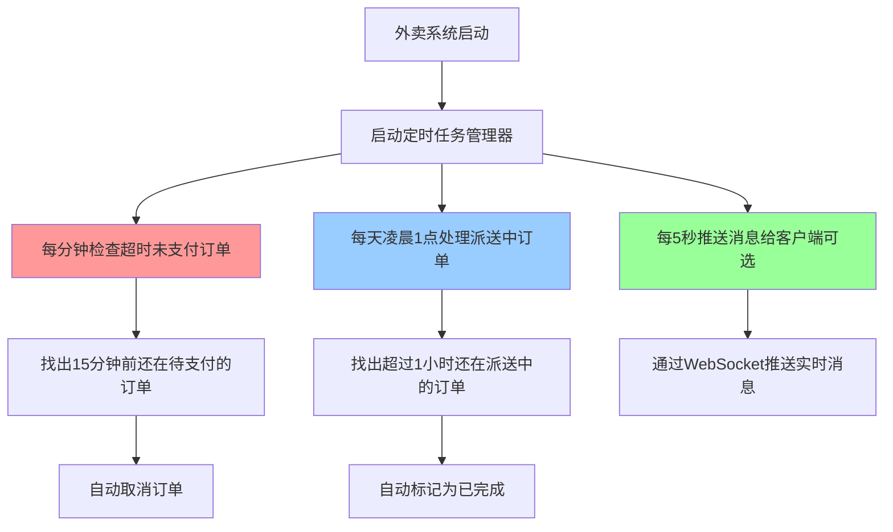

## 一、业务逻辑的通俗理解

想象一下，外卖系统就像一个餐厅的自动管理员：



**核心业务场景**：
- 📱 用户下单后15分钟没付款 → 系统自动取消订单，释放库存
- 🚚 派送员接单后超过1小时还未完成 → 系统认为已送达，自动完成订单

---

## 二、项目中的具体应用位置

### 1️⃣ **开启定时任务** - SkyApplication.java
```java
@EnableScheduling  // 这个注解必须加，否则定时任务不生效
```

### 2️⃣ **核心定时任务类** - OrderTask.java

#### 方法1：处理超时订单（每分钟执行）
```java
@Scheduled(cron = "0 * * * * ?")  // 每分钟的第0秒执行
public void processTimeoutOrder() {
    // 查询15分钟前还在"待支付"状态的订单
    LocalDateTime time = LocalDateTime.now().plusMinutes(-15);
    List<Orders> ordersList = orderMapper.getByStatusAndOrderTime(
        Orders.PENDING_PAYMENT, time
    );
    
    // 批量取消订单
    ordersList.forEach(orders -> {
        orders.setStatus(Orders.CANCELLED);
        orders.setCancelReason("支付超时，自动取消");
        orderMapper.update(orders);
    });
}
```

#### 方法2：处理派送中订单（每天凌晨1点）
```java
@Scheduled(cron = "0 0 1 * * ?")  // 每天01:00:00执行
public void processDeliveryOrder() {
    // 查询1小时前还在"派送中"状态的订单
    LocalDateTime time = LocalDateTime.now().plusMinutes(-60);
    List<Orders> ordersList = orderMapper.getByStatusAndOrderTime(
        Orders.DELIVERY_IN_PROGRESS, time
    );
    
    // 批量标记为已完成
    ordersList.forEach(orders -> {
        orders.setStatus(Orders.COMPLETED);
        orderMapper.update(orders);
    });
}
```

### 3️⃣ **演示用定时任务** - WebSocketTask.java
```java
@Scheduled(cron = "0/5 * * * * ?")  // 每5秒执行一次
public void sendMessageToClient() {
    // 向所有连接的客户端推送当前时间
    webSocketServer.sendToAllClient("这是来自服务端的消息：" + 当前时间);
}
```

---

## 三、初学者学习指南

### 🎯 **学习步骤**

#### **第1步：理解Cron表达式**
```
格式：秒 分 时 日 月 周
示例：
0 * * * * ?        → 每分钟的第0秒执行
0 0 1 * * ?        → 每天凌晨1点执行
0/5 * * * * ?      → 每5秒执行一次
0 0 */2 * * ?      → 每2小时执行一次
0 30 9 ? * MON-FRI → 每周一到周五早上9:30执行
```

💡 **口诀**：`秒分时日月周`，记住这6个位置

#### **第2步：三个必备条件**
```java
// 1. 启动类加注解
@EnableScheduling

// 2. 任务类标记为组件
@Component
public class OrderTask {
    
    // 3. 方法上加@Scheduled
    @Scheduled(cron = "0 * * * * ?")
    public void processTimeoutOrder() {
        // 具体业务逻辑
    }
}
```

#### **第3步：理解应用场景**

| 场景 | 示例 | 周期 |
|------|------|------|
| 🔥 **高频监控** | 支付超时检查 | 每分钟 |
| 📊 **数据统计** | 每日营业额报表 | 每天凌晨 |
| 🧹 **数据清理** | 删除过期日志 | 每周/每月 |
| 📧 **消息推送** | 优惠券到期提醒 | 每天上午10点 |
| 🔄 **状态同步** | 同步第三方订单状态 | 每10分钟 |

---

## 四、⚠️ 面试高频问题

### **面试官通常会这样问：**

#### 问题1：**"@Scheduled 定时任务的线程模型是怎样的？"**
**标准答案**：
- 默认使用单线程串行执行所有任务
- 如果某个任务执行时间过长，会阻塞后续任务
- 生产环境需要配置线程池：
```java
@Configuration
public class ScheduledConfig implements SchedulingConfigurer {
    @Override
    public void configureTasks(ScheduledTaskRegistrar taskRegistrar) {
        taskRegistrar.setScheduler(Executors.newScheduledThreadPool(10));
    }
}
```

#### 问题2：**"如果定时任务执行时间超过了间隔时间怎么办？"**
**举例说明**：
```java
@Scheduled(cron = "0/5 * * * * ?")  // 每5秒执行
public void task() {
    Thread.sleep(10000);  // 但任务耗时10秒
}
```
- 默认会等上一次执行完才开始下一次
- 不会并发执行（除非配置异步）

---

## 五、🚀 进阶优化建议

在本项目中，OrderTask.java 的实现虽然简单易懂，但在**高并发场景**下会有问题：

### **潜在风险**：
1. **数据库压力大**：每分钟全表扫描超时订单
2. **重复执行**：分布式部署时会重复取消同一订单
3. **事务丢失**：批量更新没加`@Transactional`

### **生产级优化方案**：
```java
// 1. 加分布式锁（防止多实例重复执行）
@Scheduled(cron = "0 * * * * ?")
@RedissonLock(key = "order:timeout:lock")
public void processTimeoutOrder() { ... }

// 2. 加事务保证原子性
@Transactional(rollbackFor = Exception.class)
public void processTimeoutOrder() { ... }

// 3. 分页查询降低数据库压力
PageHelper.startPage(1, 100);

// 4. 使用延迟队列（更优雅的方案）
// RabbitMQ死信队列 或 Redis ZSet
```

---

## 六、👨‍💻 实战练习建议

1. **修改Cron表达式**，观察任务执行时机
2. **加断点调试**，观察任务何时触发
3. **模拟超时订单**，手动创建15分钟前的订单，观察是否被取消
4. **查看日志**，确认任务是否按预期执行

---

## 📝 关键知识点总结

| 知识点 | 说明 |
|--------|------|
| `@EnableScheduling` | 启动类必加，开启定时任务功能 |
| `@Component` | 定时任务类必须是Spring Bean |
| `@Scheduled` | 标记定时方法，配置执行周期 |
| **Cron表达式** | 6位或7位，定义执行时间规则 |
| **单线程模型** | 默认串行执行，注意任务时长 |
| **分布式问题** | 多实例部署需加分布式锁 |

有任何疑问随时问我！建议你先把 OrderTask.java 的逻辑跑一遍，理解业务流程后再深入源码实现。💪