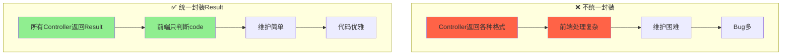
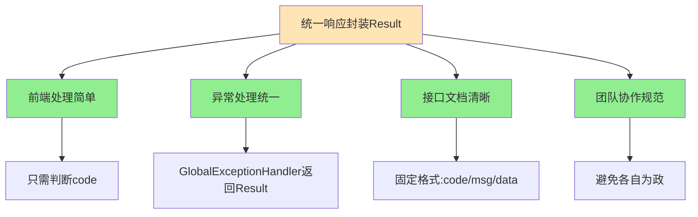

# 🎯 第一部分：Result类在哪里？如何设计的？

## 核心类：Result

**文件位置：** Result.java

```java
@Data
public class Result<T> implements Serializable {
    
    private Integer code;  // 编码：1成功，0和其它数字为失败
    private String msg;    // 错误信息
    private T data;        // 数据（泛型）
    
    // 🔥 成功（无返回数据）
    public static <T> Result<T> success() {
        Result<T> result = new Result<T>();
        result.code = 1;
        return result;
    }
    
    // 🔥 成功（有返回数据）
    public static <T> Result<T> success(T object) {
        Result<T> result = new Result<T>();
        result.data = object;
        result.code = 1;
        return result;
    }
    
    // 🔥 失败
    public static <T> Result<T> error(String msg) {
        Result result = new Result();
        result.msg = msg;
        result.code = 0;
        return result;
    }
}
```

---

## 设计亮点分析

### 1️⃣ 泛型设计

```java
public class Result<T> {
    private T data;  // 🔥 泛型，可以封装任意类型的数据
}

// 使用示例
Result<String> result1 = Result.success("操作成功");
Result<Employee> result2 = Result.success(employee);
Result<List<Dish>> result3 = Result.success(dishList);
Result<PageResult> result4 = Result.success(pageResult);
```

**好处：** 类型安全，编译期就能检测类型错误

---

### 2️⃣ 静态工厂方法（Builder模式变体）

```java
// ✅ 推荐：静态工厂方法，语义清晰
return Result.success(employee);
return Result.error("账号不存在");

// ❌ 不推荐：直接new，繁琐
Result<Employee> result = new Result<>();
result.setCode(1);
result.setData(employee);
return result;
```

**好处：** 代码简洁、语义明确、不易出错

---

### 3️⃣ 统一的响应码规范

```java
code = 1  →  成功
code = 0  →  失败
```

**为什么不用HTTP状态码（200, 404, 500）？**

| HTTP状态码 | Result的code | 说明 |
|-----------|-------------|------|
| 200 OK | code=1（成功）或 code=0（失败）| HTTP层成功，业务层可能失败 |
| 500 Server Error | code=0 | 异常被全局处理后，HTTP依然返回200 |

**示例：** 登录失败

```
HTTP/1.1 200 OK
Content-Type: application/json

{
  "code": 0,           ← 业务失败
  "msg": "密码错误",
  "data": null
}
```

---

## 配套设计：PageResult

**文件位置：** PageResult.java

```java
@Data
@AllArgsConstructor
@NoArgsConstructor
public class PageResult implements Serializable {
    private long total;    // 总记录数
    private List records;  // 当前页数据集合
}
```

**配合Result使用：**

```java
// Controller
public Result<PageResult> page(EmployeePageQueryDTO dto) {
    PageResult pageResult = employeeService.pageQuery(dto);
    return Result.success(pageResult);
}

// 前端收到的JSON：
{
  "code": 1,
  "msg": null,
  "data": {
    "total": 100,
    "records": [
      {id: 1, name: "张三"},
      {id: 2, name: "李四"}
    ]
  }
}
```

---

# 🔍 第二部分：Result在项目中的完整应用场景

## 场景1️⃣：登录（有返回数据）

**文件：** EmployeeController.java

```java
@PostMapping("/login")
public Result<EmployeeLoginVO> login(@RequestBody EmployeeLoginDTO dto) {
    log.info("员工登录：{}", dto);
    
    Employee employee = employeeService.login(dto);
    
    // 生成JWT Token
    Map<String, Object> claims = new HashMap<>();
    claims.put(JwtClaimsConstant.EMP_ID, employee.getId());
    String token = JwtUtil.createJWT(...);
    
    EmployeeLoginVO employeeLoginVO = EmployeeLoginVO.builder()
            .id(employee.getId())
            .userName(employee.getUsername())
            .name(employee.getName())
            .token(token)
            .build();
    
    // 🔥 返回封装后的数据
    return Result.success(employeeLoginVO);
}
```

**前端收到的JSON：**

```json
{
  "code": 1,
  "msg": null,
  "data": {
    "id": 1,
    "userName": "admin",
    "name": "管理员",
    "token": "eyJhbGciOiJIUzI1NiIsInR5cCI6IkpXVCJ9..."
  }
}
```

**前端处理：**

```javascript
axios.post('/admin/employee/login', loginForm).then(res => {
    if (res.data.code === 1) {
        // 成功，提取数据
        const token = res.data.data.token;
        localStorage.setItem('token', token);
        router.push('/home');
    } else {
        // 失败，显示错误信息
        alert(res.data.msg);
    }
});
```

---

## 场景2️⃣：新增/删除（无返回数据）

**文件：** EmployeeController.java

```java
@PostMapping
@ApiOperation("新增员工")
public Result save(@RequestBody EmployeeDTO employeeDTO) {
    log.info("新增员工：{}", employeeDTO);
    employeeService.save(employeeDTO);
    
    // 🔥 无需返回数据，只返回成功标识
    return Result.success();
}
```

**前端收到的JSON：**

```json
{
  "code": 1,
  "msg": null,
  "data": null
}
```

**前端处理：**

```javascript
axios.post('/admin/employee', employeeForm).then(res => {
    if (res.data.code === 1) {
        message.success('新增成功');
        // 刷新列表
        getEmployeeList();
    } else {
        message.error(res.data.msg);
    }
});
```

---

## 场景3️⃣：分页查询（返回PageResult）

**文件：** EmployeeController.java

```java
@GetMapping("/page")
@ApiOperation("员工分页查询")
public Result<PageResult> page(EmployeePageQueryDTO dto) {
    log.info("员工分页查询，参数为：{}", dto);
    PageResult pageResult = employeeService.pageQuery(dto);
    
    // 🔥 返回分页数据
    return Result.success(pageResult);
}
```

**前端收到的JSON：**

```json
{
  "code": 1,
  "msg": null,
  "data": {
    "total": 100,
    "records": [
      {
        "id": 1,
        "username": "admin",
        "name": "管理员",
        "phone": "13800138000",
        "status": 1
      },
      {
        "id": 2,
        "username": "zhangsan",
        "name": "张三",
        "phone": "13900139000",
        "status": 1
      }
    ]
  }
}
```

**前端处理：**

```javascript
axios.get('/admin/employee/page', {
    params: { page: 1, pageSize: 10 }
}).then(res => {
    if (res.data.code === 1) {
        this.total = res.data.data.total;
        this.tableData = res.data.data.records;
    }
});
```

---

## 场景4️⃣：查询详情（返回单个对象）

**文件：** DishController.java

```java
@GetMapping("/{id}")
@ApiOperation("根据id查询菜品")
public Result<DishVO> getById(@PathVariable Long id) {
    log.info("根据id查询菜品：{}", id);
    DishVO dishVO = dishService.getByIdWithFlavor(id);
    
    // 🔥 返回单个对象
    return Result.success(dishVO);
}
```

**前端收到的JSON：**

```json
{
  "code": 1,
  "msg": null,
  "data": {
    "id": 1,
    "name": "宫保鸡丁",
    "price": 38.00,
    "image": "https://xxx.jpg",
    "categoryId": 2,
    "status": 1,
    "flavors": [
      {"name": "辣度", "value": "不辣,微辣,中辣,特辣"}
    ]
  }
}
```

---

## 场景5️⃣：查询列表（返回List）

**文件：** ShoppingCartController.java

```java
@GetMapping("/list")
@ApiOperation("查看购物车")
public Result<List<ShoppingCart>> list() {
    // 🔥 返回列表
    return Result.success(shoppingCartService.showShoppingCart());
}
```

**前端收到的JSON：**

```json
{
  "code": 1,
  "msg": null,
  "data": [
    {
      "id": 1,
      "name": "宫保鸡丁",
      "image": "https://xxx.jpg",
      "amount": 38.00,
      "number": 2
    },
    {
      "id": 2,
      "name": "鱼香肉丝",
      "image": "https://yyy.jpg",
      "amount": 32.00,
      "number": 1
    }
  ]
}
```

---

## 场景6️⃣：异常情况（全局异常处理器返回）

**文件：** GlobalExceptionHandler.java

```java
@RestControllerAdvice
public class GlobalExceptionHandler {
    
    @ExceptionHandler
    public Result exceptionHandler(BaseException ex) {
        log.error("异常信息：{}", ex.getMessage());
        
        // 🔥 异常时也返回Result
        return Result.error(ex.getMessage());
    }
}
```

**前端收到的JSON（登录失败）：**

```json
{
  "code": 0,
  "msg": "密码错误",
  "data": null
}
```

---

# 🚫 第三部分：如果没有统一封装Result会怎样？

## 一、噩梦场景：混乱的响应格式

### 场景1：直接返回对象

```java
// ❌ 不统一封装
@PostMapping("/login")
public EmployeeLoginVO login(@RequestBody EmployeeLoginDTO dto) {
    Employee employee = employeeService.login(dto);
    // 直接返回VO对象
    return employeeLoginVO;
}
```

**问题：** 前端收到的响应：

```json
// 成功时：
{
  "id": 1,
  "userName": "admin",
  "name": "管理员",
  "token": "..."
}

// 失败时（抛异常）：
{
  "timestamp": "2026-02-15T10:30:00.000+00:00",
  "status": 500,
  "error": "Internal Server Error",
  "message": "密码错误",
  "path": "/admin/employee/login"
}
```

**前端噩梦：** 需要判断多种格式

```javascript
axios.post('/login', data).then(res => {
    // 格式1：成功时是对象
    if (res.data.token) {
        // 成功
    }
}).catch(err => {
    // 格式2：失败时是Spring默认格式
    if (err.response.status === 500) {
        alert(err.response.data.message);
    }
});
```

---

### 场景2：自定义返回格式不统一

```java
// Controller1 返回 Map
@PostMapping("/save")
public Map<String, Object> save() {
    Map<String, Object> result = new HashMap<>();
    result.put("success", true);
    result.put("message", "保存成功");
    return result;
}

// Controller2 返回 自定义类
@PostMapping("/delete")
public MyResponse delete() {
    return new MyResponse(true, "删除成功");
}

// Controller3 直接返回 String
@PostMapping("/update")
public String update() {
    return "success";
}
```

**前端噩梦：** 三种格式都要处理

```javascript
// 格式1：{"success": true, "message": "..."}
// 格式2：{"code": 1, "msg": "..."}
// 格式3："success"

// 前端要写复杂的判断逻辑
if (typeof res.data === 'string') {
    // ...
} else if (res.data.success !== undefined) {
    // ...
} else if (res.data.code !== undefined) {
    // ...
}
```

---

## 二、统一封装的对比



---

## 三、具体对比表

| 对比项 | 不统一封装 ❌ | 统一封装Result ✅ |
|--------|-------------|-----------------|
| **响应格式** | 每个接口不同 | 固定三个字段：code, msg, data |
| **前端处理** | 复杂，需要判断多种情况 | 简单，只判断code |
| **成功响应** | {"id":1, "name":"xxx"} | {"code":1, "data":{...}} |
| **失败响应** | Spring默认格式 | {"code":0, "msg":"..."} |
| **异常处理** | 格式混乱 | 统一格式 |
| **新增接口** | 可能忘记统一格式 | 强制统一 |
| **团队协作** | 每个人风格不同 | 规范统一 |
| **接口文档** | 难以描述 | 清晰明了 |

---

## 四、前端代码对比

### ❌ 没有统一封装

```javascript
// 员工登录
axios.post('/login', data).then(res => {
    if (res.data.token) {  // 判断是否有token
        // 成功
    }
}).catch(err => {
    alert(err.response.data.message);
});

// 员工列表
axios.get('/employee/page').then(res => {
    if (res.data.list) {  // 判断是否有list
        this.tableData = res.data.list;
    }
});

// 新增员工
axios.post('/employee', data).then(res => {
    if (res.data === 'success') {  // 判断字符串
        message.success('新增成功');
    }
});

// 🔥 每个接口的判断逻辑都不同！
```

---

### ✅ 有统一封装

```javascript
// 🎯 封装统一的请求拦截器
axios.interceptors.response.use(
    response => {
        const res = response.data;
        if (res.code === 1) {
            return res.data;  // 成功，返回数据
        } else {
            message.error(res.msg);  // 失败，提示错误
            return Promise.reject(res.msg);
        }
    },
    error => {
        message.error('网络错误');
        return Promise.reject(error);
    }
);

// 🔥 所有业务代码变得超级简洁
// 员工登录
axios.post('/login', data).then(loginVO => {
    localStorage.setItem('token', loginVO.token);
});

// 员工列表
axios.get('/employee/page').then(pageResult => {
    this.total = pageResult.total;
    this.tableData = pageResult.records;
});

// 新增员工
axios.post('/employee', data).then(() => {
    message.success('新增成功');
    getEmployeeList();
});

// 🎉 所有接口都用统一的判断逻辑！
```

---

# 📊 第四部分：项目中Result的使用统计

根据我的代码扫描，项目中**所有Controller方法**都返回`Result`类型：

## 统计表

| Controller | 方法数量 | 典型返回类型 |
|-----------|---------|------------|
| `EmployeeController` | 8个 | `Result<EmployeeLoginVO>`<br/>`Result<PageResult>`<br/>`Result` |
| `DishController` | 10个 | `Result<DishVO>`<br/>`Result<PageResult>`<br/>`Result<List<Dish>>` |
| `OrderController` | 12个 | `Result<OrderSubmitVO>`<br/>`Result<OrderVO>`<br/>`Result<PageResult>` |
| `ShoppingCartController` | 4个 | `Result<List<ShoppingCart>>`<br/>`Result` |
| ... | ... | ... |

**总计：** 项目中约有**60+个接口**全部使用`Result`封装

---

## 常见的返回类型

```java
// 1. 无返回数据（增删改）
Result

// 2. 返回单个对象（详情查询）
Result<Employee>
Result<DishVO>
Result<OrderVO>

// 3. 返回列表（列表查询）
Result<List<Dish>>
Result<List<ShoppingCart>>

// 4. 返回分页数据
Result<PageResult>

// 5. 返回登录信息
Result<EmployeeLoginVO>
Result<UserLoginVO>

// 6. 返回基本类型
Result<Integer>  // 如：店铺营业状态
Result<String>   // 如：文件上传路径
```

---

# 🔥 第五部分：面试高频考点

## ❓ 面试题1：为什么要统一封装响应？

**标准回答（三段式）：**

**第一段 - 前后端协作：**
前后端分离架构下，统一的响应格式能让前端只需编写一套数据处理逻辑，大大降低了开发和维护成本。

**第二段 - 结合项目：**
我们项目中所有接口都返回`Result`对象，包含`code`（业务状态）、`msg`（错误信息）、`data`（数据），前端只需判断`code`是否为1，如果是1就提取`data`，否则显示`msg`错误信息。

**第三段 - 好处：**
1. 响应格式统一，前端好处理
2. 便于全局异常处理
3. 接口文档清晰
4. 团队协作规范统一

---

## ❓ 面试题2：Result中为什么要用泛型？

**答：**

**类型安全 + 代码复用**

```java
// 🔥 泛型的好处
public class Result<T> {
    private T data;  // 可以封装任意类型
}

// 可以返回Employee
Result<Employee> result1 = Result.success(employee);

// 可以返回List<Dish>
Result<List<Dish>> result2 = Result.success(dishList);

// 可以返回PageResult
Result<PageResult> result3 = Result.success(pageResult);
```

**如果不用泛型：**

```java
// ❌ 需要为每种类型写一个Result类
public class EmployeeResult {
    private Employee data;
}

public class DishListResult {
    private List<Dish> data;
}

// 💀 代码重复，维护困难！
```

---

## ❓ 面试题3：为什么用静态工厂方法而不是构造器？

**答：**

**静态工厂方法的优势：**

| 对比项 | 构造器 | 静态工厂方法 |
|--------|--------|-------------|
| **语义性** | `new Result()` | `Result.success()` / `Result.error()` |
| **代码量** | 3-4行 | 1行 |
| **易错性** | 容易忘记设置code | 自动设置 |
| **可读性** | 差 | 优秀 |

```java
// ❌ 使用构造器 - 繁琐
Result<Employee> result = new Result<>();
result.setCode(1);
result.setData(employee);
return result;

// ✅ 使用静态工厂方法 - 简洁
return Result.success(employee);

// 🎯 一眼就能看出是成功还是失败
return Result.success(data);  // 成功
return Result.error("错误");   // 失败
```

---

## ❓ 面试题4：为什么code用1和0，而不是用HTTP状态码？

**答：**

**HTTP状态码是协议层，业务状态码是业务层，两者职责不同。**

| 层次 | 状态码 | 含义 |
|------|--------|------|
| **HTTP层** | 200 | 请求成功到达服务器 |
| **业务层** | code=1 | 业务逻辑处理成功 |
| **业务层** | code=0 | 业务逻辑处理失败 |

**案例：登录失败**

```
HTTP/1.1 200 OK          ← HTTP层：请求成功
Content-Type: application/json

{
  "code": 0,             ← 业务层：登录失败
  "msg": "密码错误",
  "data": null
}
```

**如果用HTTP状态码：**

```
HTTP/1.1 401 Unauthorized   ← 前端看到401会认为是未授权
{
  "msg": "密码错误"
}

HTTP/1.1 400 Bad Request    ← 前端看到400会认为是参数错误
{
  "msg": "账号不存在"
}
```

**问题：** HTTP状态码语义不够丰富，无法区分各种业务错误

---

## ❓ 面试题5：你们项目中Result的设计有什么可以优化的？

**答（展示思考能力）：**

**当前设计：**
```java
private Integer code;  // 1成功，0失败
```

**优化点1：使用枚举代替魔法值**

```java
public enum ResultCode {
    SUCCESS(1, "成功"),
    FAIL(0, "失败"),
    UNAUTHORIZED(401, "未授权"),
    NOT_FOUND(404, "资源不存在"),
    SERVER_ERROR(500, "服务器错误");
    
    private final int code;
    private final String message;
    
    // 构造器和getter...
}

// Result类改进
public class Result<T> {
    private Integer code;
    private String msg;
    private T data;
    
    public static <T> Result<T> success(T data) {
        Result<T> result = new Result<>();
        result.code = ResultCode.SUCCESS.getCode();
        result.data = data;
        return result;
    }
    
    public static <T> Result<T> error(ResultCode resultCode) {
        Result<T> result = new Result<>();
        result.code = resultCode.getCode();
        result.msg = resultCode.getMessage();
        return result;
    }
}
```

**优化点2：增加链式调用**

```java
public class Result<T> {
    // ...
    
    public Result<T> code(Integer code) {
        this.code = code;
        return this;
    }
    
    public Result<T> msg(String msg) {
        this.msg = msg;
        return this;
    }
    
    public Result<T> data(T data) {
        this.data = data;
        return this;
    }
}

// 使用
return Result.success()
        .msg("登录成功")
        .data(employeeLoginVO);
```

---

## ❓ 面试题6：前端如何处理Result格式的响应？

**答（展示全栈思维）：**

**方案1：每个请求都判断（不推荐）**

```javascript
axios.post('/login', data).then(res => {
    if (res.data.code === 1) {
        // 成功
    } else {
        // 失败
    }
});
```

**方案2：全局响应拦截器（推荐）**

```javascript
// 全局配置
axios.interceptors.response.use(
    response => {
        const res = response.data;
        
        if (res.code === 1) {
            // 成功，直接返回data
            return res.data;
        } else {
            // 失败，显示错误并拒绝Promise
            Message.error(res.msg || '操作失败');
            return Promise.reject(new Error(res.msg || 'Error'));
        }
    },
    error => {
        Message.error('网络错误');
        return Promise.reject(error);
    }
);

// 业务代码变得超级简洁
async function login() {
    try {
        const loginVO = await axios.post('/login', data);
        // loginVO 就是 Result.data，直接使用
        localStorage.setItem('token', loginVO.token);
    } catch (error) {
        // 错误已在拦截器中处理
    }
}
```

---

# 📋 总结：统一响应封装的价值



| 维度 | 价值 |
|------|------|
| **前端开发** | 只需一套处理逻辑，代码简洁 |
| **后端开发** | 规范统一，代码可读性强 |
| **团队协作** | 避免格式混乱，新人易上手 |
| **文档编写** | 格式固定，文档清晰 |
| **Bug排查** | 响应格式统一，易定位问题 |

---

**现在你想：**
1. 🎯 **下一个知识点** - 学习JWT登录认证的完整流程
2. 💡 **深入学习** - 学习项目中的AOP公共字段自动填充
3. 🔧 **实战优化** - 优化Result类，增加枚举和链式调用

选择你的学习路径！💪

Similar code found with 1 license type